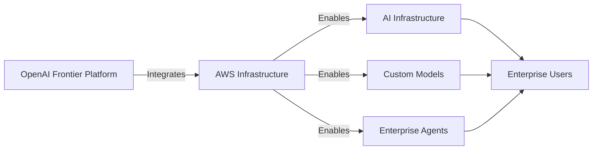

## OpenAI and Amazon announce strategic partnership

OpenAI 與 Amazon 宣布全面策略合作，將 OpenAI 的 Frontier 平台引入 AWS 生態系。本合作涵蓋 AI 基礎設施擴展、客製化模型開發與企業級 AI Agent 部署三大領域。此舉旨在將 OpenAI 的先進模型與 AWS 的全球基礎設施相結合，為企業用戶提供深度整合方案。該夥伴關係代表 OpenAI 在雲端策略上的重大擴展，進一步鞏固其在企業市場的領導地位。

### 重點
- Frontier 平台在 AWS 上全面可用，整合 OpenAI 模型與 AWS 基礎設施
- 涵蓋 AI 基礎設施、客製化模型、企業 Agent 三大核心應用
- 深化 OpenAI 與 Amazon 的商業合作，擴大企業市場覆蓋

**原文：** [openai-blog](https://openai.com/index/amazon-partnership)

---

### 📄 原文內容

點此展開 / 收合

OpenAI and Amazon announce a strategic partnership bringing OpenAI’s Frontier platform to AWS, expanding AI infrastructure, custom models, and enterprise AI agents.

