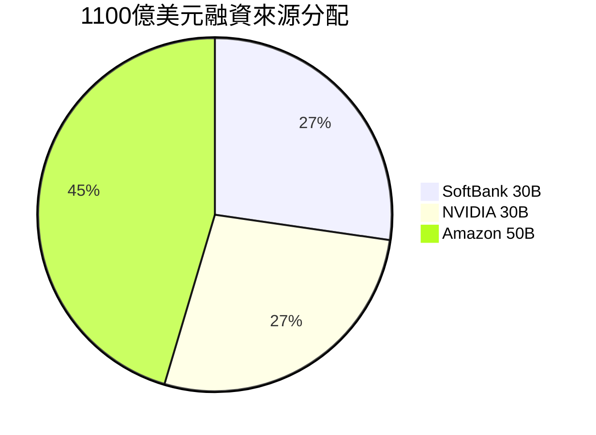

## Scaling AI for everyone

OpenAI 宣布獲得 1,100 億美元新融資，公司融資前估值達 7,300 億美元，創新創公司融資紀錄。本輪投資由 SoftBank 投入 300 億美元、NVIDIA 投入 300 億美元、Amazon 投入 500 億美元組成。Amazon 的 500 億美元投資佔融資總額 45%，代表其對 OpenAI 與 AI 基礎設施的強勁承諾。此融資規模反映市場對 AI 及 OpenAI 核心競爭力的空前信心，同時標誌 AI 產業資本密集化的新階段。

### 重點
- 融資額 1,100 億美元，估值 7,300 億美元，創新創融資紀錄
- Amazon 投資 500 億美元（45%），SoftBank 與 NVIDIA 各 300 億美元
- 顯示 AI 基礎設施的資本密集性與市場對 AGI 方向的信心

**原文：** [openai-blog](https://openai.com/index/scaling-ai-for-everyone)