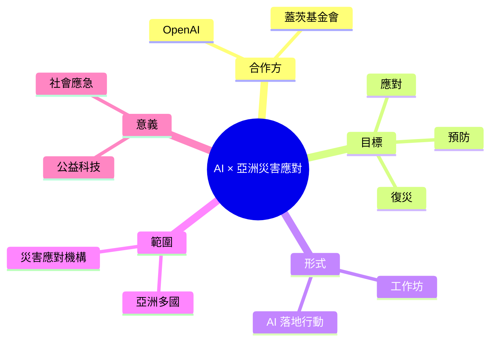

## Helping disaster response teams turn AI into action across Asia

OpenAI 與蓋茨基金會合作，在亞洲舉辦工作坊推進 AI 在災害應對中的應用。該計畫幫助災害應對團隊將 AI 技術轉化為實際行動。工作坊聚焦於災害預防、應對和復災中的 AI 應用方法。此舉展現 OpenAI 在社會應急領域的承諾。亞洲多個國家的災害應對機構參與其中。

### 重點
- OpenAI 與蓋茨基金會在亞洲合作舉辦工作坊
- 聚焦災害應對中的 AI 應用實踐
- 幫助災難應對團隊將 AI 轉化為實際行動

**原文：** [openai-blog](https://openai.com/index/helping-disaster-response-teams-asia)

---

<!-- deep-analysis:begin -->
## 📌 摘要 (TL;DR)

- OpenAI 與蓋茨基金會（Gates Foundation）合作，在亞洲舉辦工作坊，推進 AI 在災害應對（disaster response）中的實際應用。
- 計畫聚焦於災害「預防、應對、復災」三個階段，協助第一線團隊將 AI 技術轉化為可執行的行動方案。
- 亞洲多個國家的災害應對機構參與其中，展現 OpenAI 在社會應急（social emergency）領域的投入。
- ⚠️ 原文僅提供標題與摘要，本篇整理以公開摘要為主，深度細節（受益單位名單、使用模型、實際案例）需回原文確認。

## 🎯 核心概念

- **災害應對（disaster response）**：涵蓋災害發生前的預防、發生時的即時應變、以及後續的復災與重建三個階段。
- **AI 落地工作坊（AI enablement workshop）**：透過實作課程協助非 AI 專業的第一線團隊，把通用 AI 工具整合進現有工作流程。

## 📖 整理分析

### 1. 合作背景：OpenAI × 蓋茨基金會
此次行動由 OpenAI 與蓋茨基金會共同主導，延伸雙方在公益科技（tech for good）領域的既有合作。蓋茨基金會長期投入全球健康與發展議題，將其在地網絡與 OpenAI 的模型能力結合，是此次計畫的基礎。

### 2. 目標受眾：亞洲災害應對團隊
計畫鎖定亞洲地區的災害應對機構。亞洲因地震、颱風、洪水等天災頻繁，且各國應變資源差異大，被視為 AI 輔助應急最具槓桿效果的區域之一。原文摘要指出「多個國家」參與，但未具體列出名單。

### 3. 工作坊定位：從能力到行動
工作坊核心命題是「把 AI 轉化為行動」（turn AI into action），而不是停留在模型展示。這意味著內容應偏向 playbook、流程整合、在地情境演練，而非單純的技術培訓。對應急工作者而言，能不能在資源有限、網路不穩的現場使用 AI，才是關鍵門檻。

### 4. 戰略意義：OpenAI 的公共領域佈局
此舉延續 OpenAI 近年在教育、健康、政府部門的「公共使命」敘事，展現其不只專注 ChatGPT 消費級產品，也投入高社會價值、低商業報酬的場景。對於關注 AI 治理與基金會合作模式的讀者來說，這是一個可追蹤的樣本案例。

## 🧠 Mindmap

> 註：本篇受限於輸入內容僅有標題與摘要，具體工作坊日期、參與國家、使用的模型版本與成效指標，建議回原文 [openai.com](https://openai.com/index/helping-disaster-response-teams-asia) 查閱。
<!-- deep-analysis:end -->
### 📄 原文內容

點此展開 / 收合

AI for Disaster Response in Asia: OpenAI Workshop with Gates Foundation

