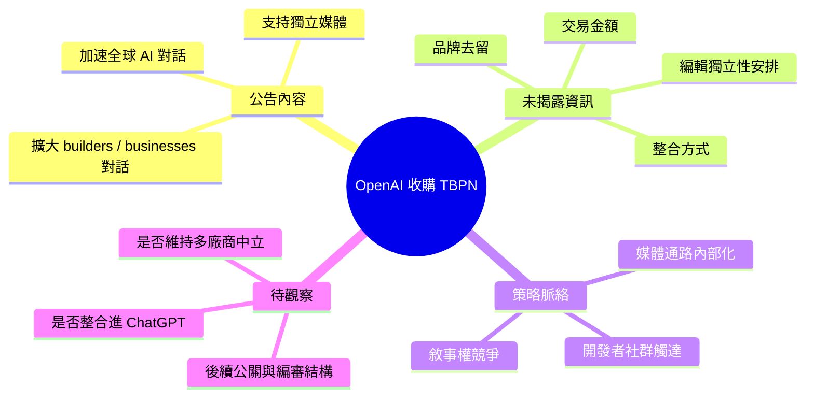

## OpenAI acquires TBPN

OpenAI 宣布收購 TBPN，旨在加速全球 AI 相關對話並支持獨立媒體。此次收購反映 OpenAI 在內容傳播和社區對話領域的戰略擴展。通過 TBPN，OpenAI 期望拓展與建造者、企業和更廣泛科技社群的對話渠道。此舉有助於推進 AI 技術在全球範圍內的認知和應用。TBPN 的具體業務模式和此次收購的詳細條款暫未披露。

### 重點
- OpenAI 收購 TBPN 加強 AI 對話平台
- 支持獨立媒體和技術社群的戰略擴展
- 拓展與建造者、企業和科技社群的對話

**原文：** [openai-blog](https://openai.com/index/openai-acquires-tbpn)

---

<!-- deep-analysis:begin -->
## 📌 摘要 (TL;DR)

- OpenAI 於官方 blog 宣布收購 **TBPN**，目的為「加速全球 AI 對話」並「支持獨立媒體」。
- 官方聲明的策略意圖：擴大與建造者（builders）、企業（businesses）、以及更廣泛科技社群的對話管道。
- **交易金額、條款、整合方式、人員安排皆未於公告中揭露**；目前僅為一段簡短聲明。
- 此舉延續科技大廠收購 / 投資媒體的路線，把「訊息傳播通路」納入產品策略的一環。
- 讀者關注重點：AI 平台商開始把「敘事權」與「開發者社群溝通」視為可被收購的戰略資產。

## 📖 整理分析

### 1. 公告的實際內容
這則公告本身只有一句話：OpenAI 收購 TBPN，用以「accelerate global conversations around AI and support independent media」。公告同時提到要擴大與 builders、businesses、broader tech community 的對話。除此之外，原文並未提供 TBPN 的業務描述、團隊規模、收購金額，也沒有揭露整合後的產品或品牌變更。

### 2. 「支持獨立媒體」這句話的張力
公告強調「support independent media」，但收購本身在定義上會改變被收購方的獨立性。OpenAI 如何在法律與編輯層面保留 TBPN 的獨立運作（例如內容編審是否與 OpenAI 公關分離、是否繼續報導 OpenAI 競品），是公告沒有回答、但決定此次交易可信度的關鍵條件。**以上為推論，原公告未對此做任何承諾。**

### 3. 放在 OpenAI 更大的佈局裡
此次收購發生在 OpenAI 以產品為核心、加速擴張消費者與開發者觸達的階段。把一個媒體品牌納入集團，意味著「對外說明 AI、示範使用情境、接觸開發者」從一個行銷職能升級為一個被內部擁有的通路。**此段屬脈絡推論，非公告明文。**

### 4. 目前無法從公告判斷的事
- TBPN 是否保留原有編輯團隊與品牌。
- 收購後是否仍接受其他 AI 廠商（Anthropic、Google DeepMind 等）的贊助或合作。
- 是否會整合進 ChatGPT 產品（例如作為內容來源、訪談節目、或社群頻道）。
- 交易規模與完成時程。

讀者若要判斷此次收購的實質影響，需等待後續揭露或第三方報導補齊資訊。

## 🧠 Mindmap

<!-- deep-analysis:end -->
### 📄 原文內容

點此展開 / 收合

OpenAI acquires TBPN to accelerate global conversations around AI and support independent media, expanding dialogue with builders, businesses, and the broader tech community.

