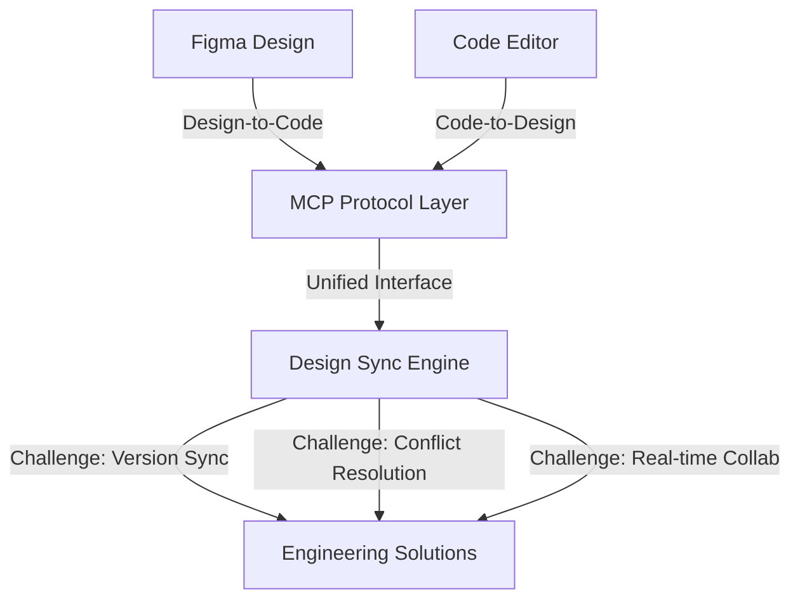

## Figma Design to Code, Code to Design: Clearly Explained

Figma 的設計轉代碼（design-to-code）和代碼轉設計（code-to-design）功能背後的實現原理。文章先分析直接 API 方案為何失效，再展示 MCP（Model Context Protocol）如何作為中立協議層優雅解決異質工具整合問題，最後探討版本同步、衝突解決、實時協作等剩餘的工程挑戰。MCP 統一了設計工具和代碼編輯器的通信接口，成為跨工具互操作的關鍵基礎。

### 重點
- MCP 協議統一設計工具和代碼編輯器的通信，解決直接 API 互操作性失效問題
- 設計轉代碼需要語義理解（元件、布局、樣式轉譯），代碼轉設計需要反向工程
- 版本同步、衝突解決、實時協作是大規模部署時的核心工程挑戰

**原文：** [substack-bytebytego](https://blog.bytebytego.com/p/figma-design-to-code-code-to-design)

---

### 📄 原文內容

點此展開 / 收合

This article covers how Figma&#8217;s design-to-code and code-to-design workflows actually work, starting with why the obvious approaches fail, how MCP solves them, and the engineering challenges that remain.

