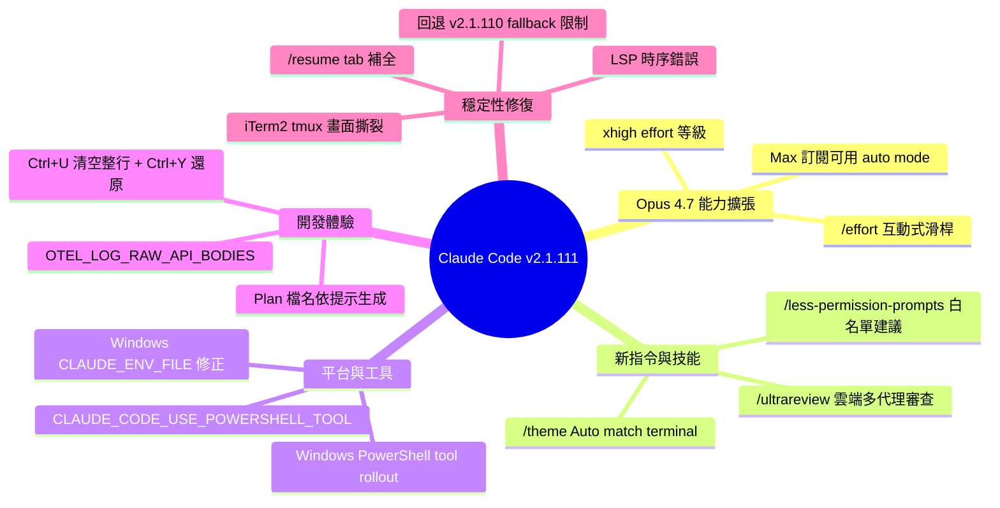

## v2.1.111

Claude Code v2.1.111 於 2026 年 4 月 16 日發布，這是重大功能版本，主要推出 Claude Opus 4.7 xhigh 努力等級。Max 訂閱戶現可使用 Opus 4.7 auto mode，並透過 /effort 滑桿調整速度與智能平衡；xhigh 等級介於 high 與 max 之間。新增 /less-permission-prompts 技能掃描常見唯讀指令自動提議白名單，/ultrareview 啟用雲端並行多代理程式碼審查。/theme 增加「Auto (match terminal)」自動配對終端深淺模式。Windows 上 PowerShell 工具逐漸推出，Linux/macOS 可透過環境變數啟用。計畫檔名改為基於提示內容生成（如 fix-auth-race-snug-otter.md），提升可追蹤性。修復 /resume 大型會話、Tab 補全、MCP 逾時等 25+ 項問題。

### 重點
- Claude Opus 4.7 xhigh 努力等級推出，Max 訂閱戶可用 auto mode 搭配 Opus 4.7
- /ultrareview 支援雲端並行代理程式碼審查，可直接審查 GitHub PR
- /less-permission-prompts 技能掃描安全白名單；計畫檔名由提示內容生成

**原文：** [claude-code-releases](https://github.com/anthropics/claude-code/releases/tag/v2.1.111)

---

<!-- deep-analysis:begin -->
## 📌 摘要 (TL;DR)

- **Claude Code v2.1.111** 新增 **Opus 4.7 xhigh** 努力等級，位於 `high` 與 `max` 之間，其他模型會 fallback 到 `high`
- **Max 訂閱戶**現可對 Opus 4.7 使用 **auto mode**，且不再需要 `--enable-auto-mode` 旗標
- 推出 `/ultrareview`：透過**雲端並行多代理**（parallel multi-agent）分析與批評，可審查當前分支或指定 PR（`/ultrareview <PR#>`）
- 新增 `/less-permission-prompts` 技能：掃描對話紀錄中常見的唯讀 Bash 與 MCP 工具呼叫，並提議寫入 `.claude/settings.json` 的白名單
- **Windows PowerShell tool** 逐步推出，Linux/macOS 可用 `CLAUDE_CODE_USE_POWERSHELL_TOOL=1` 啟用（需 `pwsh` 在 PATH）
- Plan 檔名改為依提示內容生成（例：`fix-auth-race-snug-otter.md`），取代純隨機字串，提升可追蹤性

## 🎯 核心概念

- **努力等級**（effort level）：控制模型思考深度與回應速度的設定，此版新增 `xhigh`
- **Auto mode**：依任務複雜度自動調整模型與 effort 的模式，本版對 Max 訂閱戶在 Opus 4.7 上開放
- **Ultrareview**：雲端並行多代理程式碼審查，多個 agent 同時分析 PR 並相互批評（critique）

## 📖 整理分析

### 1. Opus 4.7 xhigh 與互動式 /effort 滑桿
新的 `xhigh` 等級僅對 Opus 4.7 生效，位於 `high` 與 `max` 之間，其他模型沿用 `high`。`/effort` 不帶參數時會開啟互動式滑桿，方向鍵切換等級、Enter 確認；也可透過 `--effort` 旗標或 model picker 指定。對 Max 訂閱戶而言，Opus 4.7 的 auto mode 同時解禁，意謂日常任務可讓 Claude Code 自動權衡速度與推理深度。

### 2. /ultrareview：雲端並行多代理審查
`/ultrareview` 將程式碼審查搬到雲端，以多個 agent 平行分析並相互批評。無參數時審查當前分支；帶 PR 編號（`/ultrareview <PR#>`）則從 GitHub 抓取指定 PR。這代表審查不再佔用本機 context，而是由後端並行 pipeline 完成。

### 3. /less-permission-prompts：減少白名單摩擦
此技能會掃描使用者過往對話中常出現的**唯讀 Bash 與 MCP 工具呼叫**，排序後提議寫入 `.claude/settings.json` 的 allowlist。搭配本版另一項改動——帶 glob 的唯讀指令（如 `ls *.ts`）以及 `cd <project-dir> && …` 開頭的指令不再觸發權限提示——整體目的是降低開發者被反覆詢問 yes/no 的次數。

### 4. Windows PowerShell tool 與跨平台選項
Windows 上的 PowerShell tool 採漸進式推出（progressive rollout），可用 `CLAUDE_CODE_USE_POWERSHELL_TOOL` 明確 opt-in 或 opt-out；Linux/macOS 只要有 `pwsh` 在 PATH，設 `CLAUDE_CODE_USE_POWERSHELL_TOOL=1` 亦可啟用。Windows 另修正兩個長年痛點：`CLAUDE_ENV_FILE` 與 SessionStart hook 的環境檔終於會套用（先前是 no-op），且碟機代號大小寫不同的路徑現在會被視為同一路徑。

### 5. 體驗改進與 25+ 項 bug 修復
- **主題**：`/theme` 新增「Auto (match terminal)」自動跟隨終端深淺色
- **快捷鍵**：`Ctrl+U` 改為清空整個輸入，`Ctrl+Y` 可還原；`Ctrl+L` 額外強制全畫面重繪
- **Plan 命名**：改用提示內容 + 隨機字尾（`fix-auth-race-snug-otter.md`）
- **可觀測性**：新增 `OTEL_LOG_RAW_API_BODIES` 可將完整 API request/response body 輸出為 OpenTelemetry log 事件
- **重要修復**：iTerm2 + tmux 畫面撕裂、`/resume` tab 補全會直接跳入任意 session、LSP 在編輯前後時序錯亂害 Claude 重讀檔案、`/clear` 會丟失 `/rename` 設定的 session_name、Bedrock/Vertex/Foundry 的 429 錯誤誤引 `status.claude.com`
- **回退**：v2.1.110 對非串流 fallback 重試的限制被 revert——它在 API 過載時雖減少等待但造成更多直接失敗

## 🧠 Mindmap

<!-- deep-analysis:end -->
### 📄 原文內容

點此展開 / 收合

<h2>What's changed</h2>
<ul>
<li>Claude Opus 4.7 xhigh is now available! Use /effort to tune speed vs. intelligence</li>
<li>Auto mode is now available for Max subscribers when using Opus 4.7</li>
<li>Added <code>xhigh</code> effort level for Opus 4.7, sitting between <code>high</code> and <code>max</code>. Available via <code>/effort</code>, <code>--effort</code>, and the model picker; other models fall back to <code>high</code></li>
<li><code>/effort</code> now opens an interactive slider when called without arguments, with arrow-key navigation between levels and Enter to confirm</li>
<li>Added "Auto (match terminal)" theme option that matches your terminal's dark/light mode — select it from <code>/theme</code></li>
<li>Added <code>/less-permission-prompts</code> skill — scans transcripts for common read-only Bash and MCP tool calls and proposes a prioritized allowlist for <code>.claude/settings.json</code></li>
<li>Added <code>/ultrareview</code> for running comprehensive code review in the cloud using parallel multi-agent analysis and critique — invoke with no arguments to review your current branch, or <code>/ultrareview &lt;PR#&gt;</code> to fetch and review a specific GitHub PR</li>
<li>Auto mode no longer requires <code>--enable-auto-mode</code></li>
<li>Windows: PowerShell tool is progressively rolling out. Opt in or out with <code>CLAUDE_CODE_USE_POWERSHELL_TOOL</code>. On Linux and macOS, enable with <code>CLAUDE_CODE_USE_POWERSHELL_TOOL=1</code> (requires <code>pwsh</code> on PATH)</li>
<li>Read-only bash commands with glob patterns (e.g. <code>ls *.ts</code>) and commands starting with <code>cd &lt;project-dir&gt; &amp;&amp;</code> no longer trigger a permission prompt</li>
<li>Suggest the closest matching subcommand when <code>claude &lt;word&gt;</code> is invoked with a near-miss typo (e.g. <code>claude udpate</code> → "Did you mean <code>claude update</code>?")</li>
<li>Plan files are now named after your prompt (e.g. <code>fix-auth-race-snug-otter.md</code>) instead of purely random words</li>
<li>Improved <code>/setup-vertex</code> and <code>/setup-bedrock</code> to show the actual <code>settings.json</code> path when <code>CLAUDE_CONFIG_DIR</code> is set, seed model candidates from existing pins on re-run, and offer a "with 1M context" option for supported models</li>
<li><code>/skills</code> menu now supports sorting by estimated token count — press <code>t</code> to toggle</li>
<li><code>Ctrl+U</code> now clears the entire input buffer (previously: delete to start of line); press <code>Ctrl+Y</code> to restore</li>
<li><code>Ctrl+L</code> now forces a full screen redraw in addition to clearing the prompt input</li>
<li>Transcript view footer now shows <code>[</code> (dump to scrollback) and <code>v</code> (open in editor) shortcuts</li>
<li>The "+N lines" marker for truncated long pastes is now a full-width rule for easier scanning</li>
<li>Headless <code>--output-format stream-json</code> now includes <code>plugin_errors</code> on the init event when plugins are demoted for unsatisfied dependencies</li>
<li>Added <code>OTEL_LOG_RAW_API_BODIES</code> environment variable to emit full API request and response bodies as OpenTelemetry log events for debugging</li>
<li>Suppressed spurious decompression, network, and transient error messages that could appear in the TUI during normal operation</li>
<li>Reverted the v2.1.110 cap on non-streaming fallback retries — it traded long waits for more outright failures during API overload</li>
<li>Fixed terminal display tearing (random characters, drifting input) in iTerm2 + tmux setups when terminal notifications are sent</li>
<li>Fixed <code>@</code> file suggestions re-scanning the entire project on every turn in non-git working directories, and showing only config files in freshly-initialized git repos with no tracked files</li>
<li>Fixed LSP diagnostics from before an edit appearing after it, causing the model to re-read files it just edited</li>
<li>Fixed tab-completing <code>/resume</code> immediately resuming an arbitrary titled session instead of showing the session picker</li>
<li>Fixed <code>/context</code> grid rendering with extra blank lines between rows</li>
<li>Fixed <code>/clear</code> dropping the session name set by <code>/rename</code>, causing statusline output to lose <code>session_name</code></li>
<li>Improved plugin error handling: dependency errors now distinguish conflicting, invalid, and overly complex version requirements; fixed stale resolved versions after <code>plugin update</code>; <code>plugin install</code> now recovers from interrupted prior installs</li>
<li>Fixed Claude calling a non-existent <code>commit</code> skill and showing "Unknown skill: commit" for users without a custom <code>/commit</code> command</li>
<li>Fixed 429 rate-limit errors on Bedrock/Vertex/Foundry referencing status.claude.com (it only covers Anthropic-operated providers)</li>
<li>Fixed feedback surveys appearing back-to-back after dismissing one</li>
<li>Fixed bare URLs in bash/PowerShell/MCP tool output being unclickable when the terminal wraps them across lines</li>
<li>Windows: <code>CLAUDE_ENV_FILE</code> and SessionStart hook environment files now apply (previously a no-op)</li>
<li>Windows: permission rules with drive-letter paths are now correctly root-anchored, and paths differing only by drive-letter case are recognized as the same path</li>
</ul>

