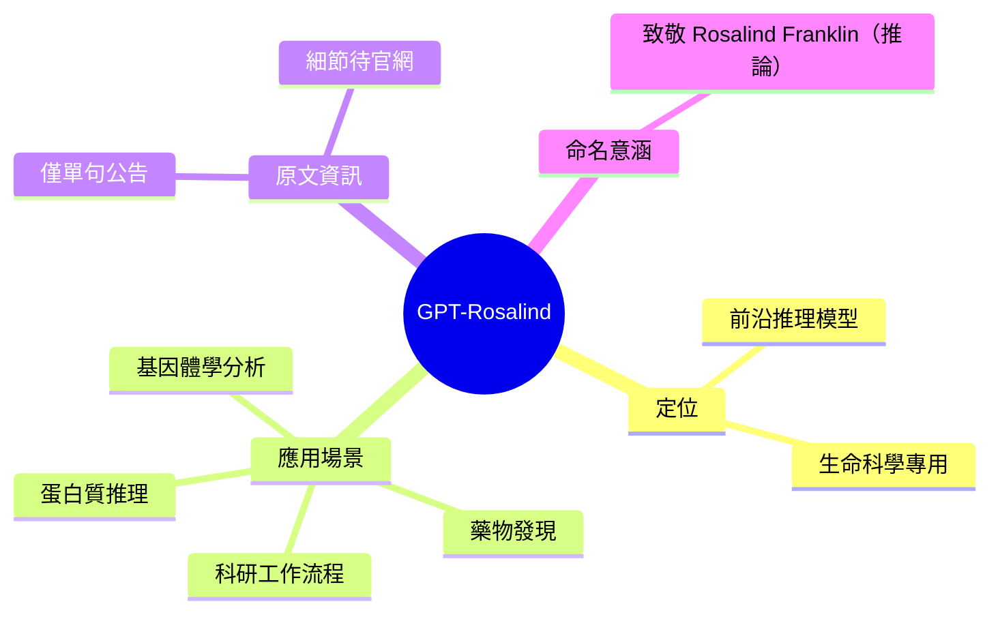

## Introducing GPT-Rosalind for life sciences research

OpenAI 推出 GPT-Rosalind，一款前沿推理模型，專為生命科學研究而設計。該模型旨在加速藥物發現、基因組學分析、蛋白質推理和科學研究工作流程。GPT-Rosalind 代表 OpenAI 在科學領域應用 AI 推理能力的重大突破。這款模型能幫助研究人員處理複雜的分子生物學問題，顯著提升研究效率。對於製藥、生物科技和學術研究機構而言，GPT-Rosalind 提供了一個強大的 AI 工具，可應用於藥物開發和基因體分析。

### 重點
- GPT-Rosalind 是專用於生命科學領域的前沿推理模型
- 支援藥物發現、基因組學分析及蛋白質推理等應用
- 加速科學研究工作流程，提升研究效率

**原文：** [openai-blog](https://openai.com/index/introducing-gpt-rosalind)

---

<!-- deep-analysis:begin -->
## 📌 摘要 (TL;DR)

- OpenAI 發布 **GPT-Rosalind**，定位為專為生命科學研究打造的前沿推理模型（frontier reasoning model）
- 應用範圍涵蓋四大領域：藥物發現（drug discovery）、基因體學分析（genomics analysis）、蛋白質推理（protein reasoning）、科學研究工作流程（scientific research workflows）
- 本次官方公告內文極簡（僅單句說明），未披露 benchmark、模型規格、可用性、定價等細節；本整理嚴格依據原文，具體資料請參閱原網頁

## 🎯 核心概念

- **前沿推理模型**（frontier reasoning model）：OpenAI 對其最先進 reasoning 系列模型的稱呼
- **藥物發現**（drug discovery）：從標靶識別、分子設計到臨床前驗證的製藥研發流程
- **基因體學**（genomics）：研究生物體完整 DNA 序列與功能的學科
- **蛋白質推理**（protein reasoning）：針對蛋白質結構、功能、交互作用進行邏輯分析的能力

## 📖 整理分析

### 1. 原文資訊量極有限
本次 OpenAI 公告所提供的內文僅有一句話，未包含具體 benchmark 數據、模型架構、可用通道（API / ChatGPT / 企業版）、價格或合作夥伴資訊。因此本整理無法提供超出官方公告範圍的具體細節，讀者若需深入資訊請直接造訪原文連結。

### 2. 定位：垂直領域的推理模型
GPT-Rosalind 被定位為「frontier reasoning model」，但明確鎖定「life sciences research」這一垂直領域。這意味著 OpenAI 除了維持通用型模型路線外，也開始推出針對特定科學領域打造的專用推理模型。

### 3. 四大應用場景
公告明確列出的應用場景為：藥物發現、基因體學分析、蛋白質推理、科研工作流程。這四項橫跨製藥、基因體、結構生物學與一般科研；原文強調的是「reasoning」能力，而非單點的結構預測或資料檢索。

### 4. 命名致敬（推論）
「Rosalind」一名極可能致敬 1950 年代以 X 光繞射照片「Photo 51」揭開 DNA 結構的科學家 Rosalind Franklin。此為對命名選擇的合理推論，原文未明確說明命名來源。

## 🧠 Mindmap

<!-- deep-analysis:end -->
### 📄 原文內容

點此展開 / 收合

OpenAI introduces GPT-Rosalind, a frontier reasoning model built to accelerate drug discovery, genomics analysis, protein reasoning, and scientific research workflows.

