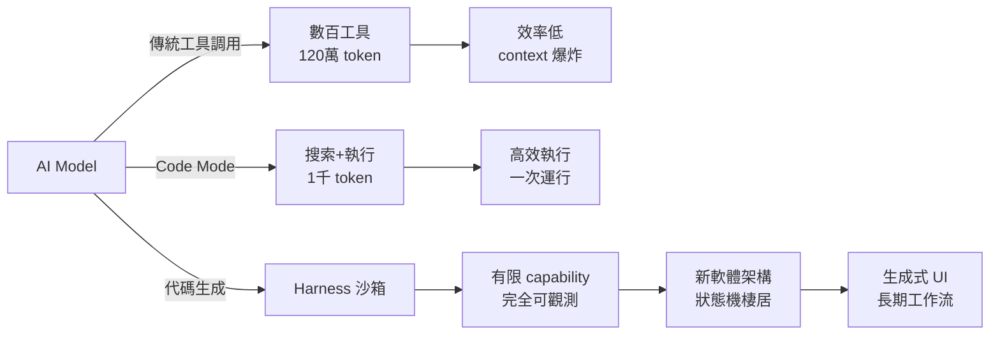

## Code Mode: Let the Code do the Talking - Sunil Pai, Cloudflare

Cloudflare 的 Sunil Pai 介紹「Code Mode」——一種新的 AI Agent 交互範式：讓模型生成可執行的 JavaScript 代碼，而非返回 JSON 結構。傳統 MCP 在數百個工具充斥上下文時效率崩潰，而 Code Mode 將 Cloudflare 2,600 個 API 端點從需要 120 萬個 token 的暴露方式縮減至 1,000 token（99.9% 削減）。Cloudflare 通過「harness」沙箱架構實現此目標：從零權限開始，逐步授予能力（API、網絡調用等），確保可觀測性和安全性。更深層的影響是軟體架構轉變：模型不再只是生成單次程序，而是「棲居」於狀態機，可生成長期運行的工作流、自定義 UI，甚至讓非程序員透過自然語言指令操控複雜系統。

### 重點
- Code Mode 將 Cloudflare API 表示從 120 萬 token 壓縮至 1,000 token（99.9% 削減），解決大規模 tool calling 的 context 爆炸問題
- Harness 沙箱架構從零權限開始，逐步授予 API 和網絡能力，確保安全且可完全觀測（支持事件審計、容錯重放）
- 新範式讓 AI 棲居於狀態機而非單次生成程序，開啟生成式 UI、多日工作流及讓非程序員能透過 LLM 操控複雜系統的可能

**原文：** [youtube-ai-engineer](https://www.youtube.com/watch?v=8txf05vVVl4)

---

### 📄 原文內容

點此展開 / 收合

# Code Mode: Let the Code do the Talking - Sunil Pai, Cloudflare

