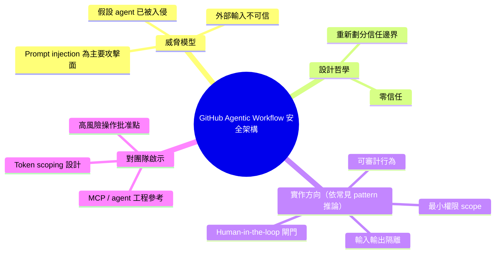

## The Security Architecture of GitHub Agentic Workflow

GitHub 打造的 agentic workflow 安全架構採取了前瞻性的威脅假設——假定代理已被入侵——進而重新設計信任邊界和驗證流程。此方式打破傳統外圍防禦思維，改採零信任模型進行架構設計。文章深入探討在此假設下的具體安全實施機制，對於構建可信任 agent 系統有重要啟示。

### 重點
- 採納「agent 已被入侵」的最嚴苛威脅模型，構築零信任安全架構
- 重新設計信任邊界：不依賴單點防禦，而是多層驗證和隔離
- 對 agentic workflow 的安全設計有框架級啟示

**原文：** [substack-bytebytego](https://blog.bytebytego.com/p/the-security-architecture-of-github)

---

<!-- deep-analysis:begin -->
## 📌 摘要 (TL;DR)

- GitHub 針對 agentic workflow（代理工作流程）設計的安全架構，採取「假設 agent 已被入侵（assume breach）」的威脅模型，重新定義信任邊界
- 此設計屬於零信任（zero trust）取向：不再依賴外圍防禦，而是在每一層驗證並限制 agent 的行為
- 對於正在建置 AI agent、MCP server 或自動化 CI/CD 流程的團隊，這類安全模型提供可參考的設計起點

> ⚠️ **來源限制說明**：本篇原文（Byte Byte Go 部落格）屬於付費訂閱內容，此次抓取僅取得文章開頭一句導言——「In this article, we will look at how GitHub built a security architecture that assumes the agent is already compromised.」以下整理以**標題**與既有**中文摘要**為依據，具體的元件命名、架構圖、設定範例與數據請以原文為準。本整理刻意不捏造原文未提及的技術細節。

## 🎯 核心概念

- **代理工作流程**（agentic workflow）：由 LLM 驅動、可自主呼叫工具、存取資源、執行多步驟任務的自動化流程
- **假設已被入侵**（assume breach）：一種威脅建模思路，設計階段即預設防線已失守，所有後續元件須在此前提下仍能限制損害
- **零信任**（zero trust）：不因來源或位置而給予信任，每次存取都需重新驗證的安全模型
- **Prompt Injection**：將惡意指令藏在 agent 會讀到的文字（如 issue、PR 描述、外部檔案）中，使 agent 被劫持的攻擊手法

## 📖 整理分析

### 1. 傳統安全模型為何不夠用

一般服務的安全設計多以「外圍防禦」為主——在系統邊界驗證身分、阻擋惡意流量，對內部元件給予較高信任。原文標題暗示 GitHub 在設計 agentic workflow 時不採這種思路，而是直接**假設 agent 已被入侵**。這個前提會往下影響所有設計決策：agent 的輸出不能被無條件信任，agent 的權限不能是靜態、長期的。

### 2. 為何 agent 特別需要新的威脅模型

LLM 驅動的 agent 與傳統 service 最大差異在於：**行為由自然語言指令驅動**，而這些指令可能來自使用者輸入、issue 留言、PR 描述、外部 repository 檔案——任何不受控文字。只要 agent 會讀到它，該文字就可能被解讀為指令，這就是 indirect prompt injection。在 GitHub 這類平台上，agent 通常具備 repository 讀寫、CI 執行、甚至 secret 存取的高權限，一旦被劫持，後果會擴散到整個組織。

### 3. 可能的設計原則（推論，非原文內容）

原文中文摘要提到「重新設計信任邊界和驗證流程」。依據 zero-trust 與 assume-breach 這類成熟典範，這種架構**常見**會包含：

- **最小權限**：agent 每次執行只取得當前任務所需的最小 scope，任務結束即回收
- **可審計**：每一次 agent 的工具呼叫、資源存取都留下可追溯紀錄
- **I/O 隔離**：不受信任的內容（外部輸入）不與 privileged context（secret、高權限 token）直接混合
- **Human-in-the-loop**：高風險操作需要人工批准閘門

> 以上為業界常見 pattern 的**推論**，不代表 GitHub 在原文中具體如此實作。實際元件名稱、信任邊界切法、驗證機制請以原文為準。

### 4. 對 AI 工程團隊的啟示

若讀者團隊正在設計類似系統——例如整合 MCP server、建立 code review agent、或在內部 CI 上跑 LLM workflow——原文值得作為對照材料。可特別關注三個問題：

1. **信任邊界畫在哪裡**：哪些輸入被視為不受信任？agent 的輸出在進入 privileged 系統前要經過什麼驗證？
2. **權限如何收斂**：agent 的 token 是否 scoped、短期、任務綁定？
3. **哪些動作需要人為批准**：哪些操作不論 agent 多「確定」都不能自動執行？

## 🧠 Mindmap

> 本整理因原文抓取受限（僅取得導言一句），未能深入還原 GitHub 的具體元件、架構圖與數據。建議點擊原文連結閱讀完整內容以取得權威資訊。
<!-- deep-analysis:end -->
### 📄 原文內容

點此展開 / 收合

In this article, we will look at how GitHub built a security architecture that assumes the agent is already compromised.

