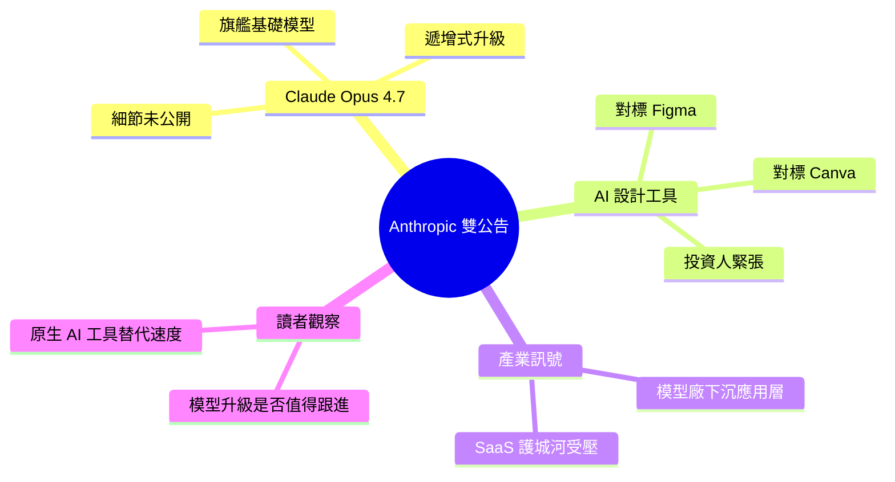

## # Anthropic Just Dropped Two Bombshells – And Most People Missed Both

Anthropic 在 2026 年 4 月發布了兩項重大公告，但大多數人只關注其中一項。首先，Claude Opus 4.7 正式發布，這是 Anthropic 目前最強大的基礎模型版本。其次，Anthropic 推出了一款 AI 設計工具，其能力足以威脅 Figma 和 Canva 這兩家設計軟件領導者的市場地位。這兩項公告標誌著 AI 產業的重要分化：不僅基礎模型在持續突破性能邊界（Opus 4.7），而且專用應用層也在快速成熟，開始對傳統軟件龍頭構成直接競爭威脅。對行業而言，這反映了 AI 應用從實驗階段向實際取代的轉變。

### 重點
- Claude Opus 4.7 發布：Anthropic 最新最強基礎模型
- AI 設計工具推出：威脅 Figma/Canva 市場地位的新產品
- 行業分化：基礎模型和應用層同時突破，AI 開始替代現有軟件

**原文：** [medium-tag-ai](https://medium.com/@white9349/anthropic-just-dropped-two-bombshells-and-most-people-missed-both-308a76d8539a?source=rss------artificial_intelligence-5)

---

<!-- deep-analysis:begin -->
## 📌 摘要 (TL;DR)

- 2026 年 4 月，Anthropic 同日推出兩項重大產品：**Claude Opus 4.7** 基礎模型，以及一款直接對標 Figma、Canva 的 AI 設計工具
- 多數媒體僅聚焦 Opus 4.7 的模型升級，幾乎忽略了設計工具帶來的應用層衝擊
- Opus 4.7 是 Anthropic 目前最強的旗艦模型；設計工具則被形容為「讓 Figma 與 Canva 的投資人緊張」
- 此組合代表 AI 競爭從「底層模型軍備賽」擴散到「應用層正面取代」，模型廠開始親自下場做垂直 SaaS
- 對讀者的啟示：同時追蹤基礎模型迭代與 AI 原生應用對既有工具的替代速度，兩者已不能分開看

> ⚠️ 原文備註：本篇 RSS 僅抓到 Medium 文章的導言段（teaser），以下整理以原文標題、副標與既有摘要為依據，未對 benchmark、定價、產品名稱等未揭露細節做任何推測。

## 🎯 核心概念

- **基礎模型（foundation model）**：像 Claude Opus 4.7 這類由 AI 實驗室訓練的通用大型語言模型，是下游應用的底層引擎
- **應用層（application layer）**：建立在基礎模型之上的具體產品，例如這次 Anthropic 推出的 AI 設計工具
- **模型廠下沉（model lab going vertical）**：原本只做 API 的模型公司親自推出面向終端用戶的應用，直接競爭 SaaS 市場

## 📖 整理分析

### 1. Opus 4.7：Anthropic 的新旗艦
作者指出 Claude Opus 4.7 為 Anthropic 目前最強大的基礎模型版本。原文未揭露具體 benchmark 數字、定價或上下文窗口變化；從命名（4.7 相對於前代 4.6）推測屬於 Opus 4 系列的遞增式升級，而非全新世代跳躍。對 API 使用者而言，焦點會放在能力 / 價格 / 速度三角的調整幅度。

### 2. AI 設計工具：對標 Figma 與 Canva
第二項公告是一款 AI 設計工具。原文以「讓 Figma 和 Canva 投資人緊張」形容其競爭強度，但並未在導言中揭露工具名稱、定價模式、是否 self-serve、或與 Claude 模型的整合方式。將新工具直接與這兩家設計軟體龍頭並列，本身即是強烈的市場定位訊號。

### 3. 為什麼多數人「錯過」了第二項
作者的核心論點是：業界已習慣把 Anthropic 歸類為「OpenAI 的基礎模型競爭者」，注意力全放在模型發布。當同一天出現應用層產品時，新聞價值反而被模型公告掩蓋。但這條路線（模型廠親做應用）才是對既有 SaaS 格局影響最大的變化。

### 4. 產業分化的雙重訊號
同日發布兩項不同層級的產品，暗示 AI 產業進入新階段：基礎模型持續推進能力邊界（Opus 4.7），同時 AI 原生應用開始從「實驗性 demo」走向「直接取代既有工具」。對傳統軟體護城河（design system、協作習慣、template 生態）構成雙重壓力——既要防模型突破，也要防原生應用從零奪客。

### 5. 讀者該關注什麼
對技術團隊：評估 Opus 4.7 是否值得升級現有 Claude pipeline；對產品 / 設計團隊：觀察 Anthropic 設計工具的實際能力與既有 Figma 工作流的替代門檻；對投資人：Figma、Canva 是否會做出防禦性動作（降價、AI 功能加速、或反向整合多模型）。

## 🧠 Mindmap

<!-- deep-analysis:end -->
### 📄 原文內容

點此展開 / 收合

*Claude Opus 4.7 is here. And so is an AI tool that&#x2019;s making Figma and Canva investors nervous.*

<a href="https://medium.com/@white9349/anthropic-just-dropped-two-bombshells-and-most-people-missed-both-308a76d8539a?source=rss------artificial_intelligence-5">Continue reading on Medium »</a>

