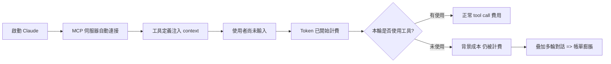
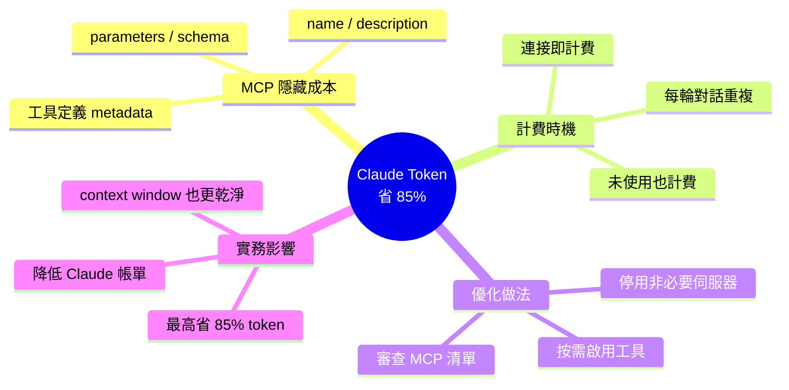

## Save up to 85% of your Claude tokens with one setting

本文揭示了 Claude 使用者容易忽略的成本陷阱：每個連接的 MCP 伺服器在使用者輸入一個字前就已開始消耗 token。工具定義、名稱、描述、參數、schema 等元資料都被計入費用，未使用的伺服器連接也會產生背景消耗。根據文章，這類隱藏成本可達整體 token 用量的高達 85%。核心優化方案是審查 MCP 伺服器配置，禁用不必要的工具連接。這對 Claude 成本控制有直接的實務意義，特別是在複雜的多伺服器工作環境中，能幫助使用者大幅降低賬單。

### 重點
- MCP 伺服器連接在使用前就消耗 token，含工具定義和 schema 元資料
- 背景 token 消耗可達整體用量的 85%，是重大成本驅動因素
- 優化方案：禁用未使用的 MCP 工具連接，能顯著降低初始 token 負擔

**原文：** [medium-tag-claude](https://medium.com/@dan.avila7/save-up-to-85-of-your-claude-tokens-with-one-setting-22d78728b8a2?source=rss------claude-5)

---

<!-- deep-analysis:begin -->
## 📌 摘要 (TL;DR)

- 每個連接的 MCP（Model Context Protocol）伺服器，在使用者輸入第一個字之前，就已經開始消耗 token。
- 工具定義、名稱、描述、參數、schema 等 metadata，全部會被計入 context 用量與費用。
- 即使某個 MCP 伺服器當下沒有被實際呼叫，只要保持連接狀態，就會持續產生背景 token 消耗。
- 作者 Dan Avila 指出，這類隱藏成本最高可佔整體 token 用量的 **85%**。
- 解法是一個設定層面的動作：檢視目前掛載的 MCP 伺服器清單，關閉非必要的連接，即可立刻壓低 Claude 帳單。

## 🎯 核心概念

- **模型情境協定（Model Context Protocol，簡稱 MCP）**：Anthropic 推出的標準協定，讓 Claude 連接外部工具與資料源。
- **工具定義（tool definitions）**：每個 MCP 工具送進 Claude context 的 metadata，包含 name、description、input schema。
- **Context 前綴**：對話開始前就注入的系統內容，每一輪對話都會重新計費。

## 📖 整理分析

### 1. MCP 的「開機成本」
Claude 與每一個啟用的 MCP 伺服器建立連接時，會把該伺服器宣告的所有工具定義塞進 context 當作系統提示的一部分。這不是按需載入（lazy loading），而是前置載入：即使這次對話只打算問一個簡單問題，所有掛載工具的 schema 依然會被一起送進模型，並在每個請求前綴中重複出現。

### 2. 哪些 metadata 在燒 token
根據原文，被計費的元素包含：工具名稱（name）、描述（description）、參數（parameters）與 JSON schema。一個設計完整的工具動輒上百 token，多個伺服器 × 每伺服器數十個工具疊加起來，context 前綴很容易膨脹到數千甚至上萬 token。

### 3. 未使用 ≠ 不計費
原文強調的關鍵事實：只要 MCP 伺服器處於「已連接」狀態，不論這次對話是否真的呼叫它，工具定義依然會被計入 context，token 依然會被扣除。這解釋了為什麼許多使用者會有「我明明沒做什麼、帳單卻很高」的疑惑。

### 4. 一個設定就能省下 85%
作者提出的優化路徑很直接：檢視目前的 MCP 設定檔，停用不必要的伺服器，或只在真正需要時才啟用特定工具集。據其說法，這個單純的 housekeeping 動作最多可省下整體 token 用量的 **85%**。

> 註：本篇 feed 僅收錄文章 snippet 與標題，以上細節主要基於摘要描述與作者論點還原；實際操作步驟建議以原文為準。

## 🧭 流程圖

## 🧠 Mindmap

<!-- deep-analysis:end -->
### 📄 原文內容

點此展開 / 收合

Every MCP server you connect costs tokens before you type a single word. Tool definitions, names, descriptions, parameters, schemas, all&#x2026;

<a href="https://medium.com/@dan.avila7/save-up-to-85-of-your-claude-tokens-with-one-setting-22d78728b8a2?source=rss------claude-5">Continue reading on Medium »</a>

