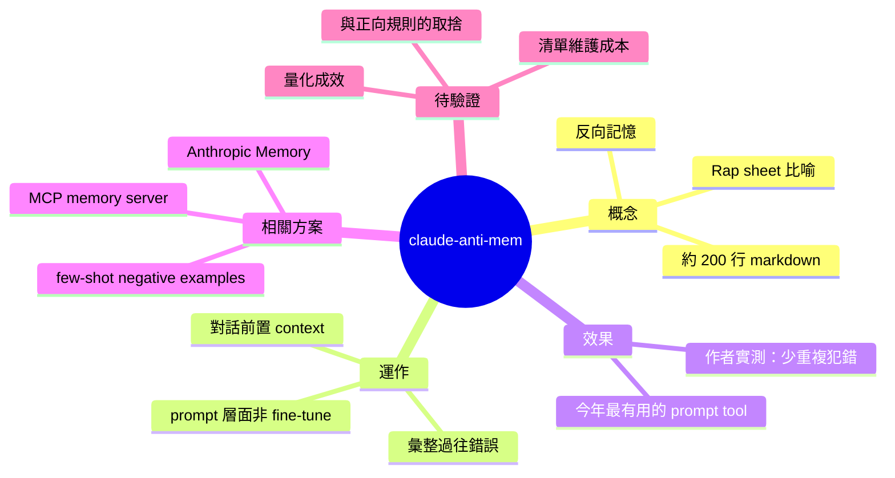

## I Gave Claude a Rap Sheet of Its Own Mistakes. It Stopped Repeating Them.

開發者建立了一套名為 claude-anti-mem 的工具（200 行 Markdown），將 Claude 曾犯過的錯誤編列成「犯罪紀錄」，在後續對話中提供給 Claude 參考。實驗結果顯示，Claude 在收到自身錯誤清單後，顯著降低了重複犯同樣錯誤的頻率。這個輕量級方案成為作者本年度最有用的提示工程工具。

### 重點
- claude-anti-mem 工具：200 行 Markdown，記錄 Claude 的歷史錯誤
- 在對話中引入錯誤清單能有效降低 Claude 重複犯錯的機率
- 極簡設計，易於集成到現有工作流

**原文：** [medium-tag-claude](https://ai.plainenglish.io/i-gave-claude-a-rap-sheet-of-its-own-mistakes-it-stopped-repeating-them-f154410c16b8?source=rss------claude-5)

---

<!-- deep-analysis:begin -->
## 📌 摘要 (TL;DR)

- 開發者公開一套名為 **claude-anti-mem** 的輕量工具，核心是一份約 200 行的 markdown，收錄 Claude 過去犯過的錯誤清單，在後續對話中當作前置 context 餵給模型。
- 概念與一般的「記憶（memory）」相反：不記「Claude 該記得的事」，而是明示「Claude 曾犯哪些錯、別再犯」。作者稱它是自己今年寫過最有用的 200 行 markdown。
- 根據作者實測，附上這份「犯罪紀錄（rap sheet）」後，Claude 重複同一類錯誤的頻率顯著下降。
- 這個做法把「修正」從一次性對話糾錯，轉成可累積、可攜帶的提示資產，對長期用 Claude 的開發者尤其值得參考。

> 備註：本次分析僅取得原文標題與 Medium 上的一句簡介，實作細節（具體錯誤範例、markdown 格式、評估方法）需回原文查閱，以下段落凡屬推論皆會標示。

## 🎯 核心概念

- **反向記憶（anti-memory）**：相對於傳統記憶系統儲存「應記住的事實與偏好」，anti-mem 專門累積「不應再犯的錯」。
- **犯罪紀錄（rap sheet）**：作者用警方「前科紀錄」比喻這份清單，暗示「記在案、下次會被盯」的語氣。
- **提示工程（prompt engineering）**：把這份清單掛進系統提示或對話前文，屬於 prompt 設計的一種應用，而非權重層面的 fine-tuning。

## 📖 整理分析

### 1. 緣起：重複犯錯是 LLM 的痛點
長期使用 Claude 的開發者常遇到「同一類錯誤一再出現」——特定 API 用錯、coding style 不符規範、推論時忽略邊界條件。與其每次重新糾正，作者把所有糾正紀錄集中成一份檔案長期維護。

### 2. claude-anti-mem 的基本作法
從標題與簡介可確認的設計：將 Claude 過去犯過的錯誤編成一份 markdown（規模約 200 行），在對話開始時以 context 形式提供給模型。格式、分類與更新流程原文未公開，此段為依題意推論。

### 3. 為什麼「列錯誤」比「列規則」有效（推論）
正面規範（「請遵守 X」）容易被模型當成抽象原則，反面具體範例（「曾在 Y 情境誤用 Z」）錨定注意力更強。這與 few-shot prompting 中 negative examples 的研究方向一致，不過本文未提供量化數據支撐。

### 4. 與 Memory / MCP 類方案的差異
Anthropic 官方的 Memory 工具，以及 Model Context Protocol（MCP）生態中的 memory server，多半傾向累積使用者偏好與專案事實。anti-mem 的切角相反，它鎖定「模型失誤軌跡」——兩者實際可並存，各補對方的空缺。

### 5. 侷限與維護成本（推論）
錯誤清單會持續膨脹，需要定期合併、去重；同一條紀錄對不同任務相關性不同，全塞進 context 會擠壓其他資訊；部分錯誤源自模型本身限制，光靠提示未必根治。原文是否已討論這些取捨，本次資料不足以確認。

## 🧠 Mindmap

<!-- deep-analysis:end -->
### 📄 原文內容

點此展開 / 收合

Meet claude-anti-mem: the opposite of memory, and maybe the most useful 200 lines of markdown I&#x2019;ve written this year.

<a href="https://ai.plainenglish.io/i-gave-claude-a-rap-sheet-of-its-own-mistakes-it-stopped-repeating-them-f154410c16b8?source=rss------claude-5">Continue reading on Artificial Intelligence in Plain English »</a>

