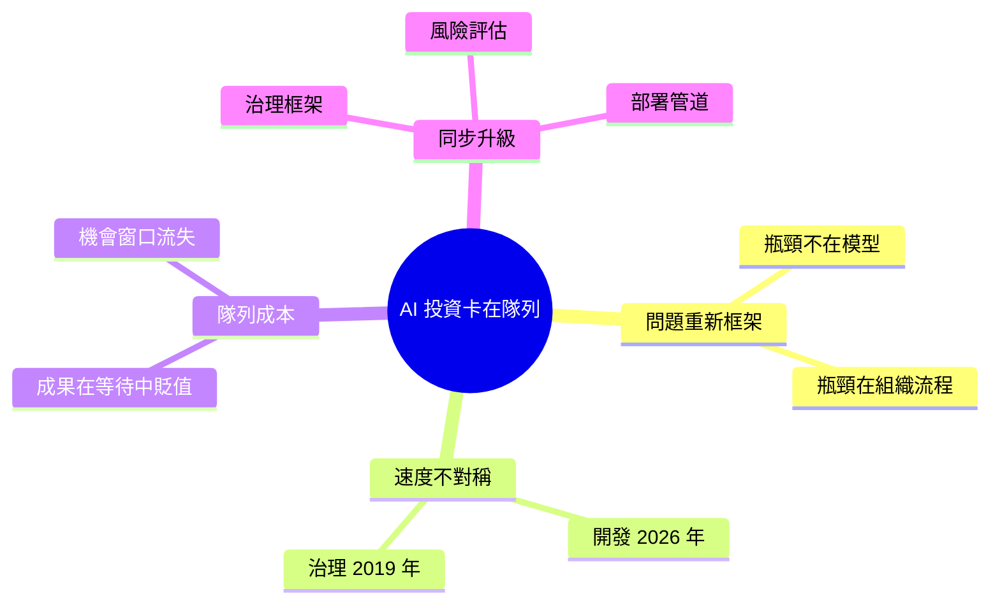

## Why Your AI Investment Is Currently Rotting in a Queue

企業對 AI 的大量投資正在被「治理滯後」所浪費。AI 能以 2026 年的速度編碼和交付，但企業的決策流程、審批機制和部署流程仍停留在 2019 年甚至更早。這造成了一個巨大的時間缺口：開發速度和上線速度之間存在數倍的差異，導致已完成的 AI 成果堆積在審批隊列中，無法及時轉化為商業價值。企業必須同步升級其治理框架、風險評估流程和部署管道，使其與 AI 開發速度相匹配，否則再強大的 AI 能力也會被組織瓶頸所抵消。

### 重點
- 治理速度滯後：審批和部署流程比 AI 開發速度慢數倍
- 隊列堆積：完成的 AI 成果無法及時上線，在隊列中堆積浪費
- 組織設計缺陷：企業必須重構決策流程以適應 AI 時代的開發速度

**原文：** [medium-tag-ai](https://medium.com/@michael-hutson/why-your-ai-investment-is-currently-rotting-in-a-queue-f8ec78bd8da7?source=rss------artificial_intelligence-5)

---

<!-- deep-analysis:begin -->
## 📌 摘要 (TL;DR)

- Michael Hutson 把「AI 投資 ROI 不如預期」重新框架：問題不在模型不夠好，而在成果卡在審批隊列裡。
- 核心對比：AI 已以「2026 年速度」寫程式，企業治理、審批與部署流程仍停留在「2019 年」。
- 結果是開發速度與交付速度出現倍數級落差，已完成的 AI 成果在隊列裡「腐壞」、失去時效。
- 解方：治理框架、風險評估、部署管道三者必須與 AI 開發速度同步升級。
- 為什麼值得讀：它把注意力從「買更好的模型」轉向「修正組織瓶頸」，這是決定 AI 投資能否真正落地的關鍵視角。

## 🎯 核心概念

- **治理滯後（governance lag）**：組織的審批、合規與風險流程更新速度跟不上 AI 技術產出的節奏。
- **時間缺口（time gap）**：從 AI 成果完成到實際上線之間，隨流程拉長的倍數差距。

## 📖 整理分析

### 1. 問題重新框架：瓶頸不在技術
作者把常見的「AI ROI 令人失望」抱怨，重新定義為治理問題而非模型問題。企業普遍假設只要有更強的模型與更多工程師就能帶來回報，但真正卡住價值的是模型完成後的審查與部署環節，而非模型能力本身。

### 2. 2026 對 2019 的速度不對稱
文章副標直指核心對比：AI 編碼已達「2026 年速度」，但多數企業的治理仍是「2019 年版本」。一端加速、另一端不動，整條交付管道就會在慢的環節累積在製品（work-in-progress），形成看不見的隱性庫存。

### 3. 已完成的成果在隊列中腐壞
「爛在隊列裡（rotting in a queue）」的比喻強調的是機會成本——每多等一週，競爭對手可能已完成整個交付循環，內部需求也在漂移，原本針對 T0 情境設計的解決方案在 T+N 上線時已不再對齊業務問題。

### 4. 需要同步升級的三層流程
摘要指出企業必須同時升級三件事：治理框架、風險評估、部署管道。單純招聘 AI 工程師或採購 GPU 並不會自動帶來 ROI，必須把審批環節的「速率上限」一起拉高，產出才能真正流到生產環境並轉為商業價值。

## 🧠 Mindmap

<!-- deep-analysis:end -->
### 📄 原文內容

點此展開 / 收合

AI Is Coding at 2026 Speeds, but Your Governance Is Stuck in 2019. Here Is Why Faster Code Isn&#x2019;t Creating Faster Value.

<a href="https://medium.com/@michael-hutson/why-your-ai-investment-is-currently-rotting-in-a-queue-f8ec78bd8da7?source=rss------artificial_intelligence-5">Continue reading on Medium »</a>

