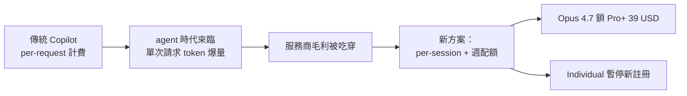
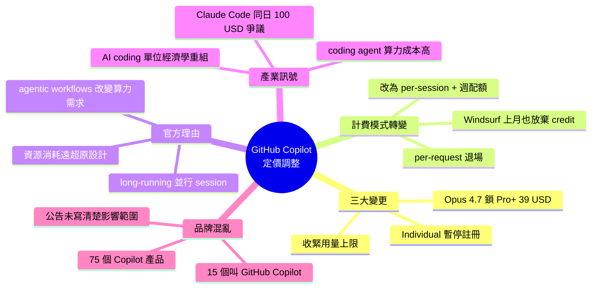

## Changes to GitHub Copilot Individual plans

GitHub Copilot調整定價與功能限制：Claude Opus 4.7模型獨占$39/月Pro+計畫，暫停個人計畫新用戶註冊，並引入每會話與每週代幣用量上限。官方聲明指出「Agent工作流從根本上改變了Copilot的運算需求，並行會話消耗資源遠超原有計畫設計」。此變化反映coding agent的計算成本遠高於傳統代碼補全，導致GitHub從每請求計費改為代幣額度限制。該調整凸顯AI服務商面臨Agent時代成本結構崩潰的共同挑戰。

### 重點
- Claude Opus 4.7限制於$39/月Pro+方案，降級Opus模型停止提供
- 實施每會話與周期性代幣用量限制，暫停個人計畫新註冊
- Agent工作流計算成本遠超預期，改變整個定價模型基礎

**原文：** [simon-willison](https://simonwillison.net/2026/Apr/22/changes-to-github-copilot/#atom-everything)

---

<!-- deep-analysis:begin -->
## 📌 摘要 (TL;DR)

- GitHub 宣布 Copilot 個人計畫重大調整：**暫停新用戶註冊 Individual plan**、收緊用量上限，並把 Claude Opus 4.7 獨家綁定到每月 $39 的 Pro+ 計畫，舊款 Opus 模型直接下架。
- 官方將原因歸咎於代理工作流（agentic workflows）：「長時間運行、並行化的 session 消耗的資源，遠超原計畫結構所能支撐」。
- 計費模式從**每請求計費（per-request）** 改為**每 session 與每週的 token 用量上限**，反映單次 agent 請求所燒掉的 token 直接侵蝕毛利。
- Simon Willison 指出：**六個月前重度 LLM 使用者所燒的 token 數，比現在少一個數量級**；coding agents 吃掉的算力不容小覷。
- 補充訂正：Windsurf 上個月也放棄了類似的 credit 計費制度，Copilot 不再是特例。
- 同日 Anthropic 的 Claude Code 也發生 $100/月 定價爭議（後來撤回），這篇文章正是在這個大背景下寫的。

## 🎯 核心概念

- **代理工作流**（agentic workflows）：AI 不再只是單次補全，而是會長時間跑、並行多個 session、自主執行多步驟任務的模式。
- **每請求計費**（per-request pricing）：無論該次請求吃掉多少 token，都只算一次——agent 時代會讓單次請求 token 爆量，直接壓縮服務商毛利。
- **Pro+ plan**：GitHub Copilot 新推的 $39/月 方案，是目前唯一能用 Claude Opus 4.7 的個人計畫層級。

## 📖 整理分析

### 1. 三個關鍵變更一次看
這次 GitHub 官方公告（非像 Anthropic 那樣語焉不詳）明列了三件事：(a) **暫停 Individual plan 新註冊**，(b) 收緊所有既有用量上限，(c) 把 Claude Opus 4.7 鎖進 $39/月 Pro+ 計畫，同時**移除先前世代的 Opus 模型**。對只付 Individual plan 的舊用戶，等於被迫升級才能用到最強模型。

### 2. Agent 時代的成本結構崩潰
官方引述值得整段讀：「Agentic workflows have fundamentally changed Copilot's compute demands. Long-running, parallelized sessions now regularly consume far more resources than the original plan structure was built to support.」Simon 的解讀更直白——**六個月前的重度用戶，token 用量比現在少一個數量級**。coding agent 不是補全工具，是一個會跑十幾分鐘、燒幾十萬 token 的 worker。

### 3. Per-request 計費走入歷史
Simon 原本認為 Copilot 是 agent 類產品中**唯一採用 per-request 而非 per-token 計費**的，後來自己訂正：Windsurf 上個月也放棄了類似的 credit 制度（見 windsurf.com/blog/windsurf-pricing-plans）。新方案改為**每 session 上限 + 每週配額**，本質上是 token-based，這樣單次高耗 token 的 agent 請求就不會單方面吃掉服務商毛利。

### 4. 「哪個 Copilot」的品牌混亂
Simon 吐槽這份公告最大的問題是——沒說清楚**影響到底是哪個 Copilot**。引用上個月 Tey Bannerman 的盤點：微軟旗下共有 **75 個 Copilot 品牌產品**，其中 **15 個叫「GitHub Copilot」**。比對 github.com/features/copilot/plans 頁面後，可確認影響範圍涵蓋：Copilot CLI、Copilot cloud agent、code review（GitHub.com 上的功能），以及 VS Code / Zed / JetBrains 等 IDE 整合。

### 5. 為什麼讀者應該關注
這不是單一廠商的調價新聞，而是**整個 AI coding 產業的共同訊號**：Anthropic 同日也踩到 Claude Code 的 $100/月 定價地雷。agent 式產品的單位經濟學（unit economics）正在重組，per-seat、per-request 的舊模式正在被 token-metered 取代。使用者要開始習慣「配額感」，開發者選型時也得把**每週 token 額度**納入評估。

## 🧭 流程圖 / 架構圖

## 🧠 Mindmap

<!-- deep-analysis:end -->
### 📄 原文內容

點此展開 / 收合

<strong><a href="https://github.blog/news-insights/company-news/changes-to-github-copilot-individual-plans/">Changes to GitHub Copilot Individual plans</a></strong>

On the same day as Claude Code's temporary will-they-won't-they $100/month kerfuffle (for the moment, <a href="https://simonwillison.net/2026/Apr/22/claude-code-confusion/#they-reversed-it">they won't</a>), here's the latest on GitHub Copilot pricing.

Unlike Anthropic, GitHub put up an official announcement about their changes, which include tightening usage limits, pausing signups for individual plans (!), restricting Claude Opus 4.7 to the more expensive $39/month "Pro+" plan, and dropping the previous Opus models entirely.

The key paragraph:

<blockquote>

Agentic workflows have fundamentally changed Copilot’s compute demands. Long-running, parallelized sessions now regularly consume far more resources than the original plan structure was built to support. As Copilot’s agentic capabilities have expanded rapidly, agents are doing more work, and more customers are hitting usage limits designed to maintain service reliability.

</blockquote>

It's easy to forget that just six months ago heavy LLM users were burning an order of magnitude less tokens. Coding agents consume a <em>lot</em> of compute.

Copilot was also unique (I believe) among agents in charging per-request, not per-token. (<em>Correction: Windsurf also operated a credit system like this which they <a href="https://windsurf.com/blog/windsurf-pricing-plans">abandoned last month</a></em>.) This means that single agentic requests which burn more tokens cut directly into their margins. The most recent pricing scheme addresses that with token-based usage limits on a per-session and weekly basis.

My one problem with this announcement is that it doesn't clearly clarify <em>which</em> product called "GitHub Copilot" is affected by these changes. Last month in <a href="https://teybannerman.com/strategy/2026/03/31/how-many-microsoft-copilot-are-there.html">How many products does Microsoft have named 'Copilot'? I mapped every one</a> Tey Bannerman identified 75 products that share the Copilot brand, 15 of which have "GitHub Copilot" in the title.

Judging by the linked <a href="https://github.com/features/copilot/plans">GitHub Copilot plans page</a> this covers Copilot CLI, Copilot cloud agent and code review (features on <a href="https://github.com/">GitHub.com</a> itself), and the Copilot IDE features available in VS Code, Zed, JetBrains and more.

    
<small></small>Via <a href="https://news.ycombinator.com/item?id=47838508">Hacker News</a></small>

    
Tags: <a href="https://simonwillison.net/tags/github">github</a>, <a href="https://simonwillison.net/tags/microsoft">microsoft</a>, <a href="https://simonwillison.net/tags/ai">ai</a>, <a href="https://simonwillison.net/tags/generative-ai">generative-ai</a>, <a href="https://simonwillison.net/tags/github-copilot">github-copilot</a>, <a href="https://simonwillison.net/tags/llms">llms</a>, <a href="https://simonwillison.net/tags/llm-pricing">llm-pricing</a>, <a href="https://simonwillison.net/tags/coding-agents">coding-agents</a>

