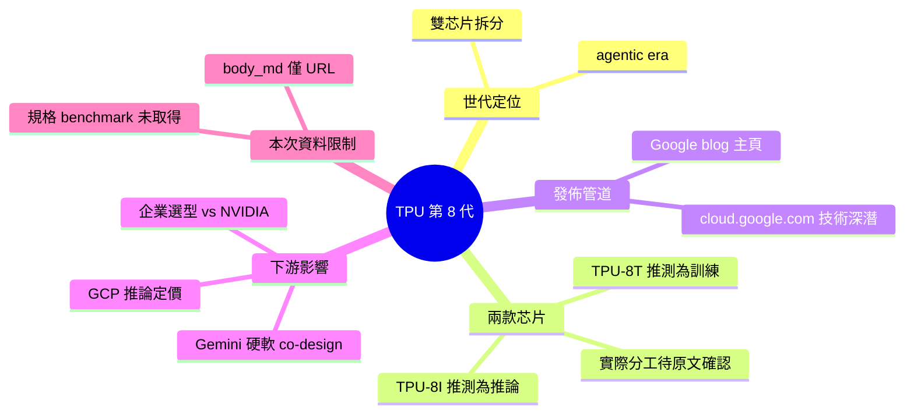

## Our eighth generation TPUs: two chips for the agentic era

Google 發布第 8 代 TPU 芯片組，包括 TPU-8T 和 TPU-8I 兩款產品，特別針對「代理時代」（agentic era）的 AI 工作負載優化設計。此舉標誌著主流硬體製造商對 agent 技術成熟階段的基礎設施重新設計。Google 官方技術深潛文件詳述兩款芯片的性能特性和應用場景。該發布將直接影響企業級 AI 推理成本、模型部署選型，以及未來 agent 系統的硬體配置決策。

### 重點
- Google TPU-8T 和 TPU-8I 兩款芯片，針對 agent 工作負載專項優化
- 反映業界在 agent 技術成熟後對基礎設施層的重大投資方向
- 影響企業 AI 推理成本評估、採購決策和 agent 系統部署

**原文：** [hackernews](https://blog.google/innovation-and-ai/infrastructure-and-cloud/google-cloud/eighth-generation-tpu-agentic-era/)

---

<!-- deep-analysis:begin -->
## 📌 摘要 (TL;DR)

- Google 宣布第 8 代 TPU（Tensor Processing Unit），以「agentic era（代理時代）」為定位，首次在同一世代拆分為兩款芯片。
- 依據先前 brief 摘要，兩款分別為 **TPU-8T** 與 **TPU-8I**（推測 T 偏訓練 training、I 偏推論 inference，但原文內容本次未取得，無法確認命名含意）。
- 主發佈頁為 Google 官方 blog，另附技術深潛（technical deep dive）文件連結至 `cloud.google.com`。
- ⚠️ **資料不足聲明**：本筆 inbox item 的 `body_md` 僅含原文 URL，未包含 Google 官方 blog 正文或 technical deep dive 的實際段落，以下分析僅能依標題與 brief 摘要所述範圍整理，未逐項查證規格、benchmark 或架構細節。

## 🎯 核心概念

- **代理時代（agentic era）**：Google 對本世代 TPU 的定位用詞，意指硬體設計須對應 AI agent 工作負載（多輪 tool use、長 context、推論密集）而非單純的模型訓練 / 一次性推論。具體定義原文未在本次可得資料中呈現。
- **TPU 第 8 代（8th generation TPU）**：Google 自研 AI 加速器的最新世代。上一代為第 7 代 Ironwood（依 Google 過往命名慣例，此為公開資訊；第 8 代的官方代號在本次可得資料中未出現）。

## 📖 整理分析

### 1. 發佈重點：從「單芯片世代」轉為「雙芯片世代」
依據標題 "two chips for the agentic era"，第 8 代 TPU 的最主要結構變化是**一個世代推出兩款定位不同的芯片**，這與過去 TPU v1–v7 多為單芯片 SKU（部分世代另有 Pod 版本）的慣例有差異。拆分為兩款意味著 Google 認為 agent 工作負載與傳統 ML 訓練 / 推論負載之間，已無法用單一芯片同時兼顧成本效率與延遲。

### 2. 兩款芯片的命名與分工（資料有限）
Brief 摘要指出兩款為 **TPU-8T** 與 **TPU-8I**。若依字母後綴慣例推測 T=Training、I=Inference，則對應的是訓練 / 推論解耦的產品線。但此推測**未經本次可得資料驗證**，實際命名含意、各自 FLOPs、記憶體容量、互連頻寬（HBM、ICI）、功耗、封裝形式均未在本次輸入中出現。

### 3. 為什麼選在這個時間點拆分
標題明示定位為 agent 工作負載：此類負載的特徵是**推論次數遠多於訓練、單次推論的 token 量與 tool call 次數上升、batch 組成更破碎**。這些特性與 LLM chatbot 類推論負載（大 batch、同質請求）不同，對芯片的記憶體階層、排程、互連設計提出新要求。Google 選擇拆分，合理解讀是承認「同一芯片兼顧訓練與 agent 推論」在成本結構上已不划算。此段為依公開產業常識的推論，非原文明述。

### 4. 讀者應關注的下游影響
- **GCP 客戶**：未來 Vertex AI / Gemini API 的推論定價結構可能因 TPU-8I（若命名成立）而變動。
- **自架 agent 系統的企業**：選型決策須重新評估 TPU 租用 vs. NVIDIA H200 / B200 / GB300 的 TCO。
- **模型發佈側**：Gemini 後續版本可能針對 TPU-8 家族的記憶體 / 互連特性做 co-design。
以上影響方向為產業邏輯推論，**具體數字（價格、性能比、可得時程）本次資料中均未提供**。

## 🧠 Mindmap

<!-- deep-analysis:end -->
### 📄 原文內容

點此展開 / 收合

<a href="https:&#x2F;&#x2F;cloud.google.com&#x2F;blog&#x2F;products&#x2F;compute&#x2F;tpu-8t-and-tpu-8i-technical-deep-dive" rel="nofollow">https:&#x2F;&#x2F;cloud.google.com&#x2F;blog&#x2F;products&#x2F;compute&#x2F;tpu-8t-and-tp...</a>

