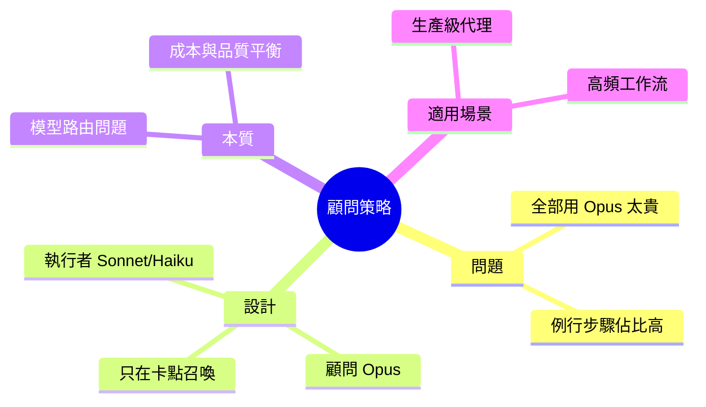

## Stop Spending Opus Tokens on Routine Agent Work

本文提出以 Claude 多模型組合實現成本最優的代理設計方案，稱為「顧問策略」。核心想法是利用 Sonnet 或 Haiku 執行日常任務，僅在面臨複雜決策時調用 Opus。這種設計模式將代理成本最佳化問題轉化為智能路由問題：並非所有工作都需要最高級模型。精妙的任務分配可大幅降低整體 token 消耗。這對構建生產級代理系統特別有指導意義，適用於高頻執行的日常任務，能在維持品質的同時顯著降低運營成本。

### 重點
- Advisor Pattern：Sonnet/Haiku 處理常規任務，Opus 決策複雜問題
- 多模型路由避免高級模型濫用，優化成本效益比
- 適用於生產級代理設計，特別是高頻工作流場景

**原文：** [medium-tag-claude](https://medium.com/illumination/stop-spending-opus-tokens-on-routine-agent-work-f17f7f26a103?source=rss------claude-5)

---

<!-- deep-analysis:begin -->
## 📌 摘要 (TL;DR)

- 文章提出「顧問策略」（advisor strategy）：由 Sonnet 或 Haiku 負責執行工作流程，只有在遇到困難決策時才呼叫 Opus 介入。
- 核心論點是代理（agent）系統不該把每一步都交給最高階模型，否則 token 成本會在大量例行動作上被浪費掉。
- 作者把成本最佳化問題重構為「模型路由」問題：關鍵不在使用哪個模型，而在於何時使用哪個模型。
- 適用對象是需要高頻執行、長時間運行的生產級代理，例如批次工作流、日常資料處理、例行客服流程。
- （說明：原文 body_md 只提供 RSS 摘要片段，以下整理以標題、片段與既有 brief 摘要為依據，未加入未提及之數字或工具名稱。）

## 🎯 核心概念

- **顧問策略**（advisor strategy）：讓較便宜的模型作為執行者，較昂貴的模型只作為遇到卡點時徵詢的「顧問」。
- **代理**（agent）：可自行呼叫工具、進行多步推理並完成任務的 AI 工作流程。
- **模型路由**（model routing）：根據任務難度動態分派給不同模型（Opus、Sonnet、Haiku）以平衡成本與品質。

## 📖 整理分析

### 1. 問題：把 Opus 當預設值的隱性成本
大部分人在建構 Claude 代理時，為了避免品質出問題，會把 Opus 設為預設模型。但代理的運作包含大量例行步驟——檔案讀取、格式整理、條件判斷、工具呼叫參數組裝——這些動作對模型能力要求不高。若全部交給 Opus 處理，token 成本會被這些「不需高智力」的步驟大幅吃掉。

### 2. 解法：顧問策略的分工模型
作者主張的「顧問策略」把代理內部角色拆成兩層：執行者（executor）由 Sonnet 或 Haiku 擔任，負責跑完絕大多數工作流程步驟；顧問（advisor）由 Opus 擔任，僅在碰到真正需要深度推理的決策點（例如策略選擇、模糊情境判讀、衝突化解）時才被召喚。這樣一來，Opus 的使用頻率被壓到最低，但關鍵品質節點仍維持頂規水準。

### 3. 為什麼這是「路由問題」
文章把代理成本最佳化重新定義為智能路由：問題不是「要用哪個模型」，而是「什麼時候切換模型」。這意味著代理設計者需要識別工作流中的決策關卡，並寫出清楚的觸發規則，讓 Sonnet/Haiku 知道何時該把手上的情境交給 Opus。這類設計模式特別適合生產級代理——越高頻執行的系統，節省幅度越明顯。

### 4. 讀者該帶走什麼
把 Opus 視為稀缺資源，而不是預設配置；在代理架構中加入模型分派層，明確區分哪些節點可被便宜模型處理、哪些必須升級。這是一種工程選擇，也是成本結構的重新設計。

## 🧠 Mindmap

<!-- deep-analysis:end -->
### 📄 原文內容

點此展開 / 收合

Claude&#x2019;s advisor strategy lets Sonnet or Haiku execute the workflow while Opus steps in only for hard decisions.

<a href="https://medium.com/illumination/stop-spending-opus-tokens-on-routine-agent-work-f17f7f26a103?source=rss------claude-5">Continue reading on ILLUMINATION »</a>

