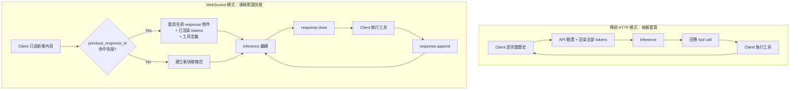
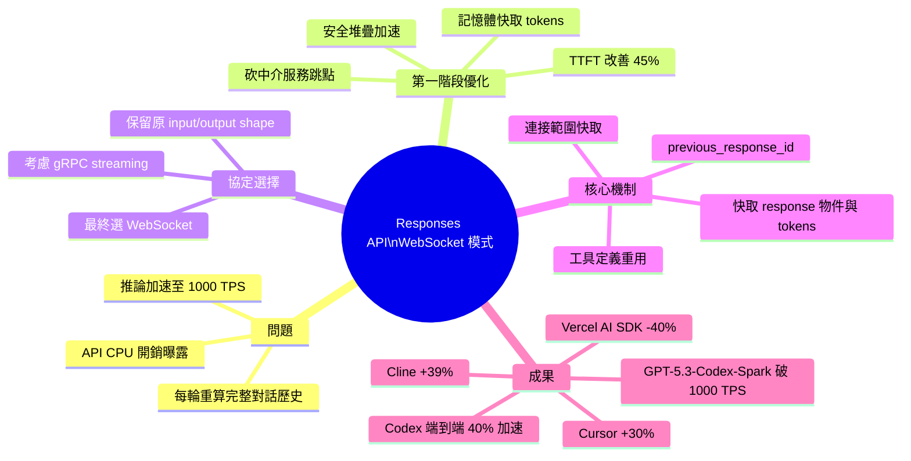

## Speeding up agentic workflows with WebSockets in the Responses API

OpenAI 深度分析 Codex agent 循環如何利用 WebSocket 和連接範圍快取（connection-scoped caching）技術，顯著降低 API 開銷並改善模型延遲。此方案針對代理式工作流的性能優化，通過持久連接和智慧快取策略實現實時性能提升。這一優化模式對構建高頻代理應用具有參考價值，可複用於其他長連接場景。

### 重點
- WebSocket 持久連接減少 API 交握開銷
- 連接範圍快取（connection-scoped caching）改善模型延遲
- Codex agent 循環的實現優化模式

**原文：** [openai-blog](https://openai.com/index/speeding-up-agentic-workflows-with-websockets)

---

<!-- deep-analysis:begin -->
## 📌 摘要 (TL;DR)

- OpenAI 在 Responses API 推出 WebSocket 模式，Codex 的代理式工作流（agentic workflow）端到端延遲降低約 40%
- 搭配 Cerebras 硬體，GPT‑5.3‑Codex‑Spark 從旗艦模型原本的 65 TPS（tokens per second）躍升到超過 1,000 TPS，實際尖峰可達 4,000 TPS
- 關鍵是連接範圍快取（connection-scoped caching）：WebSocket 連線期間把前次回應狀態、已渲染的 tokens、工具定義留在伺服器記憶體，後續請求用 `previous_response_id` 取回
- 2025 年 11 月先做的單請求優化讓 TTFT（time to first token）改善近 45%，但對 1,000 TPS 等級模型仍不夠，才走向持久連線重構
- 實測：Vercel AI SDK 延遲最多減 40%、Cline 多檔案流程快 39%、Cursor 上的 OpenAI 模型最多快 30%

## 🎯 核心概念

- **連接範圍快取** (connection-scoped caching)：在單一 WebSocket 連線期間，把可重用狀態留在伺服器記憶體中，避免每輪請求都重建
- **TTFT** (Time To First Token)：模型回應第一個 token 所需的時間，反映 API「手感」的響應度
- **取樣迴圈** (sampling loop)：模型逐 token 生成並在遇到工具呼叫時暫停的主循環
- **`previous_response_id`**：Responses API 用來把多輪對話串起來的識別符，WebSocket 模式下它會命中記憶體快取
- **Hosted tool call**：由推論服務端直接代呼叫外部服務（例如 web search）的工具模式，OpenAI 把本地工具也套用這個心智模型

## 📖 整理分析

### 1. 瓶頸從 GPU 推論轉移到 API 前處理
過去 LLM 推論在 GPU 上跑是 agent loop 最慢的環節，API 服務（請求驗證、路由、安全分類）的 CPU 開銷被蓋過去看不出來。當 GPT‑5.3‑Codex‑Spark 靠 Cerebras 專用硬體把推論推到 1,000 TPS，使用者必須先等 CPU 處理完 API 請求才用得到 GPU，API 周邊就變成新瓶頸。

### 2. 第一階段：單請求內的三項優化
2025 年 11 月 OpenAI 對 Responses API 開了一輪 performance sprint，主要做三件事：把渲染過的 tokens 與模型設定快取在記憶體，省掉多輪對話裡重複的 tokenization；砍掉中介服務（例如圖像處理解析度）的網路跳點，直接呼叫 inference service；重構安全堆疊讓分類器更快標出問題對話。結果 TTFT 改善約 45%，但仍跟不上新模型速度。

### 3. 結構性問題：每輪都重算完整歷史
更深層的原因是 Codex 每個請求被當成獨立事件，整段對話歷史每輪都要重驗證、重渲染、重算 routing。對話越長，重複工作越貴。解法必須是「只送新增內容，舊狀態在連線期間留在記憶體」。

### 4. 協定選擇：WebSocket 勝出 gRPC
團隊評估過 WebSockets 與 gRPC bidirectional streaming，最後選 WebSockets，因為它是單純的 message transport，使用者不用改 Responses API 的 input/output shape，整合成本最低、也契合既有架構。

### 5. 原型設計：把 agent rollout 當單一長請求
Codex 團隊工程師花一晚做出原型：用 Python `asyncio`，整個 agent rollout 建模成一個 long-running Response。取樣迴圈遇到工具呼叫時 async 暫停，伺服器送出 `response.done` 事件；客戶端跑完工具後回送 `response.append`，把結果塞進 context 後 unblock 取樣迴圈繼續。這等於把本地工具呼叫當成 hosted tool call 處理，只是 remote service 換成 client。這個設計能把 pre-inference 與 post-inference 的前後處理各做一次，不再每輪重跑。

### 6. 正式版：用熟悉的 API 形狀重包
原型雖快但 API 形狀陌生，正式版改回 `response.create` + `previous_response_id`。WebSocket 連線上，伺服器保留一個連線範圍內的記憶體快取，內容包含：前一個 `response` 物件、先前 input/output items、工具定義與 namespaces、已渲染的 tokens 等 sampling artifacts。於是安全分類器與請求驗證只處理新增 input，billing 等 non-blocking 的後處理能跟下一個請求重疊。

### 7. 生產結果：多家客戶同步見效
兩個月 sprint 後開 alpha 給 coding agent startups 整合、灰度放量。正式推出後 Codex 主要流量快速切到 WebSocket，GPT‑5.3‑Codex‑Spark 達到 1,000 TPS 目標並見到 4,000 TPS 尖峰；Vercel AI SDK 延遲最多降 40%、Cline 多檔案工作流快 39%、Cursor 上的 OpenAI 模型最多快 30%。OpenAI 自評這是 Responses API 自 2025 年 3 月推出以來最重要的新能力之一。

## 🧭 流程圖

傳統 HTTP 模式 vs WebSocket 模式的代理迴圈差異：

## 🧠 Mindmap

<!-- deep-analysis:end -->
### 📄 原文內容

點此展開 / 收合

A deep dive into the Codex agent loop, showing how WebSockets and connection-scoped caching reduced API overhead and improved model latency.

