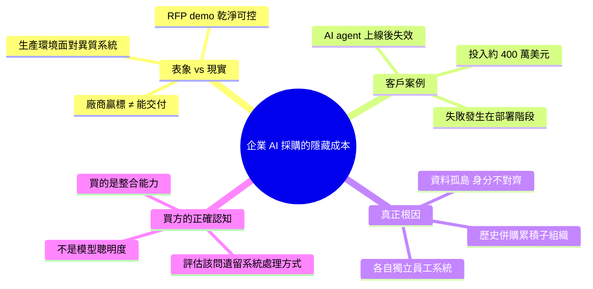

## What You’re Actually Buying When You Buy Enterprise AI

一家客戶花費 400 萬美元得到的教訓揭示企業 AI 採購的隱藏成本：廠商在 RFP 贏得的完美演示與實際部署的複雜性之間存在巨大落差。該客戶的 AI agent 在生產環境「未能如預期運作」，根本原因是企業內部有多個來自歷史併購的子組織，各自擁有獨立的員工系統與資料孤島。文章強調企業 AI 實際採購的不只是技術本身，而是理解與整合複雜組織結構、跨系統資料連結、及現實營運限制的能力。這項洞察指向一個關鍵框架：廠商演示理想化場景，企業成功取決於對遺留系統、組織複雜性及整合工作量的現實評估。

### 重點
- 400 萬美元教訓：廠商 RFP 演示完美 vs 實際部署失敗，因多個獨立 employee 系統與資料孤島
- 企業 AI 採購框架：不是買技術，而是買「理解複雜組織結構、跨系統整合、營運限制」的能力
- 廠商展示理想化案例，忽視遺留系統、舊併購子組織的資料整合成本

**原文：** [medium-tag-ai](https://medium.com/@eranki9.srikanth/what-youre-actually-buying-when-you-buy-enterprise-ai-abc5e0b080eb?source=rss------artificial_intelligence-5)

---

<!-- deep-analysis:begin -->
## 📌 摘要 (TL;DR)

- 一位顧問的客戶花費約 **400 萬美元**導入企業 AI agent，最終在正式生產環境「未能如預期運作」——這筆錢不是 PoC 預算，而是完整採購加實施成本
- 失敗的根因不在模型本身，而在**企業組織結構**：該客戶因歷史併購（M&A）累積出多個子組織，每個子組織都有獨立的員工系統與資料孤島
- RFP 階段的 demo 與實際部署之間存在巨大落差：廠商示範的是理想化、乾淨可控的場景；客戶買單的卻是跨系統整合的複雜度
- 作者給讀者的核心訊息：**企業 AI 採購真正買的，是「進入你的組織、理解遺留結構、並完成整合」的交付能力**，而非模型的聰明程度

## 📖 整理分析

### 1. 400 萬美元買到的教訓

作者開門見山陳述一位客戶投入約 400 萬美元部署企業 AI agent，最終系統在生產環境失敗。金額規模暗示這不是單純的授權費，而是包含諮詢、整合、變更管理在內的完整交付。失敗發生在上線階段，而非 PoC——也就是說，系統在受控環境中曾展示過「可以運作」。

### 2. 為什麼 RFP 贏家進場後就卡住

廠商在 RFP 階段贏得合約，依據的是乾淨、經過篩選的演示資料。一旦切換到真實企業環境，AI agent 面對的是經過多輪併購累積下來的多個子組織，每個子組織都保留著自己的員工資料模型、權限系統、流程定義。廠商在 demo 中從未面對這種異質性——這就是買方與賣方資訊不對稱的第一層。

### 3. 組織複雜性才是真正的技術負債

案例中最關鍵的細節：同一個「員工」概念，在不同子組織有不同的定義——員工 ID 格式、權限欄位、部門歸屬規則都不同。AI agent 必須先解決跨系統的身分對齊與主檔合併，才能開始執行任何有價值的任務。這部分整合工作量在 RFP 文件中通常沒有被揭露，也沒有人在簽約前花錢去盤點。結果就是：簽約金額涵蓋了「AI 能力」，但沒涵蓋「讓 AI 能跑起來所需的前置整合」。

### 4. 企業買 AI，實際在買什麼

作者的核心論點：企業採購 AI 時，真正付錢買的是「有能力進入你的組織、理解你的遺留系統、並完成跨系統整合」的交付能力。模型再好，不會自動解決資料孤島；agent 再聰明，也無法憑空穿越多個身分系統。反過來說，買方在評估廠商時，關鍵問題不該是 benchmark 分數，而是：「你打算如何處理我們內部那 N 個歷史遺留的子系統？」——能具體回答這個問題的廠商，才是真正的交付夥伴。

## 🧠 Mindmap

<!-- deep-analysis:end -->
### 📄 原文內容

點此展開 / 收合

A client of mine spent roughly $4 million learning a lesson worth writing down.

<a href="https://medium.com/@eranki9.srikanth/what-youre-actually-buying-when-you-buy-enterprise-ai-abc5e0b080eb?source=rss------artificial_intelligence-5">Continue reading on Medium »</a>

