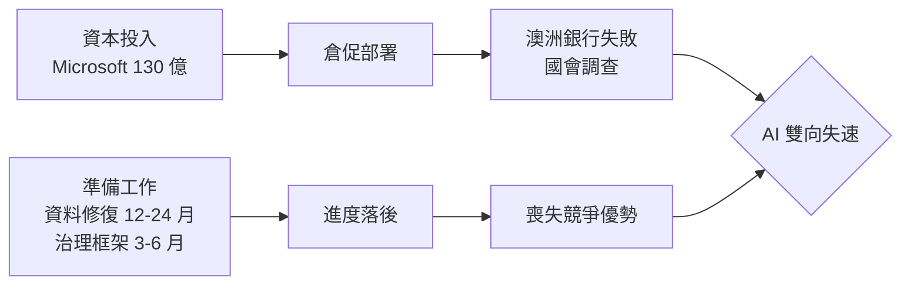
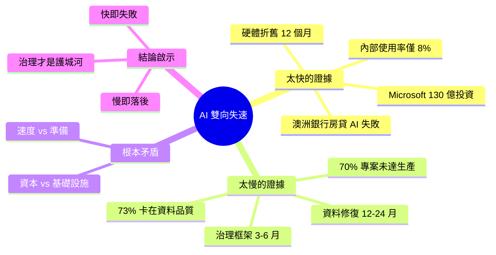

## AI Is Moving Too Fast and Too Slowly at the Same Time.

文章揭露了 AI 部署的根本悖論：資本流動速度快於組織準備速度（「capital 移動快於 infrastructure」）。部署速度過快的證據包括：73% 在 2025 年啟動 AI 專案的組織仍以資料品質為首要障礙；Microsoft 130 億美元 OpenAI 投資僅產生 8% 使用率；澳洲銀行部署房貸 AI 因缺乏詐欺偵測基礎設施而系統性失敗、引發國會調查；硬體折舊週期壓縮至 12 個月。另一側面，企業 AI 專案 70% 未達生產、資料修復需時 12-24 個月、治理框架需時 3-6 個月。文章論點：「無準備的速度造成失敗，無速度的準備喪失競爭優勢」。

### 重點
- 部署太快：73% 組織仍卡在資料品質、Microsoft 130 億 OpenAI 投資僅 8% 使用率、澳洲銀行詐欺失敗、硬體 12 個月折舊
- 進展太慢：70% 企業 AI 專案未達生產、資料修復 12-24 個月、治理框架 3-6 個月
- 核心悖論：速度無準備 → 失敗；準備無速度 → 喪失競爭，需動態平衡而非盲目追逐

**原文：** [medium-tag-ai](https://medium.com/@firalim/ai-is-moving-too-fast-and-too-slowly-at-the-same-time-9ecca4148a3a?source=rss------artificial_intelligence-5)

---

<!-- deep-analysis:begin -->
## 📌 摘要 (TL;DR)

- Medium 作者提出 AI 產業的核心悖論：**資本流動速度遠超組織基礎設施與治理準備速度**
- 「太快」端證據：Microsoft 投入 130 億美元給 OpenAI，內部使用率僅 **8%**；硬體折舊週期壓縮至 **12 個月**
- 澳洲某銀行強推房貸 AI 因缺乏詐欺偵測基礎設施導致系統性失敗，進而引發國會調查
- 「太慢」端證據：**70%** 企業 AI 專案未達生產；資料修復需 **12-24 個月**、治理框架建立需 **3-6 個月**；73% 於 2025 啟動 AI 的組織仍卡在資料品質
- 核心論點：「無準備的速度造成失敗，無速度的準備喪失競爭優勢」——AI 轉型的雙輸困局

## 🎯 核心概念

- **資本—基礎設施落差**（Capital-Infrastructure Gap）：AI 投資速度遠超過組織實際能承接的基礎設施與人才成熟度
- **治理框架**（Governance Framework）：AI 風險管控、稽核與合規制度，建立約需 3-6 個月
- **資料修復**（Data Remediation）：企業資料清理、補齊、標準化作業，約需 12-24 個月

## 📖 整理分析

### 1. 悖論起點：Mastercard 晚餐對話
文章從一段紐約晚餐情境切入：Lauren Slyman 與 Mastercard AI 治理團隊同事在 12 月某晚討論中，歸納出「AI 同時移動太快與太慢」的結論。這個看似矛盾的觀察成為全文的定錨，也為後續所有數據鋪陳提供敘事主軸。

### 2. 「太快」的證據：資本超前組織
作者以 Microsoft 投入 OpenAI 的 130 億美元為例，對比其內部 **8% 使用率**，點出資本投入與實際採用之間的巨大落差。硬體折舊週期壓縮至 12 個月，也讓投資回收壓力陡升。最具代表性的失敗案例是澳洲某銀行部署房貸 AI，因缺乏對應的詐欺偵測基礎設施而出現系統性錯誤，最終被國會介入調查——這不是技術失誤，而是「速度跑在基建前面」的結構性後果。

### 3. 「太慢」的證據：企業仍未準備好
另一側的數據則說明為何企業難以跟上：**70% 企業 AI 專案無法進入生產環境**；資料修復需 12-24 個月，而治理框架建立需 3-6 個月。2025 年啟動 AI 專案的組織中，仍有 **73% 表示資料品質是首要障礙**。換句話說，就算董事會今天拍板投資，技術落地也得等上 1-2 年。

### 4. 悖論的雙輸結構
作者的核心論點是：「無準備的速度造成失敗，無速度的準備喪失競爭優勢」。快——部署失敗、觸發監管、資本蒸發；慢——競爭對手先行、市場份額流失。這是 AI 轉型不能只靠「多投錢」或「多等等」解決的原因，也是為何治理與基建才是真正的護城河。

## 🧭 流程圖

## 🧠 Mindmap

<!-- deep-analysis:end -->
### 📄 原文內容

點此展開 / 收合

In December, over dinner in New York, Lauren Slyman and a colleague from AI governance at Mastercard arrived at a conclusion that was, at&#x2026;

<a href="https://medium.com/@firalim/ai-is-moving-too-fast-and-too-slowly-at-the-same-time-9ecca4148a3a?source=rss------artificial_intelligence-5">Continue reading on Medium »</a>

