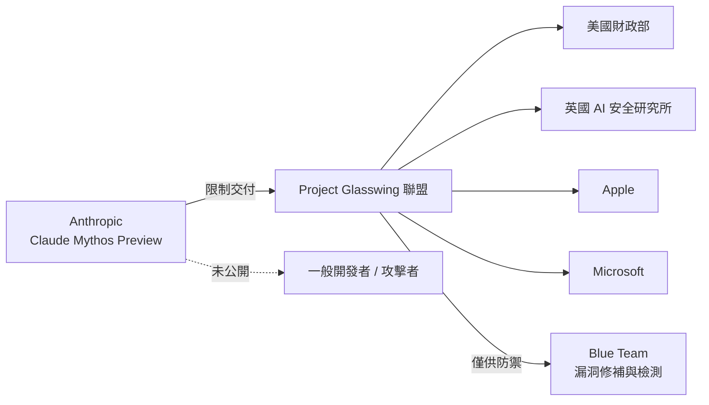
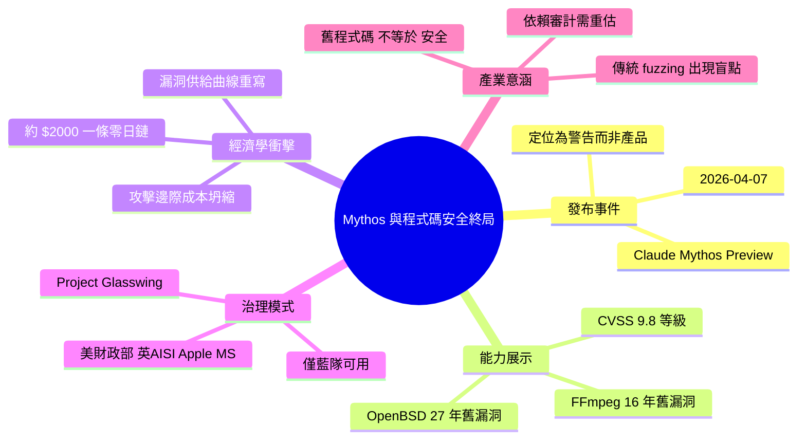

## The Zero-Day Factory: Anthropic’s ‘Mythos’ and the End of Code Security

2026 年 4 月 7 日，Anthropic 發佈 Claude Mythos Preview，一個能深度分析代碼邏輯漏洞的模型。Mythos 在數小時內發現 27 年前的 OpenBSD 關鍵漏洞與 16 年前的 FFmpeg 漏洞，證明傳統審計與自動化 fuzzing 的盲點。該模型被置於「Project Glasswing」（含美國財政部、英國 AI 安全研究所、Apple、Microsoft）的防禦聯盟下，專供藍隊防禦使用。Mythos 分析零日攻擊鏈成本約 $2000 計算資源，識別出的漏洞 CVSS 評分達 9.8 級。

### 重點
- Mythos 可識別長期被忽視的深層邏輯漏洞（27 年 OpenBSD、16 年 FFmpeg 案例）
- 零日攻擊鏈識別成本 $2000 計算資源；CVSS 評分 9.8（Critical）
- 政府-企業聯盟（Project Glasswing）管理，提供免費計算資源給開源專案修補

**原文：** [medium-tag-llm](https://meetcyber.net/the-zero-day-factory-anthropics-mythos-and-the-end-of-code-security-d8e93ed9b20a?source=rss------large_language_models-5)

---

<!-- deep-analysis:begin -->
## 📌 摘要 (TL;DR)

- **2026 年 4 月 7 日**，Anthropic 發佈 **Claude Mythos Preview**，一款專攻程式碼「邏輯漏洞」深度分析的模型，並非泛用對話模型。
- Mythos 在數小時內挖出一個**存在 27 年**的 OpenBSD 關鍵漏洞、以及**存在 16 年**的 FFmpeg 漏洞，直接打臉傳統人工審計與自動化 fuzzing 的既有方法學。
- 分析單一零日攻擊鏈的計算成本約 **$2000**，識別出的漏洞 CVSS 評分達 **9.8**（Critical 等級上限區間）。
- Mythos 未公開發布，而是置於 **Project Glasswing** 聯盟下專供「藍隊／防禦方」使用，成員包含 **美國財政部、英國 AI 安全研究所、Apple、Microsoft**。
- 作者將此視為「包裝成語言模型的警告旗」——AI 能以規模化、低成本產出零日漏洞的門檻，已正式跨過。
- 對開發者與企業的啟示：長年未被發現 ≠ 安全；既有程式碼庫的風險曲線將被重新定價。

## 🎯 核心概念

- **邏輯漏洞（logic vulnerability）**：非記憶體破壞類錯誤，而是程式流程、狀態機、權限判斷中的設計缺陷，傳統 fuzzing 難以觸發。
- **零日漏洞（zero-day）**：尚未被廠商修補、且攻擊者可利用的未知漏洞。
- **CVSS 9.8**：Common Vulnerability Scoring System 最高嚴重度區間，通常意味著可遠端未授權執行、影響機密性／完整性／可用性。
- **Project Glasswing**：本文描述的跨組織防禦聯盟，限制 Mythos 能力僅供防禦側（blue team）使用。
- **Mythos Preview**：Anthropic 此次發布的代號，為「預覽」而非正式 GA（general availability）。

## 📖 整理分析

### 1. 「語言模型」只是包裝

作者開宗明義地指出：Mythos 的發布與其說是新產品上線，不如說是 Anthropic 舉起的一面警告旗。它被**刻意**歸類為語言模型，但實際定位是一個深度程式碼推理引擎。這層語意包裝本身就是訊號——業界尚未準備好面對「AI 化的攻擊面分析能力」成為商業服務的一部分。

### 2. 27 年與 16 年：舊漏洞的啟示

Mythos 發現的兩個標誌性案例——OpenBSD 27 年未被察覺的漏洞、FFmpeg 16 年未被察覺的漏洞——直接挑戰了資安圈「眾目睽睽（many eyes）」的假設。OpenBSD 以嚴謹審計聞名，FFmpeg 則是全球最多 fuzzing 資源投入的開源專案之一。兩者皆淪陷，代表**問題不在於人力多寡，而在於分析方法的維度**。邏輯漏洞需要模型理解跨函式、跨模組的語意推理，這是傳統工具的盲點。

### 3. $2000 / 零日：攻防經濟學的重寫

文中揭露的單位成本——約 $2000 計算資源即可分析出一條零日攻擊鏈——是全文最尖銳的數字。對比地下市場一條 CVSS 9.8 級別的零日可交易數十萬至百萬美元，**攻擊側的邊際成本被壓到近乎消失**。這不只是「AI 能找 bug」的故事，而是漏洞供給曲線即將被 AI 產能拉平。

### 4. Project Glasswing：閘門式治理

Anthropic 選擇不開放 Mythos，而是交付給美國財政部、英國 AI 安全研究所、Apple、Microsoft 組成的聯盟。這個名單組合本身就值得解讀：國家級金融監管、國家級 AI 安全機構、兩家控制全球最大終端使用者作業系統的公司。作者將此視為一種「防禦先手」的治理模式——在能力外溢到攻擊方之前，先把檢測能力分發給最關鍵的防禦節點。

### 5. 對程式碼安全的長期意涵

作者的結論接近悲觀：如果低成本、規模化的零日發現能力已經存在，那麼任何長年服役的程式碼庫都必須重新被視為「尚未被檢查過」。這意味著開發團隊對「legacy stable code」的風險假設要徹底重寫，SBOM（軟體物料清單）、依賴審計、乃至於語言選擇，都將受到重新評估壓力。

## 🧭 治理結構圖

## 🧠 Mindmap

<!-- deep-analysis:end -->
### 📄 原文內容

點此展開 / 收合

On April 7th, 2026, there was a remarkable shift within the digital world. Anthropic released a warning flag disguised as a language model&#x2026;

<a href="https://meetcyber.net/the-zero-day-factory-anthropics-mythos-and-the-end-of-code-security-d8e93ed9b20a?source=rss------large_language_models-5">Continue reading on MeetCyber »</a>

