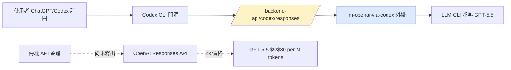
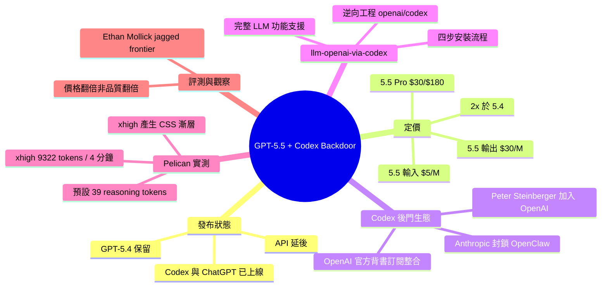

## A pelican for GPT-5.5 via the semi-official Codex backdoor API

OpenAI 發布 GPT-5.5，已在 Codex 及付費 ChatGPT 上線，API 近期推出。GPT-5.5 定價為 GPT-5.4 的 2 倍：輸入 $5/M tokens（vs 5.4 的 $2.5）、輸出 $30/M（vs $15），GPT-5.5 Pro 更高達 $30 輸入 / $180 輸出。Simon Willison 透過逆向工程 OpenAI Codex 開源專案，建立 llm-openai-via-codex 外掛，利用既有訂閱存取 GPT-5.5。關鍵發現：reasoning_effort=xhigh 參數能大幅提升品質，SVG 生成從預設 39 推理 tokens / 4 秒增至 9,322 tokens / 4 分鐘，產生梯度渲染等複雜視覺元素。成本與品質提升的權衡需個別評估。

### 重點
- GPT-5.5 定價翻倍（$5/$30 vs $2.5/$15），Pro 版本達 $30/$180，成本決策門檻升高
- reasoning_effort=xhigh 增加 100+ 倍推理 tokens，大幅改善複雜視覺任務品質但延遲增加
- Codex 訂閱存取機制啟用第三方工具（如 LLM 外掛）整合，打破 API 獨占

**原文：** [simon-willison](https://simonwillison.net/2026/Apr/23/gpt-5-5/#atom-everything)

---

<!-- deep-analysis:begin -->
## 📌 摘要 (TL;DR)

- **GPT-5.5 發布**：已在 OpenAI Codex 與付費 ChatGPT 上線，API 因安全性考量延後釋出。
- **定價翻倍**：GPT-5.5 API 將是 GPT-5.4 的 2 倍價格（輸入 $5/M、輸出 $30/M tokens），GPT-5.5 Pro 更達 $30/$180。
- **Codex 後門 API**：OpenAI 公開背書第三方工具透過 Codex CLI 的開源機制使用既有訂閱，與 Anthropic 封鎖 OpenClaw 形成對比。
- **llm-openai-via-codex 外掛**：Simon Willison 讓 Claude Code 逆向工程 openai/codex repo，寫出能用現有 Codex 訂閱跑 LLM prompt 的外掛。
- **reasoning_effort=xhigh 差異巨大**：在 SVG pelican benchmark 中，預設僅用 39 個 reasoning tokens、xhigh 用 9,322 tokens 並耗時近 4 分鐘，成品明顯更佳（含 CSS 漸層）。
- **市場定位**：GPT-5.4 保留供應，作者類比為「GPT-5.4 之於 GPT-5.5，如 Claude Sonnet 之於 Claude Opus」。

## 🎯 核心概念

- **Codex 後門 API（Codex backdoor API）**：指透過 OpenAI 開源的 Codex CLI 所使用的 `/backend-api/codex/responses` 端點，讓第三方工具能接上使用者的 ChatGPT/Codex 訂閱，而非走標準 API 計費。
- **reasoning_effort**：OpenAI 推理模型的參數，控制模型花多少 reasoning tokens 思考；`xhigh` 為最高等級。
- **pelican benchmark**：Simon Willison 用於比較模型視覺推理能力的慣用測試，要求模型輸出一張「鵜鶘騎腳踏車」的 SVG。
- **Jagged frontier**：Ethan Mollick 用語，形容 AI 能力分布不均——某些任務極強、某些任務意外地弱，難以預測。

## 📖 整理分析

### 1. GPT-5.5 的發布與價格策略

OpenAI 發布 GPT-5.5，但刻意跳過 API 釋出，官方說法是「API 部署需要不同的安全保障」，將與合作夥伴協作後再推出。定價上，API 上線後輸入將為 $5/M tokens、輸出 $30/M，等於 GPT-5.4（$2.5/$15）的兩倍；GPT-5.5 Pro 更達輸入 $30/M、輸出 $180/M。GPT-5.4 會繼續存在，Simon 將此定位類比為「GPT-5.4 之於 GPT-5.5，如 Claude Sonnet 之於 Claude Opus」——半價版本作為日常主力。

### 2. Codex 後門 API 的生態張力

Anthropic 近期封鎖了 OpenClaw 透過訂閱機制整合 Claude 的做法，引發爭議。OpenAI 則反向操作：最近聘用 OpenClaw 創辦人 Peter Steinberger，並由 Romain Huet 在 3 月 30 日公開宣示——Codex CLI 與 Codex app server 皆為開源，歡迎 JetBrains、Xcode、OpenCode、Pi、Claude Code 等工具整合訂閱。Peter Steinberger 也向 Jeremy Howard 確認「OpenAI sub is officially supported」。這等於默許任何人透過 `/backend-api/codex/responses` 端點掛接既有訂閱。

### 3. llm-openai-via-codex 外掛實作

Simon Willison 讓 Claude Code 逆向工程 `openai/codex` repo，搞清楚 authentication tokens 如何儲存，打造出 `llm-openai-via-codex` 外掛。使用流程四步：安裝 Codex CLI 並登入訂閱、`uv tool install llm`、`llm install llm-openai-via-codex`、最後 `llm -m openai-codex/gpt-5.5 '...'`。LLM 既有功能全數可用——`-a` 附加圖片、`llm chat` 開啟對話、`llm logs` 查記錄、`llm --tool` 啟用 tool calling。（作者事後笑稱，應該用 GPT-5.5 自己寫這個外掛才更諷刺。）

### 4. Pelican Benchmark：reasoning_effort 的放大效果

預設參數下生成的 SVG 鵜鶘略顯扭曲——嘴喙還行、但身體比例怪、腳勉強伸到踏板、腳踏車車架不對稱。

加上 `-o reasoning_effort xhigh` 後，耗時從秒級暴增到近 4 分鐘，但成品明顯提升：鵜鶘有了漸層、身體結構合理、腳踏車接近正確形狀（僅多了一根橫桿）。

關鍵數據：**預設版用了 39 reasoning tokens，xhigh 版用了 9,322 tokens**——差距 239 倍。比對兩份 SVG 原始碼，xhigh 採取截然不同、更依賴 CSS 的作法（因此能生出漸層）。這顯示 reasoning_effort 不只是量變，而是讓模型選擇完全不同的解題路徑。

### 5. 獨立評測：jagged frontier 未消失

Ethan Mollick 在 One Useful Thing 發表的詳細評測將 GPT-5.5 與 GPT-5.5 Pro 放入多種挑戰，結論是「jagged frontier 依然存在」——GPT-5.5 在某些任務表現極佳、某些任務仍有意外弱點，且難以事先預測。這提醒使用者：翻倍的價格並不自動對應翻倍的價值，需針對具體工作流評估。

## 🧭 訂閱 vs API 接入路徑對比

## 🧠 Mindmap

<!-- deep-analysis:end -->
### 📄 原文內容

點此展開 / 收合

<a href="https://openai.com/index/introducing-gpt-5-5/">GPT-5.5 is out</a>. It's available in OpenAI Codex and is rolling out to paid ChatGPT subscribers. I've had some preview access and found it to be a fast, effective and highly capable model. As is usually the case these days, it's hard to put into words what's good about it - I ask it to build things and it builds exactly what I ask for!

There's one notable omission from today's release - the API:

<blockquote>

API deployments require different safeguards and we are working closely with partners and customers on the safety and security requirements for serving it at scale. We'll bring GPT‑5.5 and GPT‑5.5 Pro to the API very soon.

</blockquote>

When I run my <a href="https://simonwillison.net/tags/pelican-riding-a-bicycle/">pelican benchmark</a> I always prefer to use an API, to avoid hidden system prompts in ChatGPT or other agent harnesses from impacting the results.

<h4 id="the-openclaw-backdoor">The OpenClaw backdoor</h4>

One of the ongoing tension points in the AI world over the past few months has concerned how agent harnesses like OpenClaw and Pi interact with the APIs provided by the big providers.

Both OpenAI and Anthropic offer popular monthly subscriptions which provide access to their models at a significant discount to their raw API.

OpenClaw integrated directly with this mechanism, and was then <a href="https://www.theverge.com/ai-artificial-intelligence/907074/anthropic-openclaw-claude-subscription-ban">blocked from doing so</a> by Anthropic. This kicked off a whole thing. OpenAI - who recently hired OpenClaw creator Peter Steinberger - saw an opportunity for an easy karma win and announced that OpenClaw was welcome to continue integrating with OpenAI's subscriptions via the same mechanism used by their (open source) Codex CLI tool.

Does this mean <em>anyone</em> can write code that integrates with OpenAI's Codex-specific APIs to hook into those existing subscriptions?

The other day <a href="https://twitter.com/jeremyphoward/status/2046537816834965714">Jeremy Howard asked</a>:

<blockquote>

Anyone know whether OpenAI officially supports the use of the <code>/backend-api/codex/responses</code> endpoint that Pi and Opencode (IIUC) uses?

</blockquote>

It turned out that on March 30th OpenAI's Romain Huet <a href="https://twitter.com/romainhuet/status/2038699202834841962">had tweeted</a>:

<blockquote>

We want people to be able to use Codex, and their ChatGPT subscription, wherever they like! That means in the app, in the terminal, but also in JetBrains, Xcode, OpenCode, Pi, and now Claude Code.

That’s why Codex CLI and Codex app server are open source too! 🙂

</blockquote>

And Peter Steinberger <a href="https://twitter.com/steipete/status/2046775849769148838">replied to Jeremy</a> that:

<blockquote>

OpenAI sub is officially supported.

</blockquote>
<h4 id="llm-openai-via-codex">llm-openai-via-codex</h4>

So... I had Claude Code reverse-engineer the <a href="https://github.com/openai/codex">openai/codex</a> repo, figure out how authentication tokens were stored and build me <a href="https://github.com/simonw/llm-openai-via-codex">llm-openai-via-codex</a>, a new plugin for <a href="https://llm.datasette.io/">LLM</a> which picks up your existing Codex subscription and uses it to run prompts!

(With hindsight I wish I'd used GPT-5.4 or the GPT-5.5 preview, it would have been funnier. I genuinely considered rewriting the project from scratch using Codex and GPT-5.5 for the sake of the joke, but decided not to spend any more time on this!)

Here's how to use it:

<ol>
<li>Install Codex CLI, buy an OpenAI plan, login to Codex</li>
<li>Install LLM: <code>uv tool install llm</code>
</li>
<li>Install the new plugin: <code>llm install llm-openai-via-codex</code>
</li>
<li>Start prompting: <code>llm -m openai-codex/gpt-5.5 'Your prompt goes here'</code>
</li>
</ol>

All existing LLM features should also work - use <code>-a filepath.jpg/URL</code> to attach an image, <code>llm chat -m openai-codex/gpt-5.5</code> to start an ongoing chat, <code>llm logs</code> to view logged conversations and <code>llm --tool ...</code> to <a href="https://llm.datasette.io/en/stable/tools.html">try it out with tool support</a>.

<h4 id="and-some-pelicans">And some pelicans</h4>

Let's generate a pelican!

<pre>llm install llm-openai-via-codex
llm -m openai-codex/gpt-5.5 'Generate an SVG of a pelican riding a bicycle'</pre>

Here's <a href="https://gist.github.com/simonw/edda1d98f7ba07fd95eeff473cb16634">what I got back</a>:

I've seen better <a href="https://simonwillison.net/2026/Mar/17/mini-and-nano/#pelicans">from GPT-5.4</a>, so I tagged on <code>-o reasoning_effort xhigh</code> and <a href="https://gist.github.com/simonw/a6168e4165a258e4d664aeae8e602cc5">tried again</a>:

That one took almost four minutes to generate, but I think it's a much better effort.

If you compare the SVG code (<a href="https://gist.github.com/simonw/edda1d98f7ba07fd95eeff473cb16634#response">default</a>, <a href="https://gist.github.com/simonw/a6168e4165a258e4d664aeae8e602cc5#response">xhigh</a>) the <code>xhigh</code> one took a very different approach, which is much more CSS-heavy - as demonstrated by those gradients. <code>xhigh</code> used 9,322 reasoning tokens where the default used just 39.

<h4 id="a-few-more-notes-on-gpt-5-5">A few more notes on GPT-5.5</h4>

One of the most notable things about GPT-5.5 is the pricing. Once it goes live in the API it's <a href="https://openai.com/index/introducing-gpt-5-5/#availability-and-pricing">going to be priced</a> at <em>twice</em> the cost of GPT-5.4 - $5 per 1M input tokens and $30 per 1M output tokens, where 5.4 is $2.5 and $15.

GPT-5.5 Pro will be even more: $30 per 1M input tokens and $180 per 1M output tokens.

GPT-5.4 will remain available. At half the price of 5.5 this feels like 5.4 is to 5.5 as Claude Sonnet is to Claude Opus.

Ethan Mollick has a <a href="https://www.oneusefulthing.org/p/sign-of-the-future-gpt-55">detailed review of GPT-5.5</a> where he put it (and GPT-5.5 Pro) through an array of interesting challenges. His verdict: the jagged frontier continues to hold, with GPT-5.5 excellent at some things and challenged by others in a way that remains difficult to predict.

    
        
Tags: <a href="https://simonwillison.net/tags/ai">ai</a>, <a href="https://simonwillison.net/tags/openai">openai</a>, <a href="https://simonwillison.net/tags/generative-ai">generative-ai</a>, <a href="https://simonwillison.net/tags/chatgpt">chatgpt</a>, <a href="https://simonwillison.net/tags/llms">llms</a>, <a href="https://simonwillison.net/tags/llm">llm</a>, <a href="https://simonwillison.net/tags/llm-pricing">llm-pricing</a>, <a href="https://simonwillison.net/tags/pelican-riding-a-bicycle">pelican-riding-a-bicycle</a>, <a href="https://simonwillison.net/tags/llm-reasoning">llm-reasoning</a>, <a href="https://simonwillison.net/tags/llm-release">llm-release</a>, <a href="https://simonwillison.net/tags/codex-cli">codex-cli</a>, <a href="https://simonwillison.net/tags/gpt">gpt</a>

