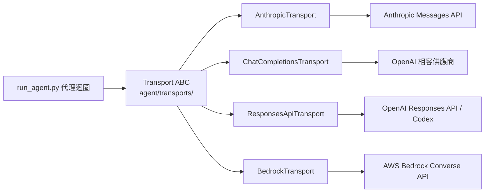
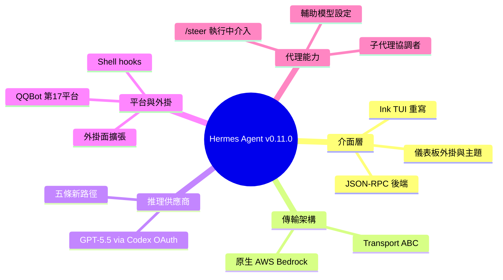

## Hermes Agent v0.11.0 (2026.4.23)

Hermes Agent v0.11.0 The Interface Release（1,556 commits、761 merged PRs、224,174 insertions）進行兩大架構升級。首先是 React/Ink TUI 完整重寫（Python JSON-RPC backend），實現 sticky composer、live streaming、status bar、LaTeX rendering。其次是 Transport ABC 層將 format conversion 和 HTTP transport 抽象化，支援 AnthropicTransport、ChatCompletionsTransport、ResponsesApiTransport、BedrockTransport，實現真正的多提供商互操作。推理提供商擴展 5 條新路徑：NVIDIA NIM、Arcee AI、Step Plan、Google Gemini OAuth、Vercel ai-gateway。新增 QQBot 第 17 平台、GPT-5.5 via Codex OAuth、/steer 指令、webhook direct-delivery、plugin surface expansion。

### 重點
- Transport ABC 層解偶：format conversion 和 HTTP 分離，讓 Bedrock/Anthropic/OpenAI 各自擁有格式轉換邏輯，高度可擴展
- React/Ink TUI 完整重寫：sticky composer + live streaming + status bar 提升互動體驗
- 5 個新推理路徑 + plugin surface 擴展（slash commands/tool dispatch/result transform）支援第三方快速集成

**原文：** [hermes-agent-releases](https://github.com/NousResearch/hermes-agent/releases/tag/v2026.4.23)

---

<!-- deep-analysis:begin -->
## 📌 摘要 (TL;DR)

- Hermes Agent 於 2026 年 4 月 23 日發布 v0.11.0（版本號 v2026.4.23），代號「The Interface release」；自 v0.9.0 起累積 1,556 次 commit、761 個合併 PR、1,314 個檔案變動、224,174 行新增、29 位社群貢獻者（含共同作者共 290 位）。
- 互動式 CLI 以 React/Ink 完整重寫，`hermes --tui` 改用 Python JSON-RPC 後端（tui_gateway），新增固定輸入框、即時串流、狀態列等；TUI 相關提交約 310 次。
- 新增傳輸層抽象（Transport ABC），把格式轉換與 HTTP 傳輸從 `run_agent.py` 抽離成可插拔的 `agent/transports/`，並在其上實作原生 AWS Bedrock 支援。
- 一次擴增五條推理路徑（NVIDIA NIM、Arcee AI、Step Plan、Gemini CLI OAuth、Vercel ai-gateway），並透過 Codex OAuth 接入 OpenAI GPT-5.5。
- 新增 QQBot 成為第 17 個支援的訊息平台；外掛系統大幅擴張，並加入 `/steer` 執行中介入指令。
- 本版也併入 v0.10.0 原本延後的所有重點（v0.10.0 只出了 Nous Tool Gateway），等於涵蓋整個技術堆疊約兩週的工作量。

## 🎯 核心概念

- **傳輸層抽象基底類別**（Transport ABC）：把不同供應商的 API 格式轉換與 HTTP 傳輸抽象成可插拔元件的一層。
- **Converse API**：AWS Bedrock 的統一對話 API，Hermes 用它實作原生 Bedrock 傳輸。
- **Codex OAuth**：透過 ChatGPT 的 Codex 授權登入 OpenAI 模型的管道，本版用來接 GPT-5.5。
- **JSON-RPC**：新 TUI 前端與 Python 後端（tui_gateway）之間的遠端程序呼叫協定。
- **OSC-52**：終端機跳脫序列，讓 TUI 串流時能把內容寫入系統剪貼簿。

## 📖 整理分析

### 1. Ink TUI 完整重寫
`hermes --tui` 從原本的互動式 CLI 改為 React/Ink 完整重寫，前端透過 Python JSON-RPC 後端（tui_gateway）溝通。新介面帶來固定式輸入框（sticky composer）、即時串流並支援 OSC-52 剪貼簿、穩定的選單按鍵、含每回合碼錶與 git 分支的狀態列、`/clear` 二次確認、淺色主題預設，以及子代理（subagent）生成的可觀測性覆蓋層。光是 `ui-tui/` 與 `tui_gateway/` 就有約 310 次提交，由 @OutThisLife 與 Teknium 主導。

### 2. Transport 抽象層與原生 Bedrock
本版把格式轉換與 HTTP 傳輸從 `run_agent.py` 抽離，獨立成可插拔的 `agent/transports/` 層（#13347）。AnthropicTransport、ChatCompletionsTransport、ResponsesApiTransport、BedrockTransport 各自負責自己的格式轉換與 API 形態。建立在這層抽象之上，Hermes 透過 AWS Bedrock 的 Converse API 提供原生 Bedrock 支援（#10549、#13814），讓多供應商真正能互通。

### 3. 五條新推理路徑與 GPT-5.5
一次新增五條推理供應商路徑：原生 NVIDIA NIM（#11774）、Arcee AI（#9276）、Step Plan（#13893）、Google Gemini CLI OAuth（#11270），以及帶定價與動態探索的 Vercel ai-gateway（#13223）。Gemini 另改走原生 AI Studio API 以提升效能（#12674）。OpenAI 新的 GPT-5.5 推理模型則透過 ChatGPT 的 Codex OAuth 接入，並把即時模型探索接進模型選擇器，讓新模型免更新型錄即可出現（#14720）。模型型錄也新增 Kimi K2.6、Xiaomi MiMo v2.5-pro、Claude Opus 4.7 等。

### 4. 外掛面擴張與執行中介入
外掛現在可註冊斜線指令（`register_command`）、直接派發工具（`dispatch_tool`）、從 hook 否決工具執行（`pre_tool_call` 可 veto）、改寫工具結果（`transform_tool_result`）與終端輸出（`transform_terminal_output`），還能提供 image_gen 後端與自訂儀表板分頁。新指令 `/steer <prompt>` 可在代理執行中注入提示，代理會在下一次工具呼叫後看到，不中斷該回合也不破壞 prompt cache（#12116）。另可用 shell 腳本直接掛上生命週期 hook，免寫 Python 外掛（#13296）。

### 5. 子代理委派與輔助模型
子代理新增明確的協調者（orchestrator）角色，可生成自己的工作者，並有可設定的 `max_spawn_depth`（預設為扁平不展開）；並行的同層子代理透過檔案協調層共享檔案系統狀態，避免互相覆寫編輯（#13691、#13718）。`hermes model` 新增「Configure auxiliary models」畫面，可針對壓縮、視覺、session 搜尋、標題生成等子任務逐項覆寫；auto 路由現在對所有使用者都預設改用主模型處理側任務（先前聚合器使用者會被默默導向便宜的供應商預設）（#11891、#11900）。

## 🧭 架構圖

傳輸層抽象把代理迴圈與各家供應商 API 解耦：

## 🧠 Mindmap

<!-- deep-analysis:end -->
### 📄 原文內容

點此展開 / 收合

Hermes Agent v0.11.0 (v2026.4.23) 
 Release Date: April 23, 2026 
 Since v0.9.0: 1,556 commits · 761 merged PRs · 1,314 files changed · 224,174 insertions · 29 community contributors (290 including co-authors) 
 
 The Interface release — a full React/Ink rewrite of the interactive CLI, a pluggable transport architecture underneath every provider, native AWS Bedrock support, five new inference paths, a 17th messaging platform (QQBot), a dramatically expanded plugin surface, and GPT-5.5 via Codex OAuth. 
 
 This release also folds in all the highlights deferred from v0.10.0 (which shipped only the Nous Tool Gateway) — so it covers roughly two weeks of work across the whole stack. 
 
 ✨ Highlights 
 
 
 New Ink-based TUI — hermes --tui is now a full React/Ink rewrite of the interactive CLI, with a Python JSON-RPC backend ( tui_gateway ). Sticky composer, live streaming with OSC-52 clipboard support, stable picker keys, status bar with per-turn stopwatch and git branch, /clear confirm, light-theme preset, and a subagent spawn observability overlay. ~310 commits to ui-tui/ + tui_gateway/ . ( @OutThisLife + Teknium) 
 
 
 Transport ABC + Native AWS Bedrock — Format conversion and HTTP transport were extracted from run_agent.py into a pluggable agent/transports/ layer. AnthropicTransport , ChatCompletionsTransport , ResponsesApiTransport , and BedrockTransport each own their own format conversion and API shape. Native AWS Bedrock support via the Converse API ships on top of the new abstraction. ( #10549 , #13347 , #13366 , #13430 , #13805 , #13814 — @kshitijk4poor + Teknium) 
 
 
 Five new inference paths — Native NVIDIA NIM ( #11774 ), Arcee AI ( #9276 ), Step Plan ( #13893 ), Google Gemini CLI OAuth ( #11270 ), and Vercel ai-gateway with pricing + dynamic discovery ( #13223 — @jerilynzheng ). Plus Gemini routed through the native AI Studio API for better performance ( #12674 ). 
 
 
 GPT-5.5 over Codex OAuth — OpenAI's new GPT-5.5 reasoning model is now available through your ChatGPT Codex OAuth, with live model discovery wired into the model picker so new OpenAI releases show up without catalog updates. ( #14720 ) 
 
 
 QQBot — 17th supported platform — Native QQBot adapter via QQ Official API v2, with QR scan-to-configure setup wizard, streaming cursor, emoji reactions, and DM/group policy gating that matches WeCom/Weixin parity. ( #9364 , #11831 ) 
 
 
 Plugin surface expanded — Plugins can now register slash commands ( register_command ), dispatch tools directly ( dispatch_tool ), block tool execution from hooks ( pre_tool_call can veto), rewrite tool results ( transform_tool_result ), transform terminal output ( transform_terminal_output ), ship image_gen backends, and add custom dashboard tabs. The bundled disk-cleanup plugin is opt-in by default as a reference implementation. ( #9377 , #10626 , #10763 , #10951 , #12929 , #12944 , #12972 , #13799 , #14175 ) 
 
 
 /steer — mid-run agent nudges — /steer &lt;prompt&gt; injects a note that the running agent sees after its next tool call, without interrupting the turn or breaking prompt cache. For when you want to course-correct an agent in-flight. ( #12116 ) 
 
 
 Shell hooks — Wire any shell script as a Hermes lifecycle hook (pre_tool_call, post_tool_call, on_session_start, etc.) without writing a Python plugin. ( #13296 ) 
 
 
 Webhook direct-delivery mode — Webhook subscriptions can now forward payloads straight to a platform chat without going through the agent — zero-LLM push notifications for alerting, uptime checks, and event streams. ( #12473 ) 
 
 
 Smarter delegation — Subagents now have an explicit orchestrator role that can spawn their own workers, with configurable max_spawn_depth (default flat). Concurrent sibling subagents share filesystem state through a file-coordination layer so they don't clobber each other's edits. ( #13691 , #13718 ) 
 
 
 Auxiliary models — configurable UI + main-model-first — hermes model has a dedicated "Configure auxiliary models" screen for per-task overrides (compression, vision, session_search, title_generation). auto routing now defaults to the main model for side tasks across all users (previously aggregator users were silently routed to a cheap provider-side default). ( #11891 , #11900 ) 
 
 
 Dashboard plugin system + live theme switching — The web dashboard is now extensible. Third-party plugins can add custom tabs, widgets, and views without forking. Paired with a live-switching theme system — themes now control colors, fonts, layout, and density — so users can hot-swap the dashboard look without a reload. Same theming discipline the CLI has, now on the web. ( #10951 , #10687 , #14725 ) 
 
 
 Dashboard polish — i18n (English + Chinese), react-router sidebar layout, mobile-responsive, Vercel deployment, real per-session API call tracking, and one-click update + gateway restart buttons. ( #9228 , #9370 , #9453 , #10686 , #13526 , #14004 — @austinpickett + @DeployFaith + Teknium) 
 
 
 
 🏗️ Core Agent &amp; Architecture 
 Transport Layer (NEW) 
 
 Transport ABC abstracts format conversion and HTTP transport from run_agent.py into agent/transports/ ( #13347 ) 
 AnthropicTransport — Anthropic Messages API path ( #13366 , @kshitijk4poor ) 
 ChatCompletionsTransport — default path for OpenAI-compatible providers ( #13805 ) 
 ResponsesApiTransport — OpenAI Responses API + Codex build_kwargs wiring ( #13430 , @kshitijk4poor ) 
 BedrockTransport — AWS Bedrock Converse API transport ( #13814 ) 
 
 Provider &amp; Model Support 
 
 Native AWS Bedrock provider via Converse API ( #10549 ) 
 NVIDIA NIM native provider (salvage of #11703 ) ( #11774 ) 
 Arcee AI direct provider ( #9276 ) 
 Step Plan provider (salvage #6005 ) ( #13893 , @kshitijk4poor ) 
 Google Gemini CLI OAuth inference provider ( #11270 ) 
 Vercel ai-gateway with pricing, attribution, and dynamic discovery ( #13223 , @jerilynzheng ) 
 GPT-5.5 over Codex OAuth with live model discovery in the picker ( #14720 ) 
 Gemini routed through native AI Studio API ( #12674 ) 
 xAI Grok upgraded to Responses API ( #10783 ) 
 Ollama improvements — Cloud provider support, GLM continuation, think=false control, surrogate sanitization, /v1 hint ( #10782 ) 
 Kimi K2.6 across OpenRouter, Nous Portal, native Kimi, and HuggingFace ( #13148 , #13152 , #13169 ) 
 Kimi K2.5 promoted to first position in all model suggestion lists ( #11745 , @kshitijk4poor ) 
 Xiaomi MiMo v2.5-pro + v2.5 on OpenRouter, Nous Portal, and native ( #14184 , #14635 , @kshitijk4poor ) 
 GLM-5V-Turbo for coding plan ( #9907 ) 
 Claude Opus 4.7 in Nous Portal catalog ( #11398 ) 
 OpenRouter elephant-alpha in curated lists ( #9378 ) 
 OpenCode-Go — Kimi K2.6 and Qwen3.5/3.6 Plus in curated catalog ( #13429 ) 
 minimax/minimax-m2.5:free in OpenRouter catalog ( #13836 ) 
 /model merges models.dev entries for lesser-loved providers ( #14221 ) 
 Per-provider + per-model request_timeout_seconds config ( #12652 ) 
 Configurable API retry count via agent.api_max_retries ( #14730 ) 
 ctx_size context length key for Lemonade server (salvage #8536 ) ( #14215 ) 
 Custom provider display name prompt ( #9420 ) 
 Recommendation badges on tool provider selection ( #9929 ) 
 Fix: correct GPT-5 family context lengths in fallback defaults ( #9309 ) 
 Fix: clamp minimal reasoning effort to low on Responses API ( #9429 ) 
 Fix: strip reasoning item IDs from Responses API input when store=False ( #10217 ) 
 Fix: OpenViking correct account default + commit session on /new and compress ( #10463 ) 
 Fix: Kimi /coding thinking block survival + empty reasoning_content + block ordering (multiple PRs) 
 Fix: don't send Anthropic thinking to api.kimi.com/coding ( #13826 ) 
 Fix: send max_tokens , reasoning_effort , and thinking for Kimi/Moonshot 
 Fix: stream reasoning content through OpenAI-compatible providers that emit it 
 
 Agent Loop &amp; Conversation 
 
 /steer &lt;prompt&gt; — mid-run agent nudges after next tool call ( #12116 ) 
 Orchestrator role + configurable spawn depth for delegate_task (default flat) ( #13691 ) 
 Cross-agent file state coordination for concurrent subagents ( #13718 ) 
 Compressor smart collapse, dedup, anti-thrashing , template upgrade, hardening ( #10088 ) 
 Compression summaries respect the conversation's language ( #12556 ) 
 Compression model falls back to main model on permanent 503/404 ( #10093 ) 
 Auto-continue interrupted agent work after gateway restart ( #9934 ) 
 Activity heartbeats prevent false gateway inactivity timeouts ( #10501 ) 
 Auxiliary models UI — dedicated screen for per-task overrides ( #11891 ) 
 Auxiliary auto routing defaults to main model for all users ( #11900 ) 
 PLATFORM_HINTS for Matrix, Mattermost, Feishu ( #14428 , @alt-glitch ) 
 Fix: reset retry counters after compression; stop poisoning conversation history ( #10055 ) 
 Fix: break compression-exhaustion infinite loop and auto-reset session ( #10063 ) 
 Fix: stale agent timeout, uv venv detection, empty response after tools ( #10065 ) 
 Fix: prevent premature loop exit when weak models return empty after substantive tool calls ( #10472 ) 
 Fix: preserve pre-start terminal interrupts ( #10504 ) 
 Fix: improve interrupt responsiveness during concurrent tool execution ( #10935 ) 
 Fix: word-wrap spinner, interruptable agent join, and delegate_task interrupt ( #10940 ) 
 Fix: /stop no longer resets the session ( #9224 ) 
 Fix: honor interrupts during MCP tool waits ( #9382 , @helix4u ) 
 Fix: break stuck session resume loops after repeated restarts ( #9941 ) 
 Fix: empty response nudge crash + placeholder leak to cron targets ( #11021 ) 
 Fix: streaming cursor sanitization to prevent message truncation (multiple PRs) 
 Fix: resolve context_length for plugin context engines ( #9238 ) 
 
 Session &amp; Memory 
 
 Auto-prune old sessions + VACUUM state.db at startup ( #13861 ) 
 Honcho overhaul — context injection, 5-tool surface, cost safety, session isolation ( #10619 ) 
 Hindsight richer session-scoped retain metadata (salvage of #6290 ) ( #13987 ) 
 Fix: deduplicate memory provider tools to prevent 400 on strict providers ( #10511 ) 
 Fix: discover user-installed memory providers from $HERMES_HOME/plugins/ ( #10529 ) 
 Fix: add on_memory_write bridge to sequential tool execution path ( #10507 ) 
 Fix: preserve session_id across previous_response_id chains in /v1/responses ( #10059 ) 
 
 
 🖥️ New Ink-based TUI 
 A full React/Ink rewrite of the interactive CLI — invoked via hermes --tui or HERMES_TUI=1 . Shipped across ~310 commits to ui-tui/ and tui_gateway/ . 
 TUI Foundations 
 
 New TUI based on Ink + Python JSON-RPC backend 
 Prettier + ESLint + vitest tooling for ui-tui/ 
 Entry split between src/entry.tsx (TTY gate) and src/app.tsx (state machine) 
 Persistent _SlashWorker subprocess for slash command dispatch 
 
 UX &amp; Features 
 
 Stable picker keys, /clear confirm, light-theme preset ( #12312 , @OutThisLife ) 
 Git branch in status bar cwd label ( #12305 , @OutThisLife ) 
 Per-turn elapsed stopwatch in FaceTicker + done-in sys line ( #13105 , @OutThisLife ) 
 Subagent spawn observability overlay ( #14045 , @OutThisLife ) 
 Per-prompt elapsed stopwatch in status bar ( #12948 ) 
 Sticky composer that freezes during scroll 
 OSC-52 clipboard support for copy across SSH sessions 
 Virtualized history rendering for performance 
 Slash command autocomplete via complete.slash RPC 
 Path autocomplete via complete.path RPC 
 Dozens of resize/ghosting/sticky-prompt fixes landed through the week 
 
 Structural Refactors 
 
 Decomposed app.tsx into app/event-handler , app/slash-handler , app/stores , app/hooks ( #14640 and surrounding) 
 Component split: branding.tsx , markdown.tsx , prompts.tsx , sessionPicker.tsx , messageLine.tsx , thinking.tsx , maskedPrompt.tsx 
 Hook split: useCompletion , useInputHistory , useQueue , useVirtualHistory 
 
 
 📱 Messaging Platforms (Gateway) 
 New Platforms 
 
 QQBot (17th platform) — QQ Official API v2 adapter with QR setup, streaming, package spl

[... truncated for safety ...]

