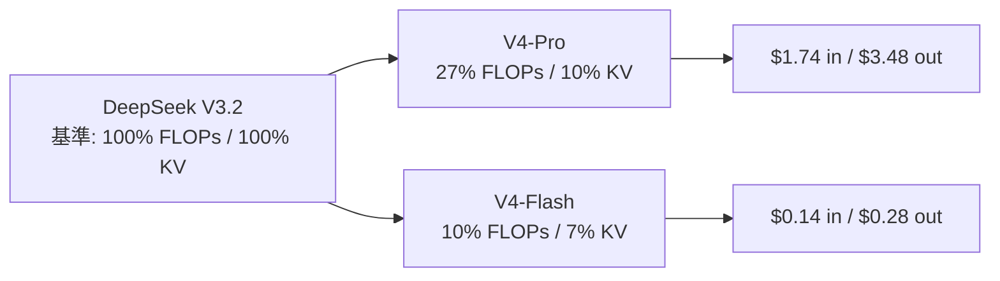
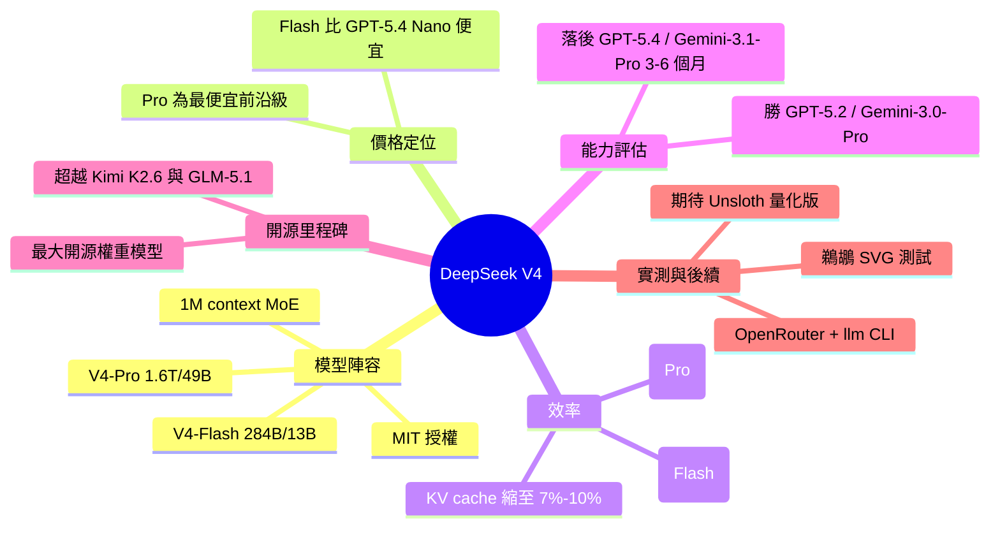

## DeepSeek V4 - almost on the frontier, a fraction of the price

DeepSeek 發布 V4 系列預覽版模型：V4-Pro（1.6T 總參數、49B 活躍參數）和 V4-Flash（284B 總參數、13B 活躍），均為 1 百萬 token 上下文的 MoE 架構，採用 MIT 開源授權。定價極具競爭力：V4-Flash 輸入 $0.14/百萬 tokens、輸出 $0.28，為業界最便宜小模型，甚至低於 OpenAI GPT-5.4 Nano ($0.20/$1.25)；V4-Pro 輸入 $1.74、輸出 $3.48，為最便宜的前沿級模型。核心優勢在效率優化：相比前一代 V3.2，V4-Pro 在 1M-token 場景下僅需 27% 的單 token FLOPs 和 10% 的 KV cache，V4-Flash 更優至 10% FLOPs 和 7% cache。V4-Pro 成為現存最大開源權重模型（超越 Kimi K2.6 的 1.1T 和 GLM-5.1 的 754B）。官方基準顯示 V4-Pro 推理能力略遜 GPT-5.4 和 Gemini-3.1-Pro（落後約 3-6 月），但優於 GPT-5.2 和 Gemini-3.0-Pro。

### 重點
- V4-Flash 定價 $0.14/$0.28/百萬 tokens，為業界最廉価小模型，比 GPT-5.4 Nano 便宜 30% 以上
- V4-Pro 在 1M-token 下相比 V3.2 減少 73% FLOPs、90% KV cache；Flash 更優化至 90% FLOPs、93% cache——MoE 效率突破解決長上下文成本瓶頸
- V4-Pro 為開源最大模型（1.6T 參數、MIT 授權），自報性能落後前沿 3-6 月但成本優勢顯著，適合成本敏感業務

**原文：** [simon-willison](https://simonwillison.net/2026/Apr/24/deepseek-v4/#atom-everything)

---

<!-- deep-analysis:begin -->
## 📌 摘要 (TL;DR)

- DeepSeek 發布 V4 系列預覽版兩款模型：**V4-Pro**（1.6T 總參數、49B 活躍參數）與 **V4-Flash**（284B 總參數、13B 活躍），皆為 1M token 上下文的 MoE 架構，採 MIT 授權。
- V4-Pro 成為**現存最大的開源權重模型**，超越 Kimi K2.6（1.1T）與 GLM-5.1（754B），體積為前代 V3.2（685B）兩倍以上。
- 定價極具殺傷力：V4-Flash 輸入 $0.14 / 輸出 $0.28（每百萬 tokens），比 GPT-5.4 Nano（$0.20/$1.25）更便宜；V4-Pro 輸入 $1.74 / 輸出 $3.48，是最便宜的前沿級模型。
- 低價來自效率優化：在 1M-token 場景下，V4-Pro 相比 V3.2 僅需 27% 的單 token FLOPs 與 10% 的 KV cache 大小；V4-Flash 更壓到 10% FLOPs 與 7% KV cache。
- DeepSeek 自評 V4-Pro-Max 推理能力勝過 GPT-5.2 與 Gemini-3.0-Pro，但仍**落後 GPT-5.4 與 Gemini-3.1-Pro 約 3 至 6 個月**。
- 作者 Simon Willison 透過 OpenRouter 用 `llm` CLI 測試「鵜鶘騎腳踏車」SVG 生成；期待 Unsloth 團隊釋出量化版後，能在自己的 128GB M5 MacBook Pro 上跑 Flash 模型。

## 🎯 核心概念

- **混合專家模型**（Mixture of Experts，簡稱 MoE）：模型將參數分散到多個「專家」子網路，每個 token 只啟動其中一小部分，因此「總參數」遠大於「活躍參數」。V4-Pro 1.6T 總、49B 活躍即此意。
- **KV cache**：Transformer 推理時為避免重算注意力鍵值而儲存的快取，長上下文場景下會吃掉大量顯存；壓縮 KV cache 是降低長文本推理成本的關鍵。
- **單 token FLOPs**：產生單一 token 所需的浮點運算量，DeepSeek 用 FP8 精度等效計算來衡量推理效率。

## 📖 整理分析

### 1. 兩款模型的規格定位
V4-Pro 與 V4-Flash 同樣是 1M token 上下文視窗的 MoE。Pro 在 Hugging Face 上佔 865GB，Flash 為 160GB。Simon Willison 推測輕度量化的 Flash 應能在他的 128GB M5 MacBook Pro 上運行；Pro 則可能需要從磁碟串流必要的活躍 expert 才有機會跑起來。授權沿用對商用最寬鬆的 MIT。

### 2. 為什麼 V4-Pro 是「最大的開源權重模型」
以總參數數量排序，V4-Pro 1.6T > Kimi K2.6 的 1.1T > GLM-5.1 的 754B > 自家前代 V3.2 的 685B。雖然「活躍參數」只有 49B，但這代表開源社群現在有了一個可下載、可微調的 1.6 兆參數 MoE，對研究端與部署端都是重要里程碑。

### 3. 定價對照：兩個價格帶都做到最低
DeepSeek 在小模型與前沿模型兩個價格帶分別插旗，下表整理原文中的對照（單位：USD/百萬 tokens）：

| Model | Input | Output |
|---|---|---|
| **DeepSeek V4 Flash** | $0.14 | $0.28 |
| GPT-5.4 Nano | $0.20 | $1.25 |
| Gemini 3.1 Flash-Lite | $0.25 | $1.50 |
| Gemini 3 Flash Preview | $0.50 | $3 |
| GPT-5.4 Mini | $0.75 | $4.50 |
| Claude Haiku 4.5 | $1 | $5 |
| **DeepSeek V4 Pro** | $1.74 | $3.48 |
| Gemini 3.1 Pro | $2 | $12 |
| GPT-5.4 | $2.50 | $15 |
| Claude Sonnet 4.6 | $3 | $15 |
| Claude Opus 4.7 | $5 | $25 |
| GPT-5.5 | $5 | $30 |

值得注意的是：V4-Pro 的輸出價（$3.48）甚至低於多數對手的小模型輸入價，前沿級能力 + 中價位定位明顯。

### 4. 效率才是低價的真正引擎
根據 DeepSeek 論文，他們把優化重點放在長上下文。1M-token 場景下：V4-Pro 相對於 V3.2 只需 **27% 的單 token FLOPs** 與 **10% 的 KV cache**；V4-Flash 更壓到 **10% FLOPs** 與 **7% KV cache**。這代表同樣硬體可以服務更多並發請求或更長文本，是低價的基本面而不只是補貼。

### 5. 能力位置：略遜於最前沿、但領先半年內梯隊
DeepSeek 自報基準寫得相當坦率：透過擴展推理 token，V4-Pro-Max 在標準推理基準上**勝過 GPT-5.2 與 Gemini-3.0-Pro**，但**略遜於 GPT-5.4 與 Gemini-3.1-Pro**，作者描述為「落後最先進前沿模型約 3 至 6 個月」。換言之，這次 V4 不是衝榜首，而是用「半代差距 + 數倍價差」打性價比戰場。

### 6. 作者的實測與後續觀察
Simon Willison 透過 OpenRouter 與 `llm-openrouter` CLI 跑了他的招牌 SVG 測試「a pelican riding a bicycle」。Flash 版的腳踏車結構較完整、鵜鶘表情兇但姿勢正確；Pro 版的鵜鶘身體比例失衡、僅有單翼，反而看起來像兩個畫家拼出來的。他正在關注 [huggingface.co/unsloth/models](https://huggingface.co/unsloth/models)，預期 Unsloth 團隊很快會釋出量化版，屆時可在本機驗證 Flash 的實際表現。

## 🧭 流程圖 / 架構圖

原文提供的鵜鶘 SVG 測試圖：

V4 對 V3.2 的效率改進（1M-token 情境）：

## 🧠 Mindmap

<!-- deep-analysis:end -->
### 📄 原文內容

點此展開 / 收合

Chinese AI lab DeepSeek's last model release was V3.2 (and V3.2 Speciale) <a href="https://simonwillison.net/2025/Dec/1/deepseek-v32/">last December</a>. They just dropped the first of their hotly anticipated V4 series in the shape of two preview models, <a href="https://huggingface.co/deepseek-ai/DeepSeek-V4-Pro">DeepSeek-V4-Pro</a> and <a href="https://huggingface.co/deepseek-ai/DeepSeek-V4-Flash">DeepSeek-V4-Flash</a>.

Both models are 1 million token context Mixture of Experts. Pro is 1.6T total parameters, 49B active. Flash is 284B total, 13B active. They're using the standard MIT license.

I think this makes DeepSeek-V4-Pro the new largest open weights model. It's larger than Kimi K2.6 (1.1T) and GLM-5.1 (754B) and more than twice the size of DeepSeek V3.2 (685B).

Pro is 865GB on Hugging Face, Flash is 160GB. I'm hoping that a lightly quantized Flash will run on my 128GB M5 MacBook Pro. It's <em>possible</em> the Pro model may run on it if I can stream just the necessary active experts from disk.

For the moment I tried the models out via <a href="https://openrouter.ai/">OpenRouter</a>, using <a href="https://github.com/simonw/llm-openrouter">llm-openrouter</a>:

<pre><code>llm install llm-openrouter
llm openrouter refresh
llm -m openrouter/deepseek/deepseek-v4-pro 'Generate an SVG of a pelican riding a bicycle'
</code></pre>

Here's the pelican <a href="https://gist.github.com/simonw/4a7a9e75b666a58a0cf81495acddf529">for DeepSeek-V4-Flash</a>:

And <a href="https://gist.github.com/simonw/9e8dfed68933ab752c9cf27a03250a7c">for DeepSeek-V4-Pro</a>:

For comparison, take a look at the pelicans I got from <a href="https://simonwillison.net/2025/Dec/1/deepseek-v32/">DeepSeek V3.2 in December</a>, <a href="https://simonwillison.net/2025/Aug/22/deepseek-31/">V3.1 in August</a>, and <a href="https://simonwillison.net/2025/Mar/24/deepseek/">V3-0324 in March 2025</a>.

So the pelicans are pretty good, but what's really notable here is the <em>cost</em>. DeepSeek V4 is a very, very inexpensive model.

This is <a href="https://api-docs.deepseek.com/quick_start/pricing">DeepSeek's pricing page</a>. They're charging $0.14/million tokens input and $0.28/million tokens output for Flash, and $1.74/million input and $3.48/million output for Pro.

Here's a comparison table with the frontier models from Gemini, OpenAI and Anthropic:

<table>
<thead>
<tr>
<th>Model</th>
<th>Input ($/M)</th>
<th>Output ($/M)</th>
</tr>
</thead>
<tbody>
<tr>
<td><strong>DeepSeek V4 Flash</strong></td>
<td>$0.14</td>
<td>$0.28</td>
</tr>
<tr>
<td>GPT-5.4 Nano</td>
<td>$0.20</td>
<td>$1.25</td>
</tr>
<tr>
<td>Gemini 3.1 Flash-Lite</td>
<td>$0.25</td>
<td>$1.50</td>
</tr>
<tr>
<td>Gemini 3 Flash Preview</td>
<td>$0.50</td>
<td>$3</td>
</tr>
<tr>
<td>GPT-5.4 Mini</td>
<td>$0.75</td>
<td>$4.50</td>
</tr>
<tr>
<td>Claude Haiku 4.5</td>
<td>$1</td>
<td>$5</td>
</tr>
<tr>
<td><strong>DeepSeek V4 Pro</strong></td>
<td>$1.74</td>
<td>$3.48</td>
</tr>
<tr>
<td>Gemini 3.1 Pro</td>
<td>$2</td>
<td>$12</td>
</tr>
<tr>
<td>GPT-5.4</td>
<td>$2.50</td>
<td>$15</td>
</tr>
<tr>
<td>Claude Sonnet 4.6</td>
<td>$3</td>
<td>$15</td>
</tr>
<tr>
<td>Claude Opus 4.7</td>
<td>$5</td>
<td>$25</td>
</tr>
<tr>
<td>GPT-5.5</td>
<td>$5</td>
<td>$30</td>
</tr>
</tbody>
</table>

DeepSeek-V4-Flash is the cheapest of the small models, beating even OpenAI's GPT-5.4 Nano. DeepSeek-V4-Pro is the cheapest of the larger frontier models.

This note from <a href="https://huggingface.co/deepseek-ai/DeepSeek-V4-Flash/blob/main/DeepSeek_V4.pdf">the DeepSeek paper</a> helps explain why they can price these models so low - they've focused a great deal on efficiency with this release, especially for longer context prompts:

<blockquote>

In the scenario of 1M-token context, even DeepSeek-V4-Pro, which has a larger number of activated parameters, attains only 27% of the single-token FLOPs (measured in equivalent FP8 FLOPs) and 10% of the KV cache size relative to DeepSeek-V3.2. Furthermore, DeepSeek-V4-Flash, with its smaller number of activated parameters, pushes efficiency even further: in the 1M-token context setting, it achieves only 10% of the single-token FLOPs and 7% of the KV cache size compared with DeepSeek-V3.2.

</blockquote>

DeepSeek's self-reported benchmarks <a href="https://huggingface.co/deepseek-ai/DeepSeek-V4-Flash/blob/main/DeepSeek_V4.pdf">in their paper</a> show their Pro model competitive with those other frontier models, albeit with this note:

<blockquote>

Through the expansion of reasoning tokens, DeepSeek-V4-Pro-Max demonstrates superior performance relative to GPT-5.2 and Gemini-3.0-Pro on standard reasoning benchmarks. Nevertheless, its performance falls marginally short of GPT-5.4 and Gemini-3.1-Pro, suggesting a developmental trajectory that trails state-of-the-art frontier models by approximately 3 to 6 months.

</blockquote>

I'm keeping an eye on <a href="https://huggingface.co/unsloth/models">huggingface.co/unsloth/models</a> as I expect the Unsloth team will have a set of quantized versions out pretty soon. It's going to be very interesting to see how well that Flash model runs on my own machine.

    
        
Tags: <a href="https://simonwillison.net/tags/ai">ai</a>, <a href="https://simonwillison.net/tags/generative-ai">generative-ai</a>, <a href="https://simonwillison.net/tags/llms">llms</a>, <a href="https://simonwillison.net/tags/llm">llm</a>, <a href="https://simonwillison.net/tags/llm-pricing">llm-pricing</a>, <a href="https://simonwillison.net/tags/pelican-riding-a-bicycle">pelican-riding-a-bicycle</a>, <a href="https://simonwillison.net/tags/deepseek">deepseek</a>, <a href="https://simonwillison.net/tags/llm-release">llm-release</a>, <a href="https://simonwillison.net/tags/openrouter">openrouter</a>, <a href="https://simonwillison.net/tags/ai-in-china">ai-in-china</a>

