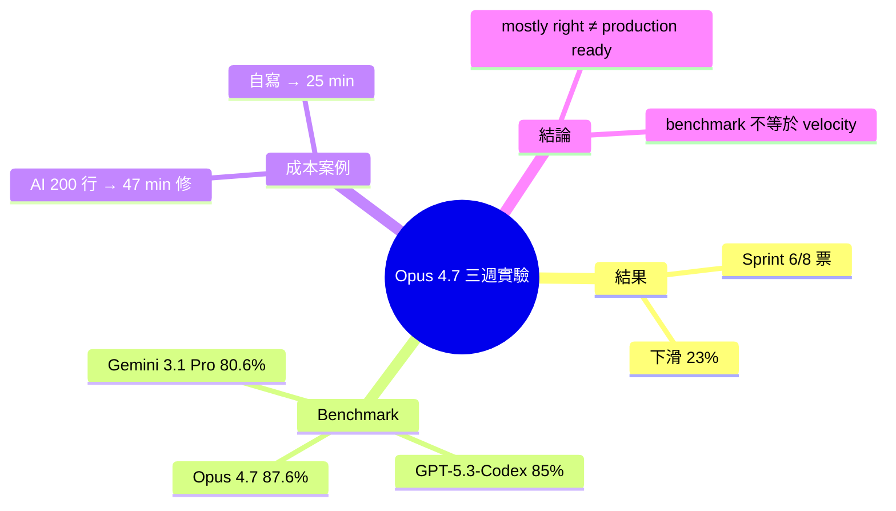

## I Switched to Claude Opus 4.7 for Everything. My Sprint Velocity Dropped 23%.

軟體工程師使用 Claude Opus 4.7 三週後發現 sprint velocity 反而下降 23%（6 tickets vs 通常 8 個）。儘管 Opus 4.7 SWE-bench 分數達 87.6%（高於 GPT-5.3-Codex 的 85% 與 Gemini 3.1 Pro 的 80.6%），但代碼審查仍耗時 47 分鐘才改完 200 行代碼（自己寫需 25 分鐘）。核心洞察：「mostly right 的代碼在生產環境不算成功」，揭示基準測試高分與實務開發速度間的落差——模型準確度優異不必然等於減少開發時間。

### 重點
- 三週使用 Opus 4.7 導致 sprint velocity 下降 23%：6 tickets vs 通常 8 個
- 代碼審查時間成本反增：Opus 寫的 200 行花 47 分鐘審查，自己寫只需 25 分鐘
- 基準測試高分（87.6% SWE-bench）≠ 生產效率提升，模型準確度需兼顧代碼可讀性與審查成本

**原文：** [medium-tag-ai](https://medium.com/@pixipace/i-switched-to-claude-opus-4-7-for-everything-my-sprint-velocity-dropped-23-f8648d7f0c72?source=rss------artificial_intelligence-5)

---

<!-- deep-analysis:begin -->
## 📌 摘要 (TL;DR)

- 作者連續三週把 Claude Opus 4.7 當主要編碼助手，一個 sprint 只結掉 6 張 ticket，比平常 8 張少 **23%**
- Opus 4.7 在 SWE-bench 拿到 **87.6%**，高於 GPT-5.3-Codex 的 85% 與 Gemini 3.1 Pro 的 80.6%，benchmark 上是當下最強
- 一次 200 行代碼，作者花了 **47 分鐘**審查與修正才能用；自己手寫只要 **25 分鐘**
- 核心觀察：「mostly right 的代碼在 production 不算成功」，benchmark 高分與實務 sprint velocity 並不同義

## 🎯 核心概念

- **衝刺速度（sprint velocity）**：團隊在一個 sprint 內完成的 ticket 數，是作者用來衡量自己產出的指標
- **SWE-bench**：評估 AI 在真實 GitHub issue 上修 bug 能力的基準測試
- **mostly right code**：作者用語，指「方向對、但細節需要人類修補」的 AI 產出

## 📖 整理分析

### 1. 三週實驗的具體下滑
作者把 Claude Opus 4.7 拉成主要 coding assistant 連續用了三週，sprint board 顯示完成 6 張 ticket，而他平常的基線是 8 張，等於少了約 23%。這個數字不是估算，是直接從他自己的看板統計。

### 2. Benchmark 排行 ≠ 實務排行
依文中所引基準：Opus 4.7 在 SWE-bench 取得 87.6%，分別領先 GPT-5.3-Codex（85%）與 Gemini 3.1 Pro（80.6%）。理論上選最高分模型應該最快，但作者的實際交付數字反而下滑，揭示了「benchmark 領先」與「sprint 領先」之間並沒有直接因果。

### 3. 審查成本壓過產出加速
關鍵例子：模型產出約 200 行代碼，作者花 47 分鐘做 review、修正、補測試才敢合進去；如果他自己從頭寫只要 25 分鐘。AI 把「產出代碼」這一段加速了，但把「驗證代碼是否真的對」這段放大到人類身上，淨值是負的。

### 4. 「mostly right」的 production 陷阱
作者最終結論：在 production 環境，「大致正確」並不是成功。差幾行邊界處理就是 bug、差一個 race condition 就是事故。SWE-bench 衡量的是「最後能不能 pass test」，但沒有衡量「人類為了讓它 pass 付出多少時間」——而後者才是 sprint velocity 的真正分母。

## 🧠 Mindmap

<!-- deep-analysis:end -->
### 📄 原文內容

點此展開 / 收合

The sprint board did not lie. Three weeks of Claude Opus 4.7 as my main coding assistant, and I had closed 6 tickets instead of my usual 8&#x2026;

<a href="https://medium.com/@pixipace/i-switched-to-claude-opus-4-7-for-everything-my-sprint-velocity-dropped-23-f8648d7f0c72?source=rss------artificial_intelligence-5">Continue reading on Medium »</a>

