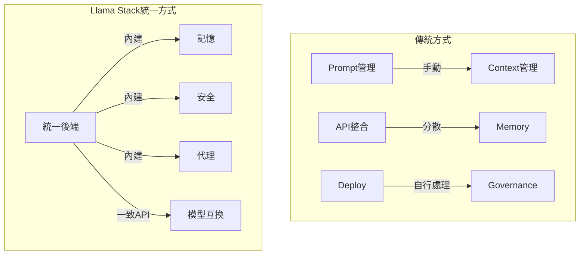

## Why Building AI Systems Feels Messy: Until You Use Llama Stack

Meta Llama Stack 以統一後端平台解決 AI 系統開發的複雜性瓶頸。開發者面臨三大痛點：(1) 手動管理 prompt、context、memory，(2) 多個 API 整合困難，(3) 自行承擔部署、擴展、治理負擔。Llama Stack 整合模型、記憶、工具、安全機制於單一層級，提供內建的記憶、安全、代理能力，轉換系統從無狀態請求處理到有狀態工作流驅動，包括原生日誌、審計、核准工作流，並提供一致 API 以減少廠商綁定。

### 重點
- AI 系統開發三大痛點：prompt/context 手動管理、API 整合複雜、部署治理自行承擔 → 產生「雜亂的 hack 系統」
- Llama Stack 統一平台提供 built-in 的 memory、safety、agents，無需手動接線多個服務
- 支持 stateful workflow 驅動和 native logging/auditing，可不改應用前提下切換底層模型

**原文：** [medium-tag-llm](https://medium.com/@adityapatil7649/why-building-ai-systems-feels-messy-until-you-use-llama-stack-f1445139f7f4?source=rss------large_language_models-5)

---

### 📄 原文內容

點此展開 / 收合

---large_language_models-5"
author: "Aditya Patil"
published_at: 2026-04-25T09:51:44+00:00
fetched_at: 2026-04-25T15:05:14.136739+00:00
content_hash: "8413edbca7f421ed7b9612d8bc1aa913cffce09548a83accde25d08eefa28906"
lang: en
caption_quality: None
raw: true
topics: []
---

# Why Building AI Systems Feels Messy: Until You Use Llama Stack

If you&#x2019;ve built anything with LLMs, you already know the pain:

<a href="https://medium.com/@adityapatil7649/why-building-ai-systems-feels-messy-until-you-use-llama-stack-f1445139f7f4?source=rss------large_language_models-5">Continue reading on Medium »</a>

