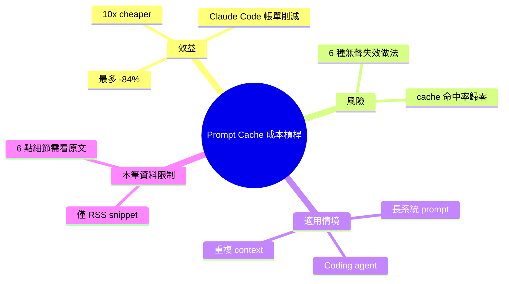

## Prompt Cache: the 10x-cheaper lever, and 6 ways to accidentally kill it

Prompt caching 可將 Claude Code 成本削減至少 84%，是降低大型模型應用成本的關鍵槓桿。文章深入分析 6 種常見的失效做法，包括動態 prompt、重複系統 message、過頻繁的 API 呼叫等，這些會無聲地摧毀 cache 效果。掌握何時應用 cache 和避免踩坑對成本最佳化至關重要。

### 重點
- Prompt caching 可降低 Claude Code 成本 84% 以上
- 6 個常見失效模式：動態 prompt、重複系統 message、過頻繁呼叫、不當 token 填充、版本變更、cache 作用域誤解
- 合理使用 cache 對成本最佳化和性能至關重要

**原文：** [medium-tag-claude](https://medium.com/@ruralwritter/prompt-cache-the-10x-cheaper-lever-and-6-ways-to-accidentally-kill-it-668694933171?source=rss------claude-5)

---

<!-- deep-analysis:begin -->
## 📌 摘要 (TL;DR)

- 作者主張**提示快取**（prompt caching）是降低 Claude Code 帳單的關鍵成本槓桿，宣稱正確使用可削減最多 **84%** 費用（約等於 6× 以上的成本壓縮）。
- 原文列出 **6 種** 會「無聲摧毀」cache 命中率的常見錯誤做法。
- ⚠️ **資料限制**：本筆來源僅為 Medium RSS 摘要（snippet 一句 + 圖片 + 連結），未包含完整內文。具體 6 點細節、實作範例與數據佐證需至原文閱讀。

## 🎯 核心概念

- **提示快取**（Prompt Caching）：Anthropic API 提供的功能，將請求中重複的前綴（system prompt、長 context、tools 定義等）標記為可快取，後續命中快取的部分以顯著較低的費率計費。
- **Claude Code**：Anthropic 推出的命令列 coding agent；因每次互動會帶大量重複 context（系統提示、檔案內容），是 prompt caching 受益最明顯的場景之一。

## 📖 整理分析

### 1. 為什麼 prompt caching 是「10× cheaper」槓桿

根據原文標題與 snippet，作者把 prompt caching 定位為「10x cheaper lever」，並給出 **最多 84% 帳單削減** 的具體數字。對於 Claude Code 這類每次都重送大段系統 prompt 與檔案 context 的工具，重複部分若能命中快取，成本差距可達一個數量級。

### 2. 6 種會意外殺死 cache 的做法

原文承諾列出 **6 個**「accidentally kill it」的反模式，但本 RSS 來源未包含具體列表。**為避免捏造，這裡不臆測哪 6 種**。常見會破壞 cache 命中率的方向（一般知識，非本文內容）通常與「前綴穩定性」「快取斷點位置」「TTL 過期」相關，但實際原文列出哪些需點擊原文連結確認。

### 3. 建議的補充閱讀

若要驗證原文 6 點具體內容，可從以下方向交叉比對：
- Anthropic 官方 prompt caching 文件（cache_control、ephemeral / 1h cache、breakpoint 規則）
- Claude Code 內部 caching 行為（system prompt、tool definitions、conversation history 的 cache 標記策略）

## 🧠 Mindmap

<!-- deep-analysis:end -->
### 📄 原文內容

點此展開 / 收合

How prompt caching slashes your Claude Code bill by up to 84% &#x2014; and the 6 accidental moves that silently wipe it out

<a href="https://medium.com/@ruralwritter/prompt-cache-the-10x-cheaper-lever-and-6-ways-to-accidentally-kill-it-668694933171?source=rss------claude-5">Continue reading on Medium »</a>

