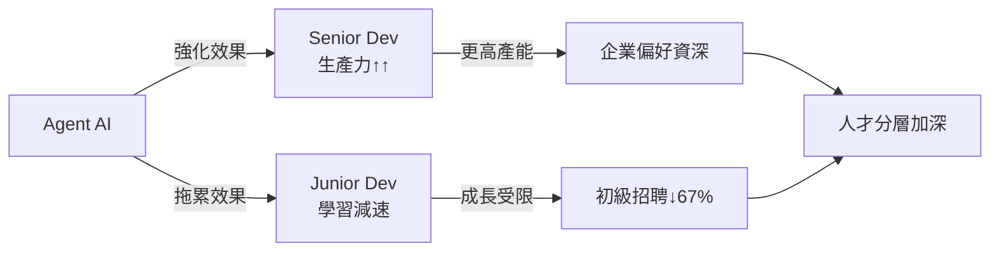
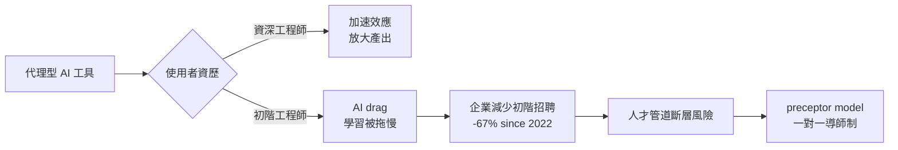
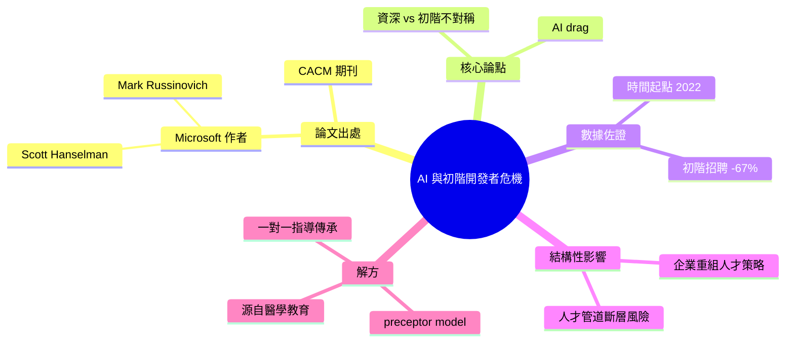

## Microsoft's Russinovich and Hanselman Warn AI Is Hollowing Out the Junior Developer Pipeline

微軟高管 Mark Russinovich 與 Scott Hanselman 在 ACM 通訊雜誌（CACM）發表論文警示，Agent 型 AI 正在拉大初階與資深開發者的技能差距。論文指出 AI 工具對資深工程師幫助最大，反而成為初級開發者學習的「拖累」（AI drag），削弱其成長曲線。統計數據顯示，自 2022 年以來初階開發者招聘量下跌 67%，反映企業因 AI 工具的加速效應而調整人才戰略。為保護人才培養管道，他們借鑒醫學教育的「preceptor 制度」（導師一對一指導模式），提出制度化解決方案。這一研究指出了 AI 時代職業結構的根本改變——並非所有層級都能平等受惠於 AI。

### 重點
- Agent AI 造成「AI drag」：對初級開發者減速，對資深開發者加速，加劇技能分層
- 入門級招聘自 2022 年以來下降 67%，反映企業調整人力策略的現實
- 提議採用醫學教育的「preceptor 模式」（導師制）保護初級開發者發展管道

**原文：** [infoq-main](https://www.infoq.com/news/2026/04/junior-developer-pipeline-crisis/?utm_campaign=infoq_content&utm_source=infoq&utm_medium=feed&utm_term=global)

---

<!-- deep-analysis:begin -->
## 📌 摘要 (TL;DR)

- Microsoft 的 Mark Russinovich 與 Scott Hanselman 在 ACM 通訊雜誌（Communications of the ACM，簡稱 CACM）發表論文，警告代理型 AI（agentic AI）正在侵蝕初階開發者的人才培養管道。
- 論文核心論點：AI 工具對資深工程師形成加速作用，卻對初階開發者構成「AI 拖累」（AI drag），擴大資歷之間的能力落差。
- 引用數據顯示，自 2022 年以來初階工程師招聘量下跌 67%，企業策略明顯轉向。
- 兩位作者借鑒醫學教育的 preceptor model（一對一導師制）作為制度化解方，目的是保留 talent pipeline。
- 報導由 InfoQ 的 Steef-Jan Wiggers 撰寫。

## 🎯 核心概念

- **代理型 AI** (agentic AI)：能自主規劃與執行多步驟任務的 AI 系統，相對於傳統單輪對話模型。
- **AI 拖累** (AI drag)：論文提出的概念，指 AI 工具反而拖慢初階開發者學習與成長曲線的現象。
- **preceptor model**：源自醫學教育的導師制度，由資深從業者一對一帶領新人，確保實戰技能傳承。

## 📖 整理分析

### 1. 論文出處與企業背景
此論文發表於 ACM 通訊雜誌（CACM），作者為 Microsoft 的 Mark Russinovich 與 Scott Hanselman。兩人從業界視角切入，主張 agentic AI 不只是生產力工具，而是會改變整個工程組織的人才結構。

### 2. AI drag：不對稱的能力放大器
論文核心觀察是：AI 工具對不同資歷層級的影響並不對等。資深工程師具備判斷力與架構經驗，能把 AI 當成放大器使用；而初階開發者尚未建立基礎判斷力，過度依賴 AI 反而被拖慢學習，形成所謂的「AI drag」。這意味著企業內部的能力鴻溝正在被 AI 工具拉大，而非弭平。

### 3. 招聘數據佐證結構性轉變
論文引用具體數字：自 2022 年以來，初階開發者招聘量下跌 67%。這個落差直接反映出企業面對 AI 加速效應後，已經在重新評估人才結構，並縮減 entry-level 職缺。長期影響是中階人才供給可能斷層。

### 4. preceptor model 作為制度化解方
為避免人才管道乾涸，作者建議借鑒醫學教育的 preceptor model——將初階工程師配對給資深工程師，透過一對一指導完成技能傳承，而不是讓新人完全依賴 AI 工具自學。這個提案把責任放回組織制度面，而非單純依賴工具或個人努力。

## 🧭 對比示意

## 🧠 Mindmap

<!-- deep-analysis:end -->
### 📄 原文內容

點此展開 / 收合

Microsoft's Russinovich and Hanselman argue in a CACM paper that agentic AI creates an "AI drag" on junior developers while boosting seniors, incentivizing companies to stop hiring entry-level engineers. Entry-level hiring is down 67% since 2022. They propose a preceptor model borrowed from medical education to preserve the talent pipeline.
 <i>By Steef-Jan Wiggers</i>

