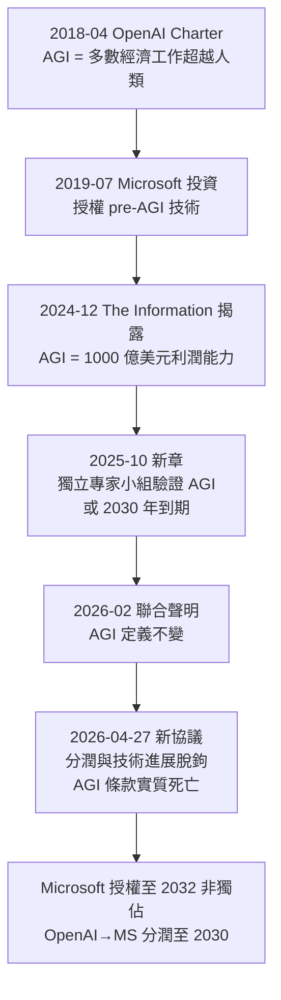
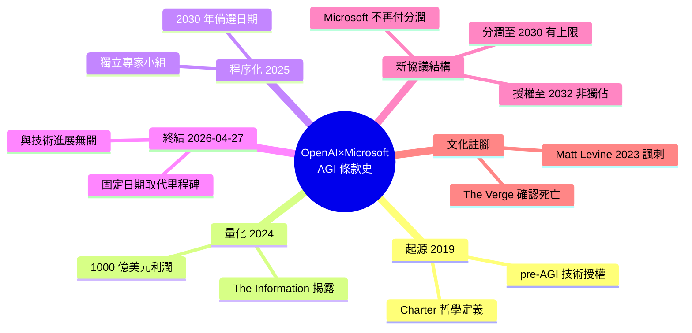

## Tracking the history of the now-deceased OpenAI Microsoft AGI clause

Microsoft 與 OpenAI 的 AGI 條款在 2026 年 4 月 27 日正式終止，該條款曾規定若達成 AGI，Microsoft 對 OpenAI 技術的商業 IP 權將失效。條款經 7 年演變：2019 年為概念性「前 AGI 技術授權」，2024 年被定量為「100 億美元利潤能力」，2025 年改由獨立專家小組判斷。新協議中，Microsoft 獲非獨佔授權至 2032 年，繼續獲 OpenAI 營收分享至 2030 年。關鍵轉變是該分享「與 OpenAI 技術進步無關」的措辭，明確終止了 AGI 條款的觸發機制，將時間限制從「技術達成條件」改為「固定日期」。

### 重點
- AGI 定義演變：2019 年概念式授權 → 2024 年量化為 100 億美元利潤 → 2025 年獨立專家評判，2026 年 4 月終止
- 新協議核心改變：營收分享至 2030 年『與技術進步無關』，明確廢除 AGI 觸發機制，轉為時間限制
- IP 權利轉變：Microsoft 獲非獨佔授權至 2032 年（原為 AGI 發生時失效），反映市場複雜性和談判平衡

**原文：** [simon-willison](https://simonwillison.net/2026/Apr/27/now-deceased-agi-clause/#atom-everything)

---

<!-- deep-analysis:begin -->
## 📌 摘要 (TL;DR)

- 2026 年 4 月 27 日，OpenAI 與 Microsoft 簽訂新合作協議，事實上終結了存在 7 年的「AGI 條款」——該條款原本規定一旦達成 AGI（artificial general intelligence），Microsoft 對 OpenAI 技術的商業 IP 權利將失效。
- Simon Willison 透過追蹤 openai.com 上的歷次公告，整理出該條款從「概念性敘述」→「100 億美元利潤門檻」→「獨立專家小組裁定」→「直接消滅」的完整演變軌跡。
- 新協議關鍵措辭：OpenAI 對 Microsoft 的營收分潤將持續至 2030 年，且「**與 OpenAI 技術進展無關**（independent of OpenAI's technology progress）」——這句話被 Willison 與 The Verge 共同解讀為 AGI 條款正式死亡。
- Microsoft 取得 OpenAI IP 授權延長至 2032 年，但改為**非獨佔**；Microsoft 不再向 OpenAI 支付營收分潤。
- 觸發條件從「技術里程碑」轉為「固定日期」，意味著雙方放棄用「AGI 是否達成」來決定權利歸屬，回歸傳統商業合約邏輯。

## 🎯 核心概念

- **AGI 條款 (AGI Clause)**：原合約中規定「達成 AGI 後，Microsoft 對 OpenAI 技術的商業 IP 權利歸零」的特殊條款。
- **AGI 定義 (Artificial General Intelligence)**：依 OpenAI Charter 為「在多數有經濟價值的工作上超越人類的高度自主系統」。
- **前 AGI 技術 (pre-AGI technologies)**：2019 年協議用語，指 AGI 達成前 OpenAI 願意授權給 Microsoft 商業化的技術。
- **獨立專家小組 (independent expert panel)**：2025 年 10 月新增的 AGI 達成驗證機制，用以裁定 OpenAI 自身的 AGI 宣告是否成立。

## 📖 整理分析

### 1. 2019 年：模糊的「前 AGI 技術」授權
2019 年 7 月 22 日 OpenAI 公告 Microsoft 投資時，僅以「我們打算授權**部分前 AGI 技術**（some of our pre-AGI technologies）」帶過。同期 OpenAI Charter 將 AGI 定義為「在多數有經濟價值工作上超越人類的高度自主系統」。Willison 指出：這種定義對於需要明確觸發點的合約而言「不夠具體」。

### 2. 2024 年 12 月：100 億美元的量化定義
據 The Information 報導（TechCrunch 摘錄），雙方私下協議將 AGI 重新定義為「OpenAI 系統能產生足以支付最早期投資人（含 Microsoft）最大利潤分配上限的能力」，文件顯示該金額約為 **1,000 億美元（$100 billion）利潤**。AGI 從哲學命題變成財務 KPI。

### 3. 2025 年 10 月：交給獨立專家小組
OpenAI 公告《Microsoft–OpenAI 合作關係的下一章》宣布：未來 OpenAI 宣告達成 AGI 後，需經**獨立專家小組驗證**。Microsoft 對研究內容（confidential methods）的 IP 權利將維持至「專家小組驗證 AGI」或「2030 年」兩者較早者。亦即首次出現「固定日期」作為退場機制的備選。

### 4. 2026 年 2 月：定義維持不變
2026 年 2 月 27 日的聯合聲明特別強調：「**AGI 定義與流程維持不變**（AGI definition and processes are unchanged）」。Willison 將這句話作為條款仍存活的最後一個書面證據。

### 5. 2026 年 4 月 27 日：條款實質死亡
最新協議三條關鍵變動：
- Microsoft 對 OpenAI IP（模型與產品）的授權延長至 **2032 年**，並改為**非獨佔**；
- Microsoft **不再向 OpenAI 支付營收分潤**；
- OpenAI 向 Microsoft 的營收分潤持續至 **2030 年**，「**與 OpenAI 技術進展無關**」，比例不變但設總額上限。

「與技術進展無關」這句話徹底切斷了「AGI 達成 → 條款觸發」的因果鏈。Willison 與 The Verge 都據此判定 AGI 條款已死。

### 6. Matt Levine 的歷史註腳
Willison 在文末引用 Bloomberg 專欄作家 Matt Levine 在 2023 年 11 月寫的諷刺假想：投資人哀號抗議無效，OpenAI 新 CEO 與非營利董事會給他們開出「上限報酬」支票後說再見，然後一個被良好治理的超級智慧解決了人類所有問題、終結了資本主義——「沒有人再需要任何 Microsoft 產品」。這段被 Willison 稱為「我最喜歡的 OpenAI AGI 評論」。

## 🧭 時間線

## 🧠 Mindmap

<!-- deep-analysis:end -->
### 📄 原文內容

點此展開 / 收合

For many years, Microsoft and OpenAI's relationship has included a weird clause saying that, should AGI be achieved, Microsoft's commercial IP rights to OpenAI's technology would be null and void. That clause appeared to end today. I decided to try and track its expression over time on <a href="https://openai.com/">openai.com</a>.

OpenAI, July 22nd 2019 in <a href="https://openai.com/index/microsoft-invests-in-and-partners-with-openai/">Microsoft invests in and partners with OpenAI to support us building beneficial AGI</a> (emphasis mine):

<blockquote>

OpenAI is producing a sequence of increasingly powerful AI technologies, which requires a lot of capital for computational power. The most obvious way to cover costs is to build a product, but that would mean changing our focus. Instead, we intend to license <strong>some of our pre-AGI technologies</strong>, with Microsoft becoming our preferred partner for commercializing them.

</blockquote>

But what <em>is</em> AGI? The <a href="https://openai.com/charter/">OpenAI Charter</a> was first published in April 2018 and has remained unchanged at least since this <a href="https://web.archive.org/web/20190311213352/https://openai.com/charter/">March 11th 2019 archive.org capture</a>:

<blockquote>

OpenAI’s mission is to ensure that artificial general intelligence (AGI)—by which we mean highly autonomous systems that outperform humans at most economically valuable work—benefits all of humanity.

</blockquote>

Here's the problem: if you're going to sign an agreement with Microsoft that is dependent on knowing when "AGI" has been achieved, you need something a little more concrete.

In December 2024 <a href="https://www.theinformation.com/articles/microsoft-and-openai-wrangle-over-terms-of-their-blockbuster-partnership">The Information reported the details</a> (summarized here outside of their paywall <a href="https://techcrunch.com/2024/12/26/microsoft-and-openai-have-a-financial-definition-of-agi-report/">by TechCrunch</a>):

<blockquote>

Last year’s agreement between Microsoft and OpenAI, which hasn’t been disclosed, said AGI would be achieved only when OpenAI has developed systems that have the ability to generate the maximum total profits to which its earliest investors, including Microsoft, are entitled, according to documents OpenAI distributed to investors. Those profits total about $100 billion, the documents showed.

</blockquote>

So AGI is now whenever OpenAI's systems are capable of generating $100 billion in profit?

In October 2025 the process changed to being judged by an "independent expert panel". In <a href="https://openai.com/index/next-chapter-of-microsoft-openai-partnership/">The next chapter of the Microsoft–OpenAI partnership</a>:

<blockquote>

The agreement preserves key elements that have fueled this successful partnership—meaning OpenAI remains Microsoft’s frontier model partner and Microsoft continues to have exclusive IP rights and Azure API exclusivity until Artificial General Intelligence (AGI). [...]

Once AGI is declared by OpenAI, that declaration will now be verified by an independent expert panel. [...]

Microsoft’s IP rights to research, defined as the confidential methods used in the development of models and systems, will remain until either the expert panel verifies AGI or through 2030, whichever is first.

</blockquote>

OpenAI on February 27th, 2026 in <a href="https://openai.com/index/continuing-microsoft-partnership/">Joint Statement from OpenAI and Microsoft</a>:

<blockquote>

<strong>AGI definition and processes are unchanged</strong>. The contractual definition of AGI and the process for determining if it has been achieved remains the same.

</blockquote>

OpenAI today, April 27th 2026 in <a href="https://openai.com/index/next-phase-of-microsoft-partnership/">The next phase of the Microsoft OpenAI partnership</a> (emphasis mine):

<blockquote>
<ul>
<li>Microsoft will continue to have a license to OpenAI IP for models and products through 2032.  Microsoft’s license will now be non-exclusive.</li>
<li>Microsoft will no longer pay a revenue share to OpenAI.</li>
<li>Revenue share payments from OpenAI to Microsoft continue through 2030, <strong>independent of OpenAI’s technology progress</strong>, at the same percentage but subject to a total cap.</li>
</ul>
</blockquote>

As far as I can tell "independent of OpenAI’s technology progress" is a declaration that the AGI clause is now dead. Here's The Verge coming to the same conclusion: <a href="https://www.theverge.com/ai-artificial-intelligence/918981/openai-microsoft-renegotiate-contract">The AGI clause is dead</a>.

My all-time favorite commentary on OpenAI's approach to AGI remains this 2023 hypothetical <a href="https://www.bloomberg.com/opinion/articles/2023-11-20/who-controls-openai">by Matt Levine</a>:

<blockquote>

And the investors wailed and gnashed their teeth but it’s true, that is what they agreed to, and they had no legal recourse. And OpenAI’s new CEO, and its nonprofit board, cut them a check for their capped return and said “bye” and went back to running OpenAI for the benefit of humanity. It turned out that a benign, carefully governed artificial superintelligence is really good for humanity, and OpenAI quickly solved all of humanity’s problems and ushered in an age of peace and abundance in which nobody wanted for anything or needed any Microsoft products. And capitalism came to an end.

</blockquote>
    
        
Tags: <a href="https://simonwillison.net/tags/computer-history">computer-history</a>, <a href="https://simonwillison.net/tags/microsoft">microsoft</a>, <a href="https://simonwillison.net/tags/ai">ai</a>, <a href="https://simonwillison.net/tags/openai">openai</a>

