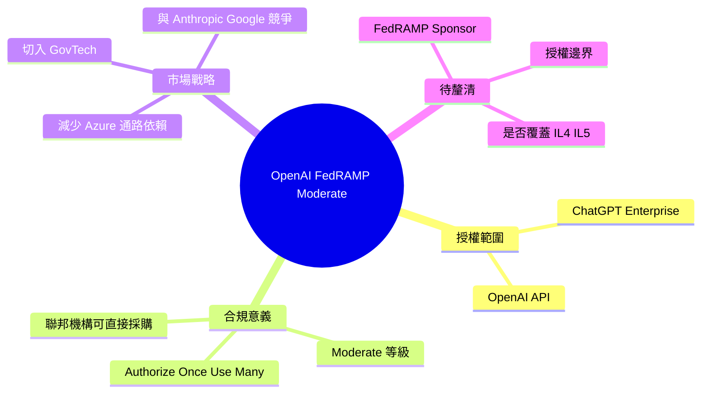

## OpenAI available at FedRAMP Moderate

OpenAI 獲得 FedRAMP Moderate 授權，ChatGPT Enterprise 和 OpenAI API 均已通過聯邦合規認證。FedRAMP（聯邦風險與授權管理計畫）Moderate 級別是美國政府機構採購雲端服務的安全標準，此認證允許美國聯邦部門安全地使用 OpenAI 服務。這標誌著 OpenAI 在政府市場和合規領域的重大進展，正式開啟聯邦機構的企業級 AI 工具採購途徑，具有重要的市場與戰略意義。

### 重點
- FedRAMP Moderate 認證覆蓋 ChatGPT Enterprise 和 OpenAI API 兩大產品線
- Moderate 級別為美國政府採購的主流安全標準，開啟聯邦機構市場
- 使聯邦部門可合規使用 OpenAI 企業級服務，降低合規風險

**原文：** [openai-blog](https://openai.com/index/openai-available-at-fedramp-moderate)

---

<!-- deep-analysis:begin -->
## 📌 摘要 (TL;DR)

- OpenAI 宣布 **ChatGPT Enterprise** 與 **OpenAI API** 雙雙取得 FedRAMP Moderate 授權，正式進入美國聯邦政府合規採購清單。
- 此授權讓美國聯邦機構可在符合安全合規要求下直接使用 OpenAI 自家服務，而不必透過第三方雲端通路（如 Azure OpenAI Service）。
- 對 OpenAI 而言，這是切入政府／公部門市場（GovTech）的關鍵里程碑，也是與 Anthropic、Google 等競爭對手在聯邦合規賽道上短兵相接的明確訊號。

## 🎯 核心概念

- **聯邦風險與授權管理計畫**（Federal Risk and Authorization Management Program，簡稱 FedRAMP）：美國聯邦政府針對雲端服務制定的標準化安全評估、授權與持續監控框架，採「Authorize Once, Use Many Times」原則。
- **Moderate 等級**：FedRAMP 三大影響等級（Low / Moderate / High）中的中間級，適用於資料外洩可能造成嚴重但非災難性影響的聯邦資訊系統，是聯邦機構採購商業雲端服務最常見的門檻。
- **ChatGPT Enterprise**：OpenAI 面向組織用戶的 ChatGPT 版本，提供更高安全性、隱私保障與管理控制。

## 📖 整理分析

### 1. 授權同時涵蓋產品端與平台端

根據原文，這次 FedRAMP Moderate 授權同時覆蓋 ChatGPT Enterprise 與 OpenAI API 兩條產品線。意義在於：聯邦機構不僅可以讓員工使用對話式 AI 工具（ChatGPT Enterprise），也能在自家系統、內部工具中以 API 方式整合 GPT 模型，覆蓋場景從「個人生產力」延伸到「機關自建應用」。

### 2. 對聯邦機構的實質效益

FedRAMP Moderate 是聯邦機構採購雲端服務最常使用的合規等級。取得此授權後，個別機構不需再各自重複做完整安全評估，可直接引用 OpenAI 的 FedRAMP package，大幅縮短採購與上線時程，降低法遵成本。

### 3. 與既有合規路徑的差異（推論）

（這是推論：原文未提供市場比較資料）此前美國聯邦機構若要使用 GPT 系列模型，較常見的合規路徑是透過 Microsoft Azure OpenAI Service（已具備 FedRAMP High 與 DoD IL 等級授權）。OpenAI 自行取得 FedRAMP Moderate，意味著機構在 Microsoft 通路之外多了一個直接採購選項，也代表 OpenAI 在政府市場的銷售自主權提升。

### 4. 公告未揭露的細節

原文僅為一段宣告性短文，並未說明：FedRAMP Sponsor 是哪個聯邦機構、Authorization Boundary（授權範圍）的具體技術界線、是否同時涵蓋國防部 IL4/IL5 等更高等級、以及資料是否在 OpenAI 自有環境或合作雲端中處理。這些將是後續判斷實際適用範圍的關鍵資訊。

## 🧠 Mindmap

<!-- deep-analysis:end -->
### 📄 原文內容

點此展開 / 收合

OpenAI is available at FedRAMP Moderate authorization for ChatGPT Enterprise and the OpenAI API, enabling secure AI adoption for U.S. federal agencies.

