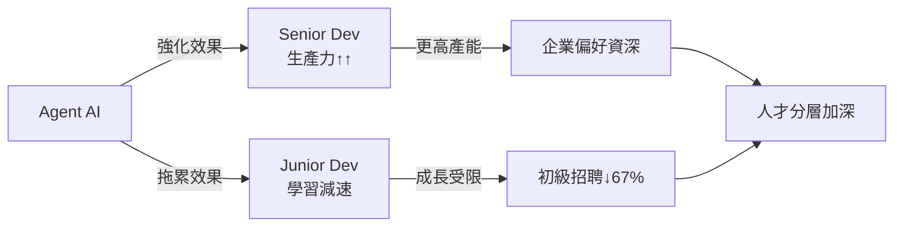

## Microsoft's Russinovich and Hanselman Warn AI Is Hollowing Out the Junior Developer Pipeline

微軟高管 Mark Russinovich 與 Scott Hanselman 在 ACM 通訊雜誌（CACM）發表論文警示，Agent 型 AI 正在拉大初階與資深開發者的技能差距。論文指出 AI 工具對資深工程師幫助最大，反而成為初級開發者學習的「拖累」（AI drag），削弱其成長曲線。統計數據顯示，自 2022 年以來初階開發者招聘量下跌 67%，反映企業因 AI 工具的加速效應而調整人才戰略。為保護人才培養管道，他們借鑒醫學教育的「preceptor 制度」（導師一對一指導模式），提出制度化解決方案。這一研究指出了 AI 時代職業結構的根本改變——並非所有層級都能平等受惠於 AI。

### 重點
- Agent AI 造成「AI drag」：對初級開發者減速，對資深開發者加速，加劇技能分層
- 入門級招聘自 2022 年以來下降 67%，反映企業調整人力策略的現實
- 提議採用醫學教育的「preceptor 模式」（導師制）保護初級開發者發展管道

**原文：** [infoq-ai-ml](https://www.infoq.com/news/2026/04/junior-developer-pipeline-crisis/?utm_campaign=infoq_content&utm_source=infoq&utm_medium=feed&utm_term=AI%2C+ML+%26+Data+Engineering)

---

### 📄 原文內容

點此展開 / 收合

Microsoft's Russinovich and Hanselman argue in a CACM paper that agentic AI creates an "AI drag" on junior developers while boosting seniors, incentivizing companies to stop hiring entry-level engineers. Entry-level hiring is down 67% since 2022. They propose a preceptor model borrowed from medical education to preserve the talent pipeline.
 <i>By Steef-Jan Wiggers</i>

