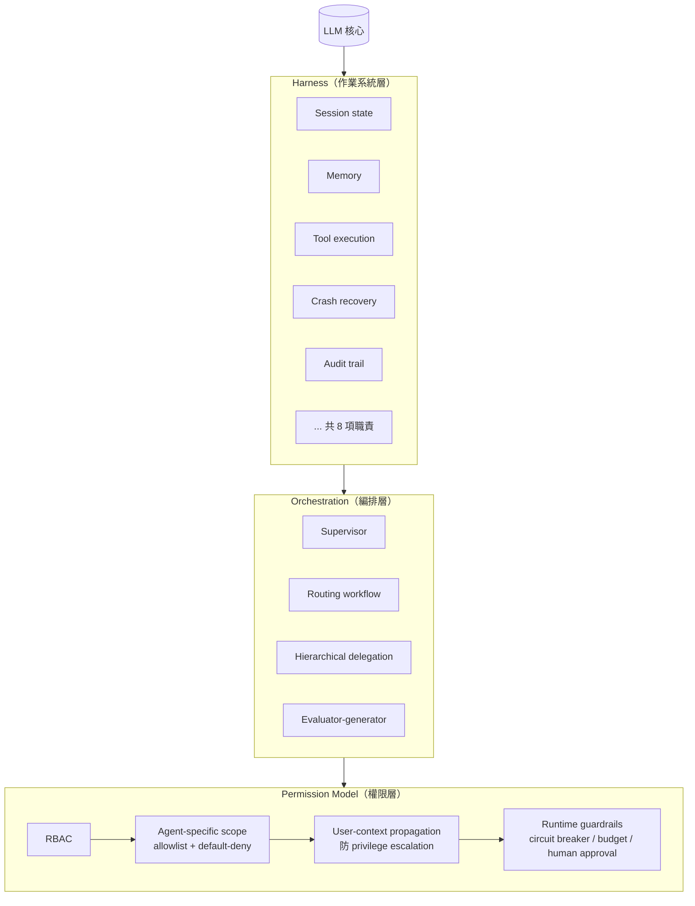
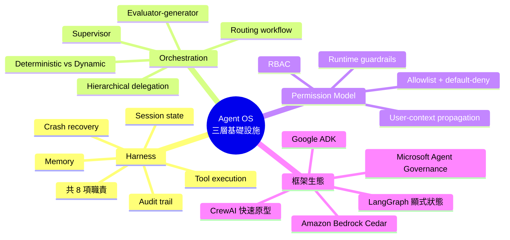

## Your AI Agents Need an Operating System: Harnesses, Orchestration, and the Permission Model

Production AI agents不能只靠LLM能力，需要三層基礎設施：(1) Harness——作業系統管理session state、memory、tool execution、crash recovery、audit trail等8項職責；(2) Orchestration——區分deterministic workflow與dynamic agent行為，提供Supervisor、Routing workflow、Hierarchical delegation、Evaluator-generator四種模式；(3) Permission model——四層防控：RBAC（基礎角色）→ Agent-specific scope（allowlist+default-deny）→ User-context propagation（user identity流過整個delegation chain，防止privilege escalation）→ Runtime guardrails（circuit breaker、execution budget、human approval）。框架生態包LangGraph（顯式狀態管理）、CrewAI（快速原型）、Google ADK、Microsoft Agent Governance、Amazon Bedrock Cedar等。

### 重點
- 四層Permission model核心：RBAC → Agent-specific allowlist → User-context propagation（防止privilege escalation的關鍵層）→ Runtime guardrails，缺一不可
- Agent Harness應管理8項責任：session state、memory、tool execution、recovery、audit trail等，這些是團隊在生產incident中反覆踩坑的點
- 四種Orchestration pattern明確區分workflow（確定性）與agent（動態），Supervisor/Routing適合簡單路由、Hierarchical delegation適合複雜多代理協作

**原文：** [medium-tag-llm](https://medium.com/version-1/your-ai-agents-need-an-operating-system-harnesses-orchestration-and-the-permission-model-7c1c140590b1?source=rss------large_language_models-5)

---

<!-- deep-analysis:begin -->
## 📌 摘要 (TL;DR)

- Production AI agent 不能只靠 LLM 能力，必須有三層基礎設施支撐：harness（作業系統層）、orchestration（編排層）、permission model（權限層）
- Harness 承擔 8 項職責，包含 session state、memory、tool execution、crash recovery、audit trail 等，類比於 agent 的作業系統
- Orchestration 必須先區分「deterministic workflow」與「dynamic agent 行為」，並提供 4 種模式：Supervisor、Routing workflow、Hierarchical delegation、Evaluator-generator
- Permission 採四層縱深防禦：RBAC → Agent-specific scope（allowlist + default-deny）→ User-context propagation（防 privilege escalation）→ Runtime guardrails（circuit breaker、execution budget、human approval）
- 框架生態具體列出 LangGraph（顯式狀態管理）、CrewAI（快速原型）、Google ADK、Microsoft Agent Governance、Amazon Bedrock Cedar 五者

## 🎯 核心概念

- **Harness（束縛層 / 執行外殼）**：agent 的作業系統，負責 session、記憶、工具呼叫、崩潰恢復與稽核軌跡
- **Orchestration（編排）**：協調多個 agent 與工作流的執行邏輯，區分固定流程與動態決策
- **Permission Model（權限模型）**：分層管控 agent 可執行的動作範圍
- **RBAC**（Role-Based Access Control）：以角色為單位的基礎權限控管
- **Allowlist + default-deny**：白名單放行、預設拒絕的零信任策略
- **User-context propagation**：將使用者身份沿 delegation chain 傳遞，避免 agent 越權
- **Privilege escalation**：權限提升攻擊
- **Circuit breaker**：熔斷器；**Execution budget**：執行預算上限

## 📖 整理分析

### 1. 為什麼 agent 需要作業系統

建構一個 demo agent 很容易，但要把它放上 production 卻需要更多基礎設施。作者把這層基礎設施直接類比為 OS：LLM 只是 CPU，真正讓系統能長時間穩定運轉的是包圍它的 harness、orchestration 與 permission model。三者缺一不可，否則 agent 在生產環境會出現失控、無法稽核、權限濫用等問題。

### 2. Harness：agent 的作業系統

Harness 不是單一元件，而是包覆 agent 的執行環境，承擔 8 項職責，文中明確點出的包括 session state、memory、tool execution、crash recovery 與 audit trail。這些責任對應 OS 中的記憶體管理、I/O、崩潰恢復與系統日誌。少了 harness，agent 一旦 crash 就遺失上下文、工具呼叫無法追蹤、也無從重放除錯。

### 3. Orchestration：先分清固定流程與動態決策

編排層的關鍵設計判斷是：哪些步驟是 deterministic workflow（明確流程）、哪些是 dynamic agent（由 LLM 自主決定）。文中提出四種模式：

- **Supervisor**：上層控制器派工
- **Routing workflow**：依輸入路由到不同 agent
- **Hierarchical delegation**：層級式委派，子 agent 再展開子任務
- **Evaluator-generator**：生成者產出、評估者驗證的成對結構

選錯模式會導致 agent 在不該即興時即興、或在該即興時被卡住。

### 4. Permission Model：四層縱深防禦

權限不是單點檢查，而是四層疊加：

1. **RBAC**：以角色為單位的基礎控管
2. **Agent-specific scope**：採 allowlist + default-deny，把每個 agent 能用的工具收斂到最小集合
3. **User-context propagation**：使用者身份必須沿著 delegation chain 一路傳下去，避免 sub-agent 拿到比呼叫者更高的權限（即 privilege escalation）
4. **Runtime guardrails**：執行期保護，包括 circuit breaker、execution budget 上限、以及高風險動作前的 human approval

這四層解決的是不同問題：RBAC 控誰能呼叫、Scope 控能呼叫什麼、Propagation 控代誰呼叫、Guardrails 控失控時怎麼停下來。

### 5. 框架生態盤點

摘要中具體列名的框架包括：**LangGraph**（強調顯式狀態管理）、**CrewAI**（快速原型）、**Google ADK**、**Microsoft Agent Governance**、**Amazon Bedrock Cedar**。從這份名單可見三大雲（Google、Microsoft、Amazon）皆已推出自家 agent 治理或編排方案，顯示這層基礎設施正從開源框架走向雲廠商標準化能力。

## 🧭 架構圖

## 🧠 Mindmap

<!-- deep-analysis:end -->
### 📄 原文內容

點此展開 / 收合

Building agents is easy. Running them safely in production requires harness engineering, smart orchestration, and a layered permission&#x2026;

<a href="https://medium.com/version-1/your-ai-agents-need-an-operating-system-harnesses-orchestration-and-the-permission-model-7c1c140590b1?source=rss------large_language_models-5">Continue reading on Version 1 »</a>

