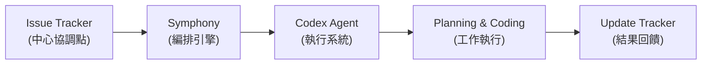

## An open-source spec for orchestration: Symphony

OpenAI 發布 Symphony——開源編排規格，用於 Codex 系統的自動化編排。Symphony 可將軟體工程的問題追蹤器（issue tracker）轉變為常態開啟的代理系統，自動處理工作分配與執行，提高工程輸出並減少上下文切換。該工具針對軟體開發團隊設計，透過自動化 issue 管理與代理協調流程，改善開發團隊的生產力與工作流程效率。

### 重點
- 開源編排規格，將 issue tracker 轉化為常態運行的 Codex 代理系統
- 減少開發者上下文切換，提升工程生產力
- 自動化 issue 管理與代理協調，改善開發工作流

**原文：** [openai-blog](https://openai.com/index/open-source-codex-orchestration-symphony)

---

### 📄 原文內容

點此展開 / 收合

Learn how Symphony, an open-source spec for Codex orchestration, turns issue trackers into always-on agent systems—boosting engineering output and reducing context switching.

