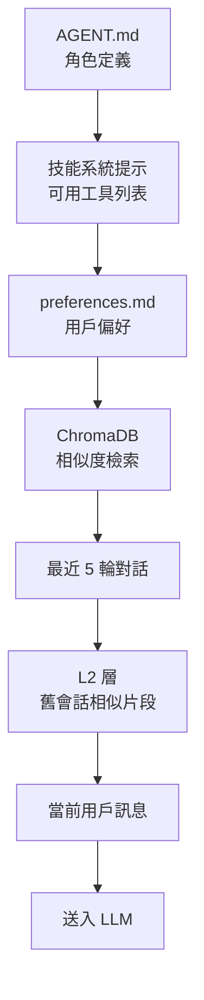
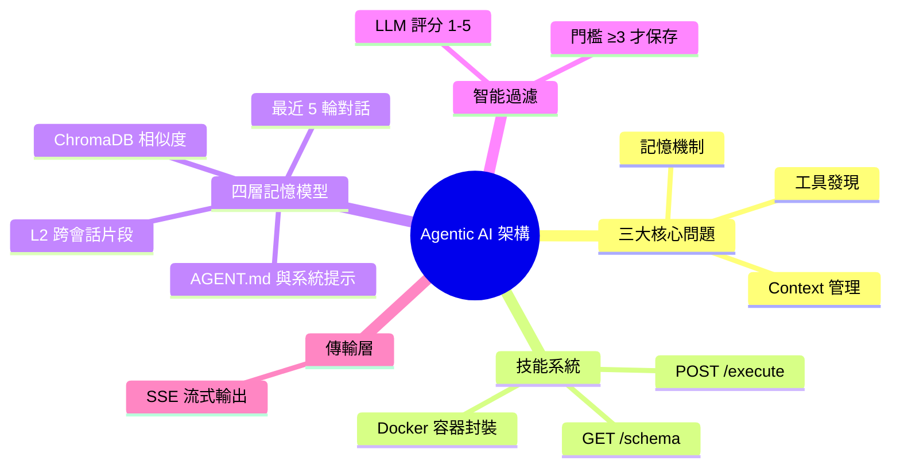

## Agentic AI the Hard Way — Part 3 Architecture and Design

本文（系列第三篇）深入 agentic AI 系統架構，核心解決三大問題：工具發現、記憶機制、context 管理。技能系統使用 Docker 容器化封裝，各容器暴露 `GET /schema` 和 `POST /execute` 兩端點。四層記憶模型依序組裝上下文：AGENT.md、技能系統提示、preferences.md、ChromaDB 相似度、最近 5 輪對話、L2 層（舊會話相似片段）、用戶消息。智能過濾機制：工具結果在存儲前由 LLM 評分 1-5，僅保存≥3 結果。使用 Server-Sent Events 實現流式傳輸。

### 重點
- Docker 容器化技能系統：每個容器暴露 /schema 和 /execute 端點，預熱池設計防止狀態污染
- 四層記憶模型：分層組裝 AGENT.md、preferences、ChromaDB、對話歷史，最小化 context 溢出風險
- 智能過濾：LLM 評分結果（1-5），僅存≥3，保持語義檢索庫清潔度

**原文：** [medium-tag-claude](https://medium.com/@CCH0/agentic-ai-the-hard-way-part-3-architecture-and-design-a3d5265f9e01?source=rss------claude-5)

---

<!-- deep-analysis:begin -->
## 📌 摘要 (TL;DR)

- 系列第三篇，聚焦 agentic AI 系統架構，作者把核心問題收斂為三件事：工具發現、記憶機制、context 管理
- 技能系統採 Docker 容器化封裝，每個技能容器只暴露兩個端點 `GET /schema`（宣告介面）與 `POST /execute`（實際執行），達成標準化呼叫
- 四層記憶模型按固定順序組裝 context：AGENT.md → 技能系統提示 → preferences.md → ChromaDB 相似度檢索 → 最近 5 輪對話 → L2 層舊會話相似片段 → 當前用戶訊息
- 智能過濾：工具結果在寫入長期記憶前，先由 LLM 評分 1-5，僅 ≥3 的內容才會存進 ChromaDB，避免雜訊污染
- 互動傳輸層使用 Server-Sent Events（SSE）做流式輸出

## 🎯 核心概念

- **技能系統**（Skill System）：把 agent 能力封裝成獨立 Docker 容器的設計模式
- **四層記憶模型**（4-Layer Memory Model）：依生命週期把不同上下文分層疊加給 LLM
- **L2 層**（L2 Layer）：跨會話的長期記憶層，存歷史會話的相似片段
- **ChromaDB**：向量資料庫，用於相似度檢索
- **Server-Sent Events**（SSE）：HTTP 上的單向流式推送協定

## 📖 整理分析

> 註：原文 RSS 摘要僅含開場聲明（內容由 AI 撰寫、作者校閱），以下分析依據既有 brief 摘要（`summary_zh`）所列出的設計要點整理，原文細節可能更豐富。

### 1. 容器化的技能架構

技能系統採 Docker 容器封裝，每個技能都是獨立服務，只需暴露兩個 HTTP 端點：`GET /schema` 宣告該技能接受的參數與用途，`POST /execute` 負責實際執行。這種設計把「工具發現」與「工具執行」解耦——agent 可以在 runtime 動態查詢可用工具的 schema，再透過統一的執行介面呼叫，新增技能不需要動到 agent 主程式。

### 2. 四層記憶的組裝順序

當 agent 收到一個請求時，context 不是一次性倒進去，而是按固定順序疊加：先放 AGENT.md（角色與任務定義），接著是技能系統提示（目前可用工具列表），再來是 preferences.md（用戶偏好），然後注入 ChromaDB 的相似度檢索結果，再接最近 5 輪對話，再從 L2 層撈相似的舊會話片段，最後才是當前用戶訊息。順序本身就決定了哪些資訊距離 LLM 注意力最近，是工程上的關鍵設計決策。

### 3. LLM 自我過濾的記憶寫入

為了避免長期記憶被低品質結果污染，工具回傳的內容不會無條件寫進 ChromaDB。系統先用一個 LLM 對結果評分 1-5 分，只有 ≥3 的內容才會被保存。這等於把「什麼值得記住」的決策外包給模型自己，比硬規則過濾更有彈性，也能避免無效雜訊在長期記憶層累積。

### 4. 串流回應的傳輸層選擇

互動體驗使用 Server-Sent Events（SSE）。相較於 WebSocket，SSE 是單向、HTTP 原生、更輕量的協定，適合 agent 把推理過程、工具呼叫狀態、最終回答逐步推送給前端，讓使用者看到 agent 的「思考過程」而不是等一大段沉默後才出現結果。

## 🧭 流程圖：四層記憶 Context 組裝順序

## 🧠 Mindmap

<!-- deep-analysis:end -->
### 📄 原文內容

點此展開 / 收合

Disclaimer &#x2014; this series of posts are authored by AI, reviewed and edited by me and I take full responsibility for the content.

<a href="https://medium.com/@CCH0/agentic-ai-the-hard-way-part-3-architecture-and-design-a3d5265f9e01?source=rss------claude-5">Continue reading on Medium »</a>

