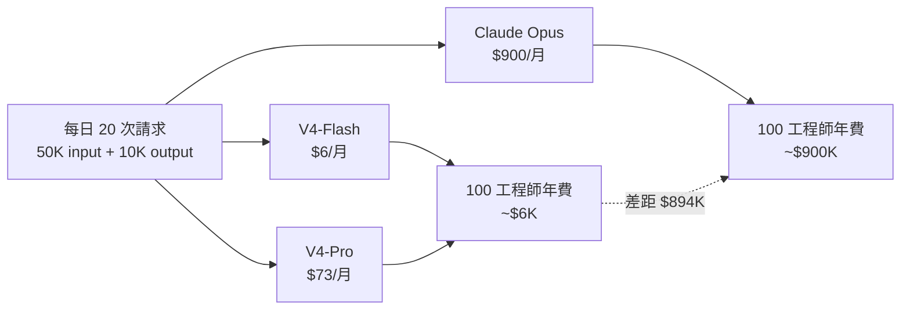
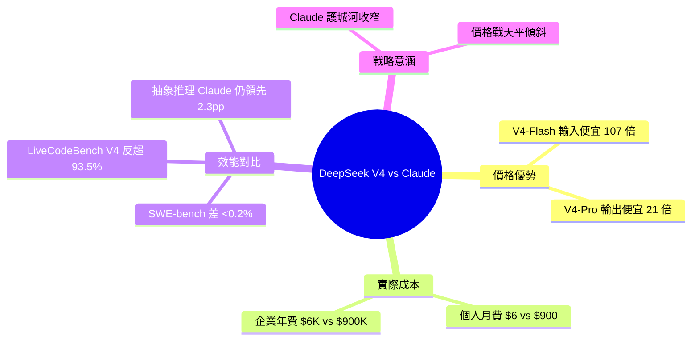

## DeepSeek V4 Just Made Claude Look Expensive, and the Gap Is Getting Worse

DeepSeek V4在成本與效能的trade-off上打破遊戲規則。具體數據：V4-Pro輸出$3.48/百萬tokens vs Claude $75（便宜21倍），V4-Flash輸入$0.14 vs Claude $15（便宜107倍）。實際編碼工作流（5萬input、1萬output token，日20次請求）月費：V4-Flash $6、V4-Pro $73、Claude Opus $900；企業規模（100工程師）年費差距$6K→$900K。性能上V4-Pro在SWE-bench與Claude Opus 4.6相當（差異<0.2%），LiveCodeBench更勝（93.5% vs 88.8%）。Claude仍保持abstract reasoning優勢（40% vs 37.7%），但差距正在縮小。

### 重點
- V4-Flash $0.14/百萬input tokens vs Claude $15（107倍差）、V4-Pro輸出$3.48 vs $75（21倍差），成本懸殊改變企業採購決策
- 編碼基準SWE-bench中V4-Pro與Claude Opus 4.6效能相當（<0.2%差），LiveCodeBench上V4-Pro-Max更勝（93.5% vs 88.8%）
- 100工程師團隊年成本：$6K (V4-Flash)、$73K (V4-Pro) vs $900K (Claude Opus)，規模化下成本差異引發戰略採購重估

**原文：** [medium-tag-llm](https://medium.com/@cognidownunder/deepseek-v4-just-made-claude-look-expensive-and-the-gap-is-getting-worse-989e100d88b4?source=rss------large_language_models-5)

---

<!-- deep-analysis:begin -->
## 📌 摘要 (TL;DR)

- **價格戰核爆**：DeepSeek V4-Pro 輸出價格 $3.48/百萬 tokens，相較 Claude 的 $75 便宜 21 倍；V4-Flash 輸入價格 $0.14/百萬 tokens，相較 Claude 的 $15 便宜 107 倍。
- **實際工作流月費差距驚人**：以每日 20 次請求、每次 5 萬 input + 1 萬 output token 的編碼情境計算，V4-Flash 月費僅 $6、V4-Pro $73，Claude Opus 則高達 $900。
- **企業規模放大效應**：100 名工程師年度成本，DeepSeek 路線約 $6K，Claude 路線約 $900K，差距接近 $894K。
- **效能不再是 Claude 護城河**：V4-Pro 在 SWE-bench 與 Claude Opus 4.6 差距 <0.2%；LiveCodeBench 上 V4-Pro 反超（93.5% vs 88.8%）。
- **Claude 僅剩抽象推理微弱優勢**：抽象推理 benchmark Claude 40% vs V4 37.7%，差距正在被快速壓縮。

## 📖 整理分析

### 1. 價格結構的代差
根據文章引用的官方定價，DeepSeek V4 不是「便宜一點」，而是「便宜一個數量級」。V4-Flash 的輸入端 $0.14/百萬 tokens 對上 Claude 的 $15，比例 1:107；V4-Pro 的輸出端 $3.48 對上 $75，比例約 1:21。這代表同樣預算下，可呼叫的模型量級完全不同。

### 2. 真實編碼工作流的月度帳單
文章以一個具體情境試算：每天 20 次請求、每次 5 萬 input token + 1 萬 output token。月度結果為 V4-Flash $6、V4-Pro $73、Claude Opus $900。對個人開發者而言，這已經從「咖啡錢」變成「房租錢」的差距。

### 3. 企業規模下的指數放大
當情境延伸到 100 名工程師整年使用，DeepSeek 路線總費用約 $6K，Claude 路線約 $900K。這個 $894K 的差距足以重塑採購決策——對 CFO 而言，這已不只是工具選擇，而是預算與人事比例的問題。

### 4. 性能差距正在收斂
文章引用的 benchmark 顯示：V4-Pro 在 SWE-bench 與 Claude Opus 4.6 差距 <0.2%（統計上幾乎等價）；在 LiveCodeBench 上甚至反超（V4-Pro 93.5% vs Claude 88.8%）。Claude 僅在抽象推理 benchmark 維持 40% vs 37.7% 的領先。

### 5. 對 Anthropic 的策略壓力
當「便宜 20–100 倍」與「效能持平甚至反超」同時成立，Claude 的高價只能由「抽象推理 +2.3 個百分點」來支撐。文章的核心論點是：這條護城河正在被填平，價格戰的天平已經傾斜。

## 🧭 成本對照圖

## 🧠 Mindmap

<!-- deep-analysis:end -->
### 📄 原文內容

點此展開 / 收合

The Price War Just Went Nuclear

<a href="https://medium.com/@cognidownunder/deepseek-v4-just-made-claude-look-expensive-and-the-gap-is-getting-worse-989e100d88b4?source=rss------large_language_models-5">Continue reading on Medium »</a>

