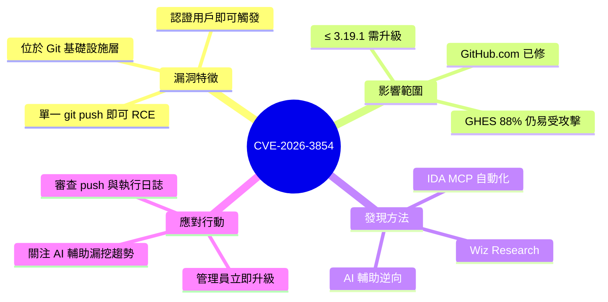

## GitHub RCE Vulnerability: CVE-2026-3854 Breakdown

Wiz Research 發現 GitHub 內部 Git 基礎設施的關鍵遠程代碼執行漏洞（CVE-2026-3854）。任何認證用戶可通過一條簡單的 `git push` 命令在 GitHub 的後端伺服器執行任意程式碼，無需額外工具。此漏洞首次使用 AI 輔助（IDA MCP 自動反向工程）發現，展示了 AI 在複雜二進製分析中的威力。GitHub.com 於報告後 6 小時修復；GitHub Enterprise Server (GHES) 發布補丁。**критическая問題：截至報告時，88% 的 GHES 實例仍易受攻擊**。受影響版本 ≤ 3.19.1，修復版本包括 3.19.3 等。在 GHES 上，該漏洞允許完整伺服器破壞和訪問所有託管倉庫與內部祕密。

### 重點
- CVE-2026-3854：Git 推送 RCE 漏洞，利用多服務架構中的協議解析不一致（babeld → internal service chain）
- 88% GHES 實例仍然易受攻擊，緊急升級需求達到最高級別
- AI 反向工程突破：IDA MCP 自動化分析編譯二進製文件，發現了傳統手工審計耗時過高而遺漏的協議缺陷

**原文：** [hackernews](https://www.wiz.io/blog/github-rce-vulnerability-cve-2026-3854)

<!-- deep-analysis:begin -->
## 📌 摘要 (TL;DR)

- Wiz Research 在 GitHub 內部 Git 基礎設施發現關鍵遠端程式碼執行漏洞 **CVE-2026-3854**：任何已認證使用者只需一條 `git push` 命令，即可在 GitHub 後端伺服器執行任意程式碼，無需額外工具或複雜利用鏈。
- 此漏洞**首次使用 AI 輔助（IDA MCP 自動反向工程）**發現，展示了 AI 在複雜二進制分析中加速漏洞挖掘的能力。
- GitHub.com 於收到回報後 **6 小時內修補**；GitHub Enterprise Server（GHES）也發布了對應補丁，受影響版本為 ≤ 3.19.1，修復版本包括 3.19.3 等。
- 截至報告發布時，**88% 的 GHES 實例仍處於易受攻擊狀態**——這是這篇報告最值得管理員立即行動的數字。
- 在 GHES 上利用此漏洞可導致完整伺服器淪陷，攻擊者能存取所有託管倉庫與內部機密（secrets）。

## 🎯 核心概念

- **遠端程式碼執行（Remote Code Execution，RCE）**：攻擊者能在目標伺服器上執行任意命令，是漏洞嚴重等級中最高的一類。
- **GitHub Enterprise Server（GHES）**：GitHub 提供給企業自架（self-hosted）的版本，與 GitHub.com SaaS 平台共用核心程式碼。
- **IDA MCP**：基於 Model Context Protocol（MCP）的 IDA Pro 反組譯整合，讓 AI agent 可自動驅動逆向分析流程。

## 📖 整理分析

> ⚠️ 注意：本次抓取到的原文內容僅有標題，下列分析僅根據 Wiz 提供的摘要重述。技術細節（具體觸發路徑、易受攻擊的解析器、payload 結構等）需回到原文 https://www.wiz.io/blog/github-rce-vulnerability-cve-2026-3854 才能完整理解。

### 1. 漏洞性質：低門檻、高衝擊
根據摘要，攻擊前置條件僅為「擁有任一已認證 GitHub 帳號」，觸發方式是「一條 `git push`」。這代表攻擊面涵蓋全部能 push 程式碼的使用者——對於開放接受外部貢獻的組織，威脅模型實質上等同於「任何網路上的人」。漏洞落在 GitHub 內部處理 Git 流量的基礎設施層，而非應用層 API。

### 2. 雙環境影響：SaaS vs. 自架
摘要明確區分兩條修復線：GitHub.com（SaaS）由 GitHub 內部團隊在 6 小時內熱修；但 GHES 屬於使用者自行部署，補丁發布後仍須由各企業管理員主動升級。這是 88% GHES 實例仍易受攻擊的根因——修補責任落在使用者端，而 GHES 上的成功利用可導致「完整伺服器淪陷 + 全倉庫與內部 secrets 外洩」。

### 3. AI 輔助漏洞研究的里程碑
Wiz 將此案例定位為「首次使用 AI 輔助發現」的代表性漏洞。具體做法是用 IDA MCP 把 IDA Pro 暴露給 AI agent，由 agent 自動驅動反組譯、交叉引用、函式語意推測等流程。這暗示傳統需要資深逆向工程師數週的工作，可被 AI 壓縮到更短時間——這是攻防雙方都需要關注的趨勢轉折。

### 4. 修補狀態與管理員行動清單
- **GitHub.com 使用者**：無需動作，雲端側已於 6 小時內修補。
- **GHES 管理員**：立即檢查版本，若 ≤ 3.19.1 應升級至 3.19.3 或更新版本（具體分支版號需以 GitHub 官方安全公告為準）。
- **事後檢查**：審視 audit log 是否有異常 `git push` 模式或不明流程執行紀錄。

## 🧭 影響範圍對照

| 環境 | 修補狀態 | 使用者需動作 | 最大潛在衝擊 |
|------|----------|--------------|--------------|
| GitHub.com（SaaS） | 6 小時內熱修完成 | 無 | 已封閉 |
| GHES ≤ 3.19.1 | 補丁已釋出，但 88% 實例尚未升級 | 立即升級至 3.19.3+ | 完整伺服器淪陷、所有倉庫與 secrets 外洩 |

## 🧠 Mindmap

<!-- deep-analysis:end -->
