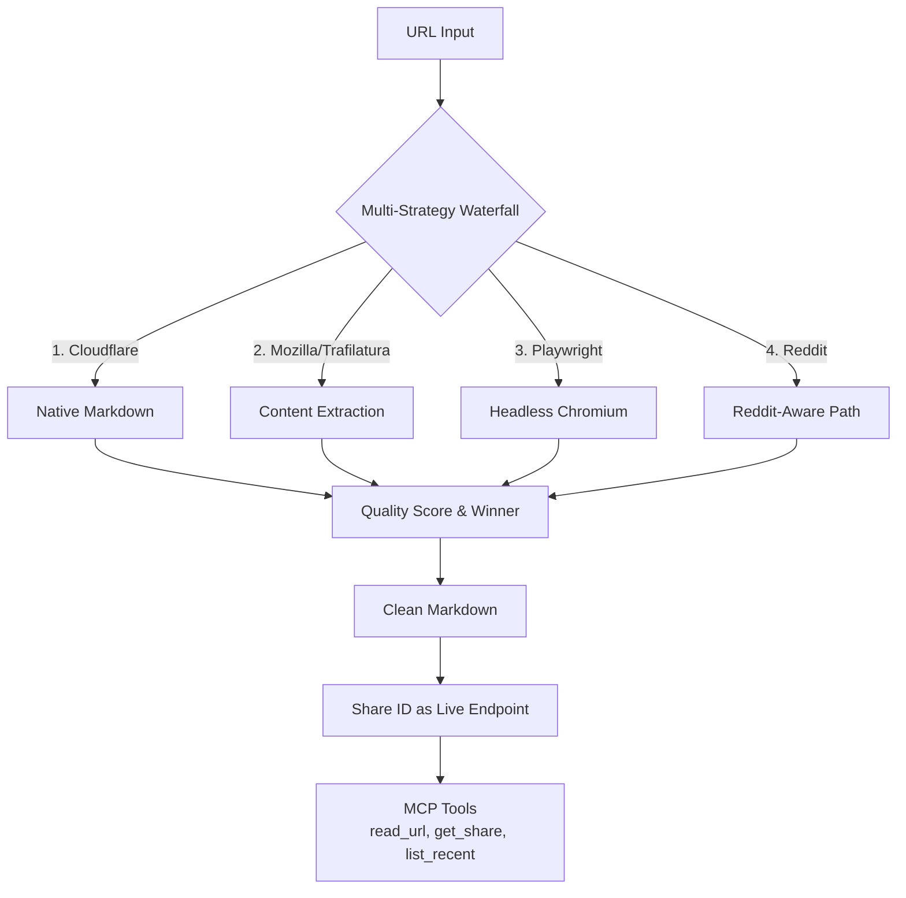

## PullMD - gave Claude Code an MCP server so it stops burning tokens parsing HTML

開發者發布 PullMD v1.1.2，一個自託管 Docker 堆棧，解決兩大痛點：(1) 行動設備複製貼上的繁瑣流程，(2) Claude Code 解析 HTML 浪費 token。PullMD 採用多策略瀑布架構（Cloudflare native → Mozilla Readability + Trafilatura → Playwright headless），可將任何 URL 轉換為清潔 Markdown，並原生支持 MCP。實測 token 削減率達 74.8%–97.8%（GitHub README 97.8%、MDN 74.8%、LinkedIn 94.1%、Reddit 90.2%、Medium 85.3%）。快取命中速度 6–13ms，冷啟動 0.3–6 秒，20 並發無誤。支援 linux/amd64 與 linux/arm64，AGPLv3 license。Claude Code 使用者可一行指令整合。

### 重點
- 多策略瀑布設計（4 層遞進，質量評分決勝負），GitHub README 等文件 token 削減 97.8%，LinkedIn 新聞削減 94.1%
- Share ID 作為持久性終點，1 小時內自動重新抓取新鮮內容，支援 MCP 原生整合（Streamable HTTP transport）
- 全棧性能：快取命中 6–13ms、冷啟動 0.3–6s、20 並發零誤、Playwright 記憶體 215–500MB

**原文：** [reddit-claudeai](https://www.reddit.com/r/ClaudeAI/comments/1sxzlh6/pullmd_gave_claude_code_an_mcp_server_so_it_stops/)

---

### 📄 原文內容

點此展開 / 收合

<table> <tr><td>  </td><td> <!-- SC_OFF -->

Hey all,
 
Built this over the past few weeks because I got tired of two things:
 
<strong>1. Mobile copy-paste is awful.</strong> Long Reddit thread or blog post on my phone, want to ask Claude about it. Long-press, drag selection handles past nav/sidebar/footer, copy, switch app, paste. None of that is hard, but it's annoying enough that I wanted to fix it.
 
<strong>2. Claude Code burns tokens on HTML boilerplate.</strong> Letting it fetch raw HTML and parse the chrome out is wildly inefficient. A typical article is 80% navigation/cookie banners/footers, 20% content. The agent shouldn't have to wrestle with a cookie banner before answering my question.
 
So I built <strong>PullMD</strong> - a fully self-hosted Docker stack that turns any URL into clean Markdown, with first-class MCP support so Claude Code (and Desktop, Cursor, anything MCP-compatible) gets pre-cleaned content directly. Runs on your own box, no third-party service in the loop.
 <h1>Self-host in three commands</h1> 
Multi-arch images (<code>linux/amd64</code>, <code>linux/arm64</code>) on Docker Hub. Zero-config compose:
 <pre><code>mkdir pullmd &amp;&amp; cd pullmd curl -O https://raw.githubusercontent.com/AeternaLabsHQ/pullmd/main/docker-compose.yml docker compose up -d # → http://localhost:3000 </code></pre> 
Three services in the stack: main app (Node.js), Trafilatura sidecar (Python), Playwright sidecar (optional ~3.7GB Chromium bundle for JS-heavy pages - leave it off and PullMD silently degrades to static extraction). Sensible defaults, Traefik example included, GHCR mirror available.
 <h1>How it works for Claude users</h1> 
<strong>MCP server</strong> at <code>/mcp</code> (Streamable HTTP, stateless), three tools:
 <ul> <li><code>read_url</code> - fetch + convert any URL</li> <li><code>get_share</code> - retrieve a previously-fetched conversion by share ID</li> <li><code>list_recent</code> - list recent conversions</li> </ul> 
Add to Claude Code in one line:
 <pre><code>claude mcp add --transport http pullmd https://your-instance.example.com/mcp </code></pre> 
For Claude Desktop, drop into the JSON config:
 <pre><code>{ &quot;mcpServers&quot;: { &quot;pullmd&quot;: { &quot;type&quot;: &quot;http&quot;, &quot;url&quot;: &quot;https://your-instance.example.com/mcp&quot; } } } </code></pre> 
<strong>Claude Code skill bundle</strong> - the running instance generates a <code>web-reader.zip</code> with your URL baked in. Drop into <code>~/.claude/skills/</code>, restart Claude Code, the skill activates on web-reading requests. Useful if you don't want to add another MCP server but still want a nudge for Claude to use PullMD over raw fetch.
 <h1>How extraction actually works</h1> 
Multi-strategy waterfall:
 <ol> <li><strong>Cloudflare's native Markdown endpoint</strong> if the site supports it</li> <li><strong>Mozilla Readability + Trafilatura in parallel</strong>, both scored, winner picked</li> <li><strong>Headless Chromium</strong> (Playwright sidecar) for JS-heavy pages as last resort</li> <li><strong>Reddit-aware path</strong> - auto-detects threads, pulls post + nested comment tree, indents replies with spaces instead of <code>&gt;</code> blockquotes (those turn unreadable past depth 4 in copy-paste)</li> </ol> 
Every response carries headers - <code>X-Source</code> (which extractor won), <code>X-Quality</code> (0.0–1.0 confidence), <code>X-Share-Id</code> (8-hex permalink).
 
<strong>Refreshable share links:</strong> every conversion gets a share ID. <code>/s/&lt;id&gt;</code> returns cached Markdown and re-fetches from source if older than 1h. So a share link is also a live endpoint that stays fresh. If the source dies, last good snapshot keeps working.
 <h1>Built with Claude Code</h1> 
Claude Code wrote essentially all of the code. I did the planning, made the architectural decisions, steered the implementation, tested every iteration, and integrated everything into something I actually use daily.
 
The architecture went through a planning phase in claude.ai <em>before</em> a line of code was written - including dual-strategy Reddit (<code>.json</code> trick first, old.reddit HTML as fallback), the share-id-as-live- endpoint trick, the indented comment formatting, the Playwright fallback heuristic based on quality scoring. Those decisions are mine, the code that implements them came from Claude Code.
 
Without it, this project wouldn't exist in this scope or this fast. With it, my role shifted from typing code to deciding what should exist and whether what came back was right. That's the part I take responsibility for.
 
It's a v1.1.2 - works well, I use it every day, but corners exist.
 
The MCP integration in particular was rewarding to build - the Streamable HTTP transport just works, and watching Claude Code use <code>read_url</code> natively once the schema descriptions are good is one of those &quot;yeah, this is the right abstraction&quot; moments.
 <h1>Links</h1> <ul> <li>GitHub: <a href="https://github.com/AeternaLabsHQ/pullmd">https://github.com/AeternaLabsHQ/pullmd</a></li> <li>Docker Hub: <a href="https://hub.docker.com/r/aeternalabshq/pullmd">https://hub.docker.com/r/aeternalabshq/pullmd</a></li> <li>License: AGPLv3 (free to self-host, modify, share modifications if you run a modified version as a service)</li> </ul> 
Happy to answer questions about the Docker setup, the MCP integration, the extraction scoring logic, or anything else. 
 
<strong>EDIT:</strong> Since some of you asked about real numbers - I ran a quick benchmark on my homelab instance. Token-Counts are tiktoken cl100k_base approximations, not exact Claude tokens, but the orders of magnitude hold.
 
<strong>Token reduction (raw HTML → PullMD markdown):</strong>
 <table><thead> <tr> <th align="left">Source</th> <th align="left">raw</th> <th align="left">PullMD</th> <th align="left">reduction</th> <th align="left">path</th> </tr> </thead><tbody> <tr> <td align="left">GitHub README</td> <td align="left">141,599</td> <td align="left">3,125</td> <td align="left">97.8%</td> <td align="left">readability</td> </tr> <tr> <td align="left">MDN reference</td> <td align="left">63,979</td> <td align="left">16,093</td> <td align="left">74.8%</td> <td align="left">readability</td> </tr> <tr> <td align="left">LinkedIn News (EN)</td> <td align="left">54,534</td> <td align="left">3,194</td> <td align="left">94.1%</td> <td align="left">readability</td> </tr> <tr> <td align="left">Reddit thread</td> <td align="left">3,264</td> <td align="left">320</td> <td align="left">90.2%</td> <td align="left">reddit</td> </tr> <tr> <td align="left">Medium article</td> <td align="left">3,046</td> <td align="left">449</td> <td align="left">85.3%</td> <td align="left">playwright</td> </tr> </tbody></table> 
<strong>Other observations:</strong>
 <ul> <li>Cache hits: 6–13ms warm vs 0.3–6s cold (up to ~850× speedup)</li> <li>Concurrency: 20 parallel requests against a mixed URL pool, 0 errors</li> <li>Playwright sidecar: ~215MB idle, ~360MB single SPA render, ~500MB under 20× load</li> </ul> 
<!-- SC_ON --> &#32; submitted by &#32; <a href="https://www.reddit.com/user/SYSWAVE"> /u/SYSWAVE </a>   <a href="https://i.redd.it/vu0jdtms3xxg1.png">[link]</a> &#32; <a href="https://www.reddit.com/r/ClaudeAI/comments/1sxzlh6/pullmd_gave_claude_code_an_mcp_server_so_it_stops/">[comments]</a> </td></tr></table>

