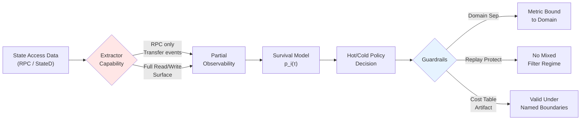

## ZK State Prune: The Boundaries Behind Rollup Cost Models

ZK rollup 的狀態分層系統面臨「熱冷問題」：必須判斷哪些 state slot 保留在快速記憶體、哪些降級到較慢存儲層。原作者實現了基於生存模型的成本預測 pipeline（Go），但發現輸出無法回答下游使用者的基本問題（觀測域邊界、可比性、穩定性），因此引入四大「守護欄」(guardrails)：(1) Capability stamps 宣告提取器觀測能力(RPC Transfer-log vs state-diff 見全不同) (2) Domain separation 綁定指標到其觀測域 (3) Replay protection 防止異構假設混入 (4) Partial observability 聲明看不到的部分。在 Scroll 100k 區塊運行實測發現，slot 重啟激活模式無法用簡單閾值預測，需要完整的生存分析框架。核心洞察：成本表沒有觀測域邊界，跟無域鑑別的交易一樣危險。

### 重點
- ZK rollup state 分層決策需在 RPC 提取與 state-diff 間宣告能力邊界（Capability stamps），避免無聲的觀測域混淆導致對照無效
- 四大 guardrails（domain separation、replay protection、partial observability、tail mindset）類比區塊鏈簽名的域鑑別模式，成本指標必須綁定到它的觀測域
- Scroll 100k 區塊實驗顯示，slot 重啟激活無法用固定閾值預測，需要生存模型估計 p_i(τ) = 下一 τ 區塊內重新啟用概率

**原文：** [medium-stackademic](https://blog.stackademic.com/zk-state-prune-the-boundaries-behind-rollup-cost-models-0226282e31a1?source=rss----d1baaa8417a4---4)

---

### 📄 原文內容

點此展開 / 收合

<figure><figcaption>Not all state behaves the same. Some stays hot. Most goes cold. Some comes back.</figcaption></figure>
A user bridges USDC onto a rollup. The balance slot gets touched, updated, then sits idle for hours. Another transaction arrives later and touches it again. Meanwhile, thousands of other slots in that block were touched once and never used again.

A rollup node has to decide: which of these stays in fast memory, and which can move to a slower tier?

That is the hot/cold state problem. The hard part is that “old” is not the same as “dead.” A slot can sit idle for a long time and then be accessed again. If the system demotes it too early, the next access becomes a cold miss; if it keeps too much state hot, the node pays unnecessary memory and lookup cost.

This looks like a caching problem. It is except the cost of getting it wrong shows up as latency, proof size, and node hardware requirements in a rollup.

The <a href="https://medium.com/coinmonks/why-zk-rollups-need-a-smarter-way-to-manage-state-642aea0fde6d">previous post</a> argued that this should be treated as a prediction problem: estimate the probability that a slot will be reused within a future horizon, then turn that probability into a cost-aware tiering decision.

The first version of <a href="https://github.com/egpivo/zk-state-prune">zk-state-prune</a> implemented that idea as a Go pipeline:
<ul><li>extract state-access data (RPC / statediff)</li><li>fit a survival model</li><li>simulate hot/cold tiering policies</li><li>print a cost table</li></ul>
It worked. And that was the problem.

The numbers looked precise. But I had no way to answer the basic questions a downstream reader would ask:
<ul><li>What exactly did the extractor observe?</li><li>Were two runs actually comparable?</li><li>Did a “win” come from the model, or just from a smaller RAM budget?</li><li>Was a result stable, or just a lucky window?</li></ul>
At that point, the issue was no longer the model. It was that the artifact had no clear boundaries. The predictive policy decides <em>when to demote</em>; the guardrails name the boundaries under which that decision is valid.
<h3><strong>What the pipeline actually sees</strong></h3>
Before talking about guardrails, here is what the pipeline sees on real data: three slots from a 100k-block window on <a href="https://scroll.io">Scroll</a> mainnet, captured via public JSON-RPC `<em>eth_getLogs</em>` on Transfer events, evaluated under the same 50-block hot/cold threshold used in the synthetic figure from the previous post:
<figure><figcaption>Three real Scroll slots from the &lt;code&gt;scroll_100k&lt;/code&gt; run under a 50-block threshold. Top: a system-contract slot with 87 events stays hot throughout. Middle: a holder slot with a 389-block gap gets demoted at block 91, then re-promoted (★) at block 430. Bottom: a one-shot slot demoted 75 blocks after its single event.</figcaption></figure>
The reactivation star on the middle lane is the kind of thing the system has to be honest about. The data source here is the RPC Transfer-log surrogate: the timeline is what was <em>visible to the extractor</em>, not the full state-access surface. There may be more reactivations in reality (reads, non-Transfer writes the surrogate cannot see). If that distinction is not machine-readable in the artifact itself, downstream readers will quote the figure as the full picture.

What the model is actually estimating is pᵢ(τ): the probability that slot <em>i</em> will be accessed again within horizon τ.
<figure><figcaption>That estimate is built on history that is <em>*censored*</em> (some slots are still alive at the end of the window), <em>*truncated*</em> (the window starts mid-life), and <em>*partial*</em> (the extractor only sees part of the access surface). The guardrails below exist because the gap between what $p_i(\tau)$ assumes and what we actually observed is structural — not a bug we can fix in the model.</figcaption></figure><h3><strong>The boundaries behind a cost number</strong></h3>
As rollups scale and push more execution off-chain, the gap between what is observable and what actually happens only gets larger. That makes this kind of domain confusion more likely, not less.

The guardrails that ended up in the pipeline were not in the original design. They were forced in — every one exists because there was a concrete way the system could mislead me, or someone else, without it.

The shape of those constraints is familiar to anyone who has worked on blockchain systems:
<ul><li><strong>Domain separation.</strong> A signature is only valid under a specific context (chain id, contract, nonce, intent). For a cost table: a metric must be bound to the observation domain that produced it.</li><li><strong>Replay protection.</strong> The same input cannot be reused under mutated assumptions. For a cost table: a ` <em>— resume</em>` run cannot mix two different filtering regimes into one database.</li></ul>
The pattern is well-known in production. After the 2016 DAO fork, the same signed Ethereum transaction could be replayed on both ETH and ETC because transactions were not yet bound to a chain ID. That was a domain failure, not a cryptographic one, and a `<em> — resume</em>` run without domain binding is the same bug shape in a different system.
<ul><li><strong>Partial observability.</strong> Not all state transitions are visible from a given interface. For a cost table, “not visible” is not “absent”, the extractor has to declare what it can and can’t see.</li><li><strong>Tail / adversarial mindset.</strong> Average-case OK is not enough; the worst case is what releases.</li></ul>
A cost table without its observation domain is no different from a replayable transaction: the same bytes interpreted under unrelated assumptions.
<h3><strong>The four boundaries I had to draw</strong></h3>
Each guardrail came out of a concrete moment the pipeline almost lied to me, and the boundary that moment forced into the artifact.
<h4><strong>1. Capability stamps — what the extractor can see</strong></h4>
The RPC Transfer-log surrogate and the state-diff extractor write the same schema — `state_slots`, `access_events`, the same Cox fit, the same `zksp report`. But they see different worlds. The surrogate sees Transfer-derived pseudo touches only: no reads, no non-Transfer writes. The state-diff extractor sees the full read-and-write surface. Same database file, same chart, two completely different observation domains. If both artifacts land in the same sweep, the chart is silently comparing different observation processes.

The fix: every extractor implements a <a href="https://github.com/egpivo/zk-state-prune/blob/main/internal/extractor/extractor.go">Capability</a> interface that declares what it observes: `<em>source</em>`, `<em>observes_reads</em>`, `<em>observes_non_transfer_write</em>`, written into `<em>schema_meta</em>` at the end of extraction. Downstream consumers banner-print it, surface it in JSON envelopes, and refuse to mix artifacts whose stamps disagree. `<a href="https://github.com/egpivo/zk-state-prune/blob/main/scripts/qa_viz.py">qa_viz.py</a>` treats a `<em>data_source</em>` mismatch as a hard fail, not a warning.

The boundary becomes machine-readable: the artifact tells you exactly which lifecycle it has observed.
<h4><strong>2. Extract limits — what the extractor filtered out</strong></h4>
One block in the 100k-block Scroll run emitted 218 access events, roughly 50× the median across active blocks. That may be legitimate chain activity (token launch, airdrop), or it may be an RPC / ingestion failure. Same shape, very different meaning for a survival fit. Letting an unbounded block mutate the database first and asking questions later is the wrong failure mode for an analysis pipeline.

The fix: opt-in per-block hard limits, calibrated from the observed run with conservative headroom (thresholds and rationale in `<a href="https://github.com/egpivo/zk-state-prune/blob/main/internal/extractor/EXTRACT_LIMITS.md">EXTRACT_LIMITS.md</a>`). The extractor pre-tallies each block before writing any rows; if a tally exceeds its limit, it fails closed rather than silently truncating. The chosen limits land in `<em>schema_meta</em>` as a second stamp, `<em>extract_limits</em>`. A ` <em>— resume</em>` run that arrives with different limits is rejected.
<figure><figcaption>Two domain-binding stamps in the same key/value table — coverage and filtering, both stored as JSON values the extractor controls and downstream code can refuse to ignore.</figcaption></figure><h4><strong>3. Same-RAM matching — what is actually being compared</strong></h4>
I kept comparing policies and getting “wins” that made no sense. The `<em>statistical</em>` policy at miss penalty ℓ = 32 looked good on `<em>TotalCost</em>`, but it kept only 0.04% of slots hot and caught 18.8% of accesses — it had not learned a useful placement rule; the cost parameters had pushed it into a degenerate corner. It turned out I was just comparing different RAM budgets: a smaller hot set always implies smaller `<em>RAMCost</em>`.

The fix: only compare policies at the same RAM band (auto-pair only policies whose `<em>RAMRatio</em>` differs by less than `ε`), and flag degenerate cells (kept-few + pruned-most + miss-heavy) so they can’t drag a chart’s eye. With the apples-to-oranges hazard removed, what’s left is a real difference — not an artifact of the RAM budget.
<h4><strong>4. </strong>Drift / out-of-distribution (OOD) — whether the past still describes the future</h4>
A tiering policy is a forecast. The honest validation is time-ordered: fit on a train window, evaluate on a future test window, repeat across rolling folds, measure the tail. For each fold the simulation also searches for a `fixed-N` baseline whose RAMRatio matches the predictive policy’s — otherwise we are back to the same-RAM problem above.

On the 100k-block Scroll rolling backtest, the all-fold mean was only mildly bad. The tail was not. For each fold, <em>regret</em> is
<blockquote>Total cost statistical − Total cost matched fixed</blockquote>
negative means the predictive policy wins:
<figure><figcaption>Same backtest, two scopes. The 13 OOD folds make the tail catastrophic; the 2 in-distribution folds quietly win.</figcaption></figure>
The two scopes disagree because a drift guardrail is doing its job. The <a href="https://github.com/egpivo/zk-state-prune/blob/main/scripts/backtest.py">backtest</a> script compares train and test workload summary stats per fold; if any ratio exceeds ` <em>— drift-ratio</em>` (default 1.5×), the fold is flagged out-of-distribution. On this run, 13 of 15 folds trip that flag.

The useful boundary is not “the model wins” or “the model loses” — it’s the artifact distinguishing <strong>the model is bad here</strong> from <strong>this is a different distribution.</strong> Three opt-in release gates (`<em> — max-regre</em>t`, ` <em>— min-coverage</em>`, ` <em>— max-fpr</em>`) wrap that distinction in a CI exit code, so a regression in policy quality and a regime shift can be told apart.
<h3><strong>What this does not claim</strong></h3>
The motivation is real failure modes that show up in L2 systems (DoS-like endpoint instability, schema drift, tail behaviour under workload shifts). It is <strong>not</strong> a protocol-security analysis.
<ul><li><strong>Covered.</strong> Endpoint / ingestion robustness, domain-binding via stamps, out-of-sample policy evaluation, tail-risk surfacing.</li><li><strong>Not covered.</strong> Censorship-resistance guarantees, data-availability guarantees, bridge / fund-security vulnerabilities, “L2 attacks” as a comprehensive taxonomy.</li></ul>
If you quote a number from a `zksp` run, record five things:
<ol><li>Chain + window `<em>[start, end)</em>` and the run command</li><li>`data_source` capability stamp (`<em>rpc</em>` vs `<em>statediff</em>`)</li><li>Cost parameters: `<em>ram_unit_cost</em>`, `<em>miss_penalty</em>`, `<em>tau</em>`</li><li>Stamped `<em>extract_limits</em>` and the extractor endpoint</li><li>Repo commit SHA</li></ol><h3><strong>Closing</strong></h3>
A rollup node never sees the full lifecycle of its state. It sees a projection of it — shaped by the extractor, filtered by limits, summarized into a cost table. The model makes a prediction on that projection. The artifact turns that prediction into a number.

The question is not whether the number is correct. It is whether the number knows what it is.

A predictive system does not fail only when the model is wrong. It fails when it produces numbers under assumptions the artifact never names.

<strong>A cost number is only useful when its boundaries are named.</strong>
<h3><strong>References</strong></h3><ul><li>Source: <a href="https://github.com/egpivo/zk-state-prune">github.com/egpivo/zk-state-prune</a></li><li><a href="https://medium.com/coinmonks/why-zk-rollups-need-a-smarter-way-to-manage-state-642aea0fde6d">Previous post: Why ZK Rollups Need a Smarter Way to Manage State</a></li></ul>
Note that this post is originally from my blog <a href="https://egpivo.github.io/2026/04/27/zk-state-prune-guardrails.html">post</a>.

<a href="https://blog.stackademic.com/zk-state-prune-the-boundaries-behind-rollup-cost-models-0226282e31a1">ZK State Prune: The Boundaries Behind Rollup Cost Models</a> was originally published in <a href="https://blog.stackademic.com">Stackademic</a> on Medium, where people are continuing the conversation by highlighting and responding to this story.

