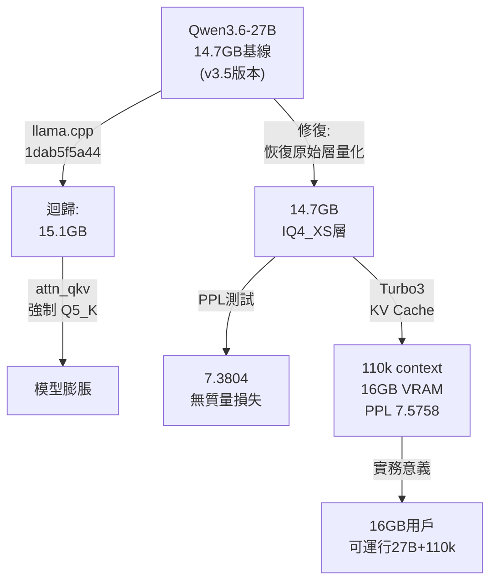

## Qwen3.6-27B IQ4_XS FULL VRAM with 110k context

Qwen3.6-27B 的 IQ4_XS 量化版本因 llama.cpp 提交 1dab5f5a44 的迴歸，導致模型大小從 14.7GB 膨脹至 15.1GB。該提交硬編碼 attn_qkv 層最低量化級別為 Q5_K，破壞 16GB VRAM 用戶體驗。作者通過修改 llama.cpp 代碼恢復原始層量化配置，實現 14.7GB 大小同時保持等效的推理質量（Perplexity 7.3804 ± 0.0276 vs 標準版 7.3765 ± 0.0276，無顯著差異）。進一步採用對稱 Turbo3 KV Cache 量化策略，達成 110k context（110,000 token 窗口）完全保存在 16GB VRAM，Perplexity 僅增加 0.2（7.5758 ± 0.0287）。詳細 benchmark 涵蓋 65k 與 110k context，驗證 KV Cache 層級量化（K 與 V 為等權重）。

### 重點
- 根因確認：llama.cpp commit 1dab5f5a44 硬編碼 attn_qkv 層最低為 Q5_K，致 IQ4_XS 從 14.7GB 膨脹至 15.1GB
- 修復驗證：恢復原始層量化，Perplexity 無顯著下降（7.3804 vs 7.3765，差異在誤差範圍內），破除 Q5_K 強制的必要性
- KV Cache 優化：對稱 Turbo3 量化（ctk=turbo3, ctv=turbo3）實現 110k context@16GB，PPL 7.5758，打破 16GB 用戶 65k context 的上限

**原文：** [reddit-localllama](https://www.reddit.com/r/LocalLLaMA/comments/1sy0qj5/qwen3627b_iq4_xs_full_vram_with_110k_context/)

---

### 📄 原文內容

點此展開 / 收合

<!-- SC_OFF -->
<h1>Qwen3.6-27B IQ4_XS Bloat: Reverting llama.cpp commit saves 16GB VRAM (14.7GB vs 15.1GB) + KVCache Tests</h1> 
With the release of Qwen3.6-27B, I noticed that compared to the excellent IQ4_XS quantization (14.7GB) by mradermacher for the 3.5 version (<a href="https://huggingface.co/mradermacher/Qwen3.5-27B-i1-GGUF">Qwen3.5-27B-i1-GGUF</a>), the current images have bloated. The Qwen3.6 equivalent (<a href="https://huggingface.co/mradermacher/Qwen3.6-27B-i1-GGUF">Qwen3.6-27B-i1-GGUF</a>) now weighs 15.1GB.
 
The IQ4_XS is a true &quot;unicorn&quot; – in all benchmarks, it offers an incredible ratio of size to model quality. In practice, it is the only viable option for running a 27B model on 16GB VRAM with a decent context. Anything lower than this is unsuitable for coding tasks. Unfortunately, the increase from 14.7GB to 15.1GB breaks the experience for 16GB cards.
 
<strong>The Cause &amp; The Fix</strong> The culprit is a specific <code>llama.cpp</code> commit (<code>1dab5f5a44</code>): <a href="https://github.com/ggml-org/llama.cpp/commit/1dab5f5a443a7b972005c56fb92eca2b07d57fea">GitHub link</a>. Its effect is hardcoding <code>attn_qkv</code> layer quantizations to a minimum of <code>Q5_K</code>.
 
To fix this, I modified the source code and replicated the original IQ4_XS layer quantization 1:1. I used the imatrix from mradermacher (<a href="https://huggingface.co/mradermacher/Qwen3.6-27B-i1-GGUF">Qwen3.6-27B-i1-GGUF</a>) and performed comparative benchmarks. I observed no significant drop in model quality. In my opinion, the mentioned commit is a pure regression for the IQ4_XS format.
 
<strong>My custom 14.7GB model with reverted layers is available here:</strong> 👉 <a href="https://huggingface.co/cHunter789/Qwen3.6-27B-i1-IQ4_XS-GGUF"><strong>cHunter789/Qwen3.6-27B-i1-IQ4_XS-GGUF</strong></a>
 <h1>Perplexity Benchmarks: 65k Context (-c 65536)</h1> 
<em>Testing parameters:</em> <code>pg19.txt</code> <em>(downloaded from Project Gutenberg here),</em> <code>--chunks 32</code><em>,</em> <code>-ngl 99</code> <em>(unless noted),</em> <code>-fa 1</code><em>,</em> <code>-b 512</code><em>,</em> <code>-ub 128</code>
 <table><thead> <tr> <th align="left">ID</th> <th align="left">Model Size</th> <th align="left">Model File / Version</th> <th align="left"><code>-ctk</code></th> <th align="left"><code>-ctv</code></th> <th align="left">Final PPL</th> </tr> </thead><tbody> <tr> <td align="left"><strong>1</strong></td> <td align="left">15.1GB</td> <td align="left"><code>Qwen3.6-27B.i1-IQ4_XS.gguf</code> (Standard)</td> <td align="left"><code>q8_0</code></td> <td align="left"><code>q8_0</code></td> <td align="left"><strong>7.3765</strong> ± 0.0276</td> </tr> <tr> <td align="left"><strong>2</strong></td> <td align="left">14.7GB</td> <td align="left"><code>...-IQ4_XS-attn_qkv-IQ4_XS.gguf</code> (Custom)</td> <td align="left"><code>q8_0</code></td> <td align="left"><code>q8_0</code></td> <td align="left"><strong>7.3804</strong> ± 0.0276</td> </tr> <tr> <td align="left"><strong>3</strong></td> <td align="left">14.7GB</td> <td align="left"><code>...-IQ4_XS-attn_qkv-IQ4_XS.gguf</code> (Custom)</td> <td align="left"><code>q8_0</code></td> <td align="left"><code>turbo2</code></td> <td align="left"><strong>7.4260</strong> ± 0.0277</td> </tr> <tr> <td align="left"><strong>4</strong></td> <td align="left">15.1GB</td> <td align="left"><code>Qwen3.6-27B.i1-IQ4_XS.gguf</code> (Standard)</td> <td align="left"><code>q8_0</code></td> <td align="left"><code>turbo3</code></td> <td align="left"><strong>7.4069</strong> ± 0.0277</td> </tr> <tr> <td align="left"><strong>5</strong></td> <td align="left">14.7GB</td> <td align="left"><code>...-IQ4_XS-attn_qkv-IQ4_XS.gguf</code> (Custom)</td> <td align="left"><code>q4_0</code></td> <td align="left"><code>q4_0</code></td> <td align="left"><strong>7.3964</strong> ± 0.0277</td> </tr> <tr> <td align="left"><strong>6</strong></td> <td align="left">14.7GB</td> <td align="left"><code>...-IQ4_XS-attn_qkv-IQ4_XS.gguf</code> (Custom)</td> <td align="left"><code>turbo3</code></td> <td align="left"><code>turbo3</code></td> <td align="left"><strong>7.4317</strong> ± 0.0279</td> </tr> </tbody></table> 
<strong>Command lines for 65k context:</strong>
 <ol> <li><code>./llama-perplexity -m Qwen3.6-27B.i1-IQ4_XS.gguf -f pg19.txt -c 65536 --chunks 32 -ngl -1 -ctk q8_0 -ctv q8_0 -fa 1 -b 512 -ub 128</code></li> <li><code>./llama-perplexity -m Qwen3.6-27B.i1-IQ4_XS-attn_qkv-IQ4_XS.gguf -f pg19.txt -c 65536 --chunks 32 -ngl -1 -ctk q8_0 -ctv q8_0 -fa 1 -b 512 -ub 128</code></li> <li><code>./llama-perplexity -m Qwen3.6-27B.i1-IQ4_XS-attn_qkv-IQ4_XS.gguf -f pg19.txt -c 65536 --chunks 32 -ngl -1 -ctk q8_0 -ctv turbo2 -fa 1</code></li> <li><code>./llama-perplexity -m Qwen3.6-27B.i1-IQ4_XS.gguf -f pg19.txt -c 65536 --chunks 32 -ngl 99 -ctk q8_0 -ctv turbo3 -fa 1 -b 512 -ub 128</code></li> <li><code>./llama-perplexity -m Qwen3.6-27B.i1-IQ4_XS-attn_qkv-IQ4_XS.gguf -f pg19.txt -c 65536 --chunks 32 -ngl 99 -ctk q4_0 -ctv q4_0 -fa 1 -b 512 -ub 128</code></li> <li><code>./llama-perplexity -m Qwen3.6-27B.i1-IQ4_XS-attn_qkv-IQ4_XS.gguf -f pg19.txt -c 65536 --chunks 32 -ngl 99 -ctk turbo3 -ctv turbo3 -fa 1 -b 512 -ub 128</code></li> </ol> 
<strong>KV Cache Observations:</strong> These tests indicate that for Qwen3.6-27B, the conclusions in <a href="https://github.com/TheTom/turboquant_plus">turboquant_plus</a> do not apply. There is no significant benefit to increasing K-cache at the expense of V-cache. In fact, for this model, the V-cache appears equally critical.
 <h1>Perplexity Benchmarks: 110k Context (-c 110000)</h1> 
Based on the above, I decided to use symmetric <code>Turbo3</code> quantization. Combined with my custom 14.7GB model, this optimization allowed me to achieve <strong>110k context fully within 16GB VRAM</strong>. <em>(This took quite a while to test, so I hope you appreciate the data!)</em>
 <table><thead> <tr> <th align="left">ID</th> <th align="left">Model Size</th> <th align="left">Model File / Version</th> <th align="left"><code>-ctk</code></th> <th align="left"><code>-ctv</code></th> <th align="left">Final PPL</th> </tr> </thead><tbody> <tr> <td align="left"><strong>7</strong></td> <td align="left">14.7GB</td> <td align="left"><code>...-IQ4_XS-attn_qkv-IQ4_XS.gguf</code> (Custom)</td> <td align="left"><code>q8_0</code></td> <td align="left"><code>q8_0</code></td> <td align="left"><strong>7.5205</strong> ± 0.0285</td> </tr> <tr> <td align="left"><strong>8</strong></td> <td align="left"><strong>14.7GB</strong></td> <td align="left"><strong>Selected Final Configuration</strong></td> <td align="left"><strong>turbo3</strong></td> <td align="left"><strong>turbo3</strong></td> <td align="left"><strong>7.5758</strong> ± 0.0287</td> </tr> <tr> <td align="left"><strong>9</strong></td> <td align="left">15.1GB</td> <td align="left"><code>Qwen3.6-27B.i1-IQ4_XS.gguf</code> (Standard)</td> <td align="left"><code>turbo3</code></td> <td align="left"><code>turbo3</code></td> <td align="left"><strong>7.5727</strong> ± 0.0287</td> </tr> </tbody></table> 
<strong>Command lines for 110k context:</strong>  7. <code>./llama-perplexity -m Qwen3.6-27B.i1-IQ4_XS-attn_qkv-IQ4_XS.gguf -f pg19.txt -c 110000 --chunks 32 -ngl -1 -ctk q8_0 -ctv q8_0 -fa 1 -b 512 -ub 64</code>  8. <code>./llama-perplexity -m Qwen3.6-27B.i1-IQ4_XS-attn_qkv-IQ4_XS.gguf -f pg19.txt -c 110000 --chunks 32 -ngl 99 -ctk turbo3 -ctv turbo3 -fa 1 -b 512 -ub 256</code>  9. <code>./llama-perplexity -m Qwen3.6-27B.i1-IQ4_XS.gguf -f pg19.txt -c 110000 --chunks 32 -ngl -1 -ctk turbo3 -ctv turbo3 -fa 1 -b 512 -ub 256</code>
 <h1>The Q3 Debate</h1> 
There are theories floating around that the Q3 model is fine. Judge for yourselves:
 <table><thead> <tr> <th align="left">ID</th> <th align="left">Model Size</th> <th align="left">Model File / Version</th> <th align="left"><code>-ctk</code></th> <th align="left"><code>-ctv</code></th> <th align="left">Final PPL</th> </tr> </thead><tbody> <tr> <td align="left"><strong>10</strong></td> <td align="left">Q3_K_L</td> <td align="left"><code>Qwen3.6-27B.i1-Q3_K_L.gguf</code></td> <td align="left"><code>q8_0</code></td> <td align="left"><code>q8_0</code></td> <td align="left"><strong>7.6538</strong> ± 0.0292</td> </tr> <tr> <td align="left"><strong>11</strong></td> <td align="left">Q3_K_L</td> <td align="left"><code>Qwen3.6-27B.i1-Q3_K_L.gguf</code></td> <td align="left"><code>turbo3</code></td> <td align="left"><code>turbo3</code></td> <td align="left"><strong>7.7085</strong> ± 0.0295</td> </tr> </tbody></table> 
<strong>Command lines for Q3 tests:</strong>  10. <code>./llama-perplexity -m Qwen3.6-27B.i1-Q3_K_L.gguf -f pg19.txt -c 110000 --chunks 32 -ngl -1 -ctk q8_0 -ctv q8_0 -fa 1 -b 512 -ub 128</code>  11. <code>./llama-perplexity -m Qwen3.6-27B.i1-Q3_K_L.gguf -f pg19.txt -c 110000 --chunks 32 -ngl 99 -ctk turbo3 -ctv turbo3 -fa 1 -b 512 -ub 256</code>
 
<!-- SC_ON --> &#32; submitted by &#32; <a href="https://www.reddit.com/user/Pablo_the_brave"> /u/Pablo_the_brave </a>   <a href="https://www.reddit.com/r/LocalLLaMA/comments/1sy0qj5/qwen3627b_iq4_xs_full_vram_with_110k_context/">[link]</a> &#32; <a href="https://www.reddit.com/r/LocalLLaMA/comments/1sy0qj5/qwen3627b_iq4_xs_full_vram_with_110k_context/">[comments]</a>

