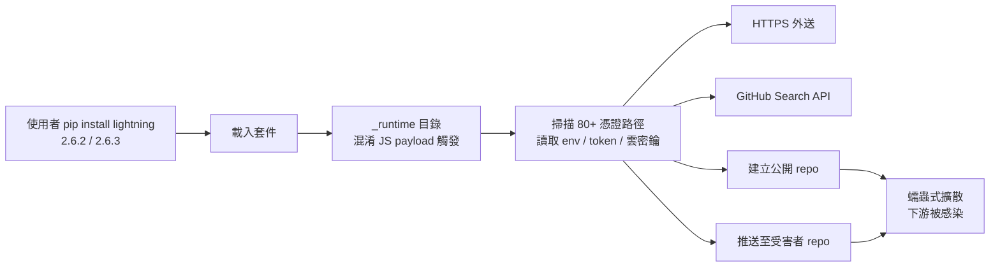
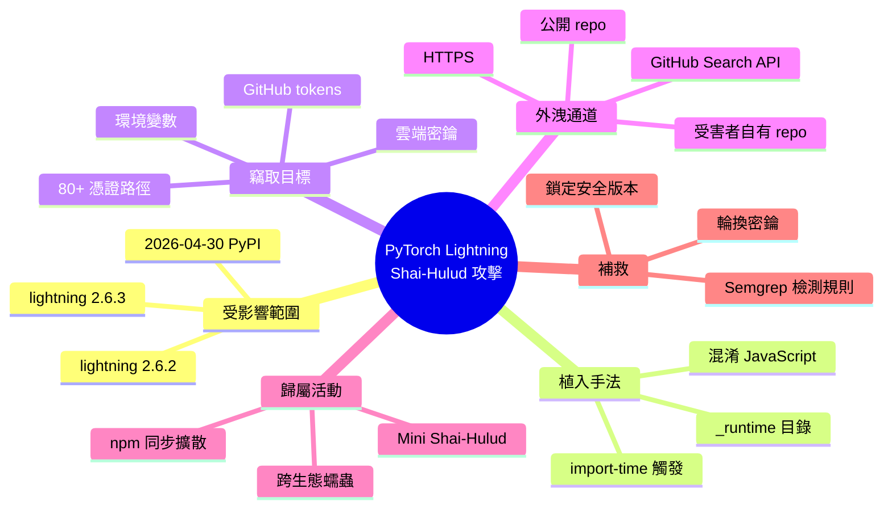

## Shai-Hulud Themed Malware Found in the PyTorch Lightning AI Training Library

PyPI 套件 `lightning`（PyTorch Lightning）版本 2.6.2 和 2.6.3 在 2026 年 4 月 30 日遭供應鏈攻擊。惡意代碼隱藏在 _runtime 目錄內，包含混淆 JavaScript 有效載荷，在模組導入時自動執行，竊取憑證、GitHub tokens、環境變數、雲密鑰等敏感數據。攻擊使用四個並行竊取渠道（HTTPS、GitHub 搜尋、公開 repo、受害者倉庫），掃描 80+ 個憑證檔案路徑。該攻擊屬於 Mini Shai-Hulud 活動，亦通過 npm 進行蠕蟲傳播，可能影響數百個下游套件。Semgrep 已發布檢測規則和補救建議。

### 重點
- PyTorch Lightning v2.6.2 和 v2.6.3 注入惡意 JavaScript，模組導入時自動執行，竊取 GitHub ghs_ tokens 和雲憑證
- 四渠道並行竊取設計：HTTPS POST、GitHub commit 搜尋、公開 repo 上傳、受害者自身 repo 推送，確保數據洩露持續進行
- 通過 npm 發佈 tokens 進行蠕蟲傳播，若獲得 npm 認證可污染所有可發佈套件，形成連鎖感染

**原文：** [hackernews](https://semgrep.dev/blog/2026/malicious-dependency-in-pytorch-lightning-used-for-ai-training/)

<!-- deep-analysis:begin -->
## 📌 摘要 (TL;DR)

- PyPI 套件 `lightning`（PyTorch Lightning）的 **2.6.2 與 2.6.3** 兩個版本於 **2026 年 4 月 30 日**遭供應鏈攻擊（supply chain attack）植入惡意載荷。
- 惡意代碼藏在套件內的 `_runtime` 目錄，是經過混淆的 JavaScript payload，**只要 Python 程式 `import lightning` 就會被觸發**。
- 竊取目標包括：GitHub tokens、環境變數、雲端密鑰、以及 **80+ 個常見憑證檔案路徑**。
- 採用 **四個並行外洩渠道**：HTTPS、GitHub 搜尋 API、建立公開 repo、向受害者自有 repo 推送，提高 exfiltration 成功率。
- 此事件屬於更大規模的 **Mini Shai-Hulud** 活動，npm 端也有蠕蟲式變體在傳播，潛在影響數百個下游套件。
- Semgrep 已發布偵測規則與補救建議，所有使用 PyTorch Lightning 訓練 AI 模型的團隊應立即比對版本與輪換密鑰。

## 🎯 核心概念

- **供應鏈攻擊** (supply chain attack)：攻擊者不直接打目標系統，而是污染目標所依賴的開源套件，藉「合法依賴」滲透下游。
- **Shai-Hulud**：近年針對 npm / PyPI 等套件生態系的蠕蟲式攻擊家族；這次 PyTorch Lightning 事件屬於其衍生變體 **Mini Shai-Hulud**。
- **PyTorch Lightning**：PyPI 上名稱為 `lightning` 的高階 AI 訓練框架，廣泛用於模型訓練 pipeline，是高價值的下游分發節點。

## 📖 整理分析

### 1. 受影響範圍與時間
依 Semgrep 揭露，PyPI 上的 `lightning` 套件在 **2026 年 4 月 30 日**被推上 **2.6.2 與 2.6.3** 兩個惡意版本。由於 PyTorch Lightning 是 AI 訓練的常用框架，潛在曝險面遍及研究單位、企業 ML pipeline 與 CI/CD 訓練環境。

### 2. 惡意代碼藏匿手法
惡意載荷被放在套件內的 `_runtime` 目錄，內容是**混淆過的 JavaScript payload**。攻擊鏈設計成 import-time 觸發 —— 不需要呼叫任何特定 API，只要載入模組就會執行；這意味著光是 `import lightning` 或被間接依賴的腳本啟動，就會洩漏資料。

### 3. 竊取目標：80+ 條憑證路徑
惡意代碼會掃描 **80+ 個常見憑證檔案路徑**，鎖定 GitHub personal access tokens、雲端服務密鑰、`.env` 環境變數、以及其他敏感憑證。對 AI 訓練環境特別致命，因為這類環境往往存有 HuggingFace token、雲端 GPU 帳號、模型 registry 憑證。

### 4. 四通道並行外洩
為了規避單點封鎖，攻擊使用 **四個並行 exfiltration 通道**：
1. HTTPS 直送外部伺服器
2. 透過 GitHub 搜尋 API 留下指紋
3. 建立**公開 GitHub repo** 將竊得資料外露
4. 推送至**受害者自己的 repo**（利用已竊得的 token）

第 3、4 條通道的設計極具 Shai-Hulud 特色——讓被害者自己的 GitHub 帳號成為散播節點，形成蠕蟲擴散。

### 5. Mini Shai-Hulud 與跨生態擴散
這次 PyPI 事件並非孤立。Semgrep 將其歸入 **Mini Shai-Hulud** 活動，**npm 生態同時有蠕蟲式變體在擴散**，可能影響數百個下游套件。跨生態（PyPI + npm）並用，顯示攻擊者瞄準 polyglot 開發環境（例如同時用 Python 訓練、用 Node.js 做服務層的 AI 產品團隊）。

### 6. 偵測與補救建議
Semgrep 已釋出對應的檢測規則。建議行動順序：
- 立即檢查 `lightning` 是否為 2.6.2 / 2.6.3，鎖定到已知安全版本
- 輪換所有 GitHub token、雲端密鑰與 `.env` 內容
- 審計 CI/CD 環境變數歷史與 GitHub 帳號近期是否被建立公開 repo / 異常 push
- 在 lockfile 與 SBOM 中加入版本黑名單，防止重新引入

## 🧭 攻擊流程圖

## 🧠 Mindmap

<!-- deep-analysis:end -->
