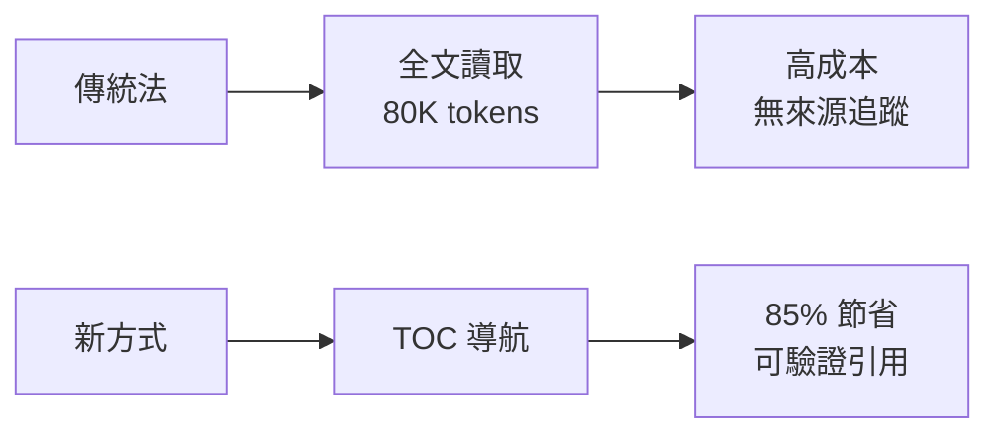

## Built an MCP Claude Connector for SEC filings after I nuked through my Claude usage limit

開發者建構 AlphaCreek — 一個 MCP 連接器解決 SEC 文件查詢的成本爆炸問題。傳統方法將整份 80,000+ tokens 的 10-K 文件輸入上下文；新方法先生成檔案目錄導航，讓 Agent 精確定位後只讀取相關部分，實現 85% token 節省。支援 6,000+ 美國上市公司的 10-K、10-Q，8-K 與收益文字稿計劃中。免費服務，每個結果都附原文連結便於驗證。

### 重點
- 分層文檔檢索模式（目錄優先，按需讀取）節省 85% tokens vs 全文輸入
- 支援 6,000+ 美國上市公司、10-K 與 10-Q 檔案，模型不可知
- 含引用來源連結，解決 LLM 幻覺導致信用度喪失問題

**原文：** [reddit-claudeai](https://www.reddit.com/r/ClaudeAI/comments/1t02ohf/built_an_mcp_claude_connector_for_sec_filings/)

---

### 📄 原文內容

點此展開 / 收合

<!-- SC_OFF -->

I blew through my weekly Claude limit so many times I almost upgraded to the next tier. I knew the problem was because I was dumping the entire 10-Ks in there for context. My lazy ass could have just copied the specific section I cared about, but if I'm already going to the filing to do that, I might as well not have used Claude in the first place. So I just built the solution.
 
The problem I kept running into with any SEC filing workflow was the same thing: raw filings are enormous, and my agent was reading all of it to answer something that lived in three paragraphs.
 
A 10-K from a large-cap company can be 80 000+ tokens. If you're just dumping the filing into context and asking a question, you're paying for the whole document. It works, technically. It's just expensive and slow, and the answers get sloppier the more noise surrounds the relevant section.
 
The other thing that bothered me was citations. Most approaches return text but give you no way to verify where it came from. You get an answer, you trust the model, and if it hallucinated a number from the footnotes, there goes future credibility. 
 
<strong>What I built</strong>
 
Landed on an <a href="https://www.alphacreek.ai">approach </a>to create a navigation-map first and split the document into logical sections (preserving text under a title and linking it to the title based on formatting). Instead of returning the filing, you get a table of contents for the filing. The agent looks at the structure first, decides what it actually needs, and only then fetches those specific sections. Each chunk comes back with a reader_url that links directly to that passage in the original EDGAR HTML filing.
 
Before: agent calls filing API, gets a wall of text, burns context, returns an answer with no traceable source.
 
After: agent calls get_filing_toc, sees the map, navigates to the relevant node, pulls 2-4 paragraphs, cites the exact line.
 
Token reduction in practice is around 85% vs. raw retrieval.
 <ul> <li>6,000+ US public companies</li> <li>10-K, 10-Q. Working on bringing in 8-K (probably later this week or next) and then maybe earnings transcript (right after)</li> <li>Model agnostic (works with Claude, GPT, maybe Gemini but haven’t tested it)</li> </ul> 
It’s free 😄 would love to get some honest feedback. Also remember to update claude instructions for optimal result!
 
Check it out here: <a href="https://www.alphacreek.ai">https://www.alphacreek.ai</a>
 
<!-- SC_ON --> &#32; submitted by &#32; <a href="https://www.reddit.com/user/konamul"> /u/konamul </a>   <a href="https://www.reddit.com/r/ClaudeAI/comments/1t02ohf/built_an_mcp_claude_connector_for_sec_filings/">[link]</a> &#32; <a href="https://www.reddit.com/r/ClaudeAI/comments/1t02ohf/built_an_mcp_claude_connector_for_sec_filings/">[comments]</a>

