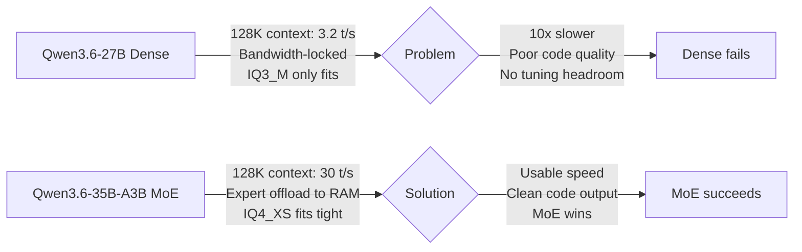

## Long-context coding on RTX 5080 16GB: Qwen3.6-35B-A3B holds 30 t/s at 128K (89 t/s fresh), no quality drop

用戶在消費級 RTX 5080 16GB 上實現 Qwen3.6-35B-A3B MoE 模型長上下文編碼代理，在 128K token 上下文維持 30 token/s 速度。對比測試顯示，MoE 模型雖參數多（35B vs 27B），但通過專家卸載到系統 RAM，相比密集模型提升 10 倍速度（30 vs 3.2 t/s）且代碼質量更高（通過實際 bug 修復測試驗證）。詳細 CUDA 核心優化分析表明密集模型因帶寬限制無法調優。

### 重點
- RTX 5080 16GB 上 Qwen3.6-35B-A3B MoE：128K 上下文 30 token/s，vs 27B 密集 3.2 t/s（10 倍提升）
- MoE 模型通過編碼質量實測驗證（餐廳帳單分割器），密集模型有變數名錯誤；MoE 通過全部 4 個測試用例
- 帶寬分析：密集模型因 mul_mat_q 核心寄存器限制（254 寄存器/執行緒）導致帶寬鎖定，微調無效；MoE 通過專家卸載規避此限制

**原文：** [reddit-localllama](https://www.reddit.com/r/LocalLLaMA/comments/1t07s6x/longcontext_coding_on_rtx_5080_16gb_qwen3635ba3b/)

---

### 📄 原文內容

點此展開 / 收合

<!-- SC_OFF -->

I wanted to see how much of my coding-agent workflow I could move local instead of paying for hosted tools forever.
 
There was another push: Anthropic's own <a href="https://www.anthropic.com/engineering/april-23-postmortem">April 23 postmortem</a> confirmed product-layer regressions through March/April. With a local model, what you benchmark is what you get.
 
The other constraint was context. I needed something that stayed usable at 65K–128K minimum.
 
I had an RTX 5080 16GB sitting idle most of the day. Qwen3.6 had been getting enough praise for coding that it seemed worth testing seriously. Claude Code can be pointed at a local Anthropic-compatible <code>/v1/messages</code> endpoint (<a href="https://unsloth.ai/docs/basics/claude-code#fixing-90-slower-inference-in-claude-code">Unsloth has a good guide on this</a>), so the goal was simple: keep the Claude Code workflow, but serve the model from local llama.cpp.
 
This is not a leaderboard benchmark. It is a field log from trying to make long-context coding-agent work usable on one consumer GPU.
 <h2>Hardware</h2> <ul> <li>RTX 5080 16GB (sm_120, consumer Blackwell GB203)</li> <li>Ryzen 9700X (8c/16t)</li> <li>96GB DDR5</li> <li>Windows 11</li> <li>iGPU drives the display, 5080 is compute-only</li> <li>PCIe Gen 5 x16</li> </ul> 
One important note: CUDA 12.9.1 is mandatory on the fork I ended up using. CUDA 13.x produces garbage output and 13.1 segfaults in MMQ kernels. Learned that the hard way.
 <h2>The fork</h2> 
Not running mainline llama.cpp. I started with Madreag/turbo3-cuda (a TurboQuant CUDA fork in the TheTom/llama-cpp-turboquant lineage — TurboQuant adds TCQ / Trellis-Coded Quantization for the KV cache, ~3.125 bits per value). My patched fork is here: <a href="https://github.com/craftogrammer/llama.cpp-adaptive-turboquant">craftogrammer/llama.cpp-adaptive-turboquant</a>. It worked fine at lower context around 64K, but speed dropped off hard at the longer context I was targeting and I wanted to understand why. So I profiled decode with <code>ncu</code> (Nsight Compute) on the dense 27B at d=65K. <code>mul_mat_q&lt;IQ3_S&gt;</code> ate 43% of profiled decode time. Dug deeper: 254 registers per thread, ~12.5% theoretical occupancy, DRAM throughput under 7%. The kernel is register-bound, not memory-bound — cp.async, prefetch, and pipelining tricks don't help. I tried two committed kernel changes (backtrace to shared memory, alignment fix) plus one local experiment (cp.async for MMQ tile loads, tested and reverted) and clean-rebenched each: +0.16% combined. Null. A series of smaller inlining and vectorization wins (V-dequant inline, byte-pair vectorization, minBlocks bump, inline scorer) did compound to +0.7% at d=0 scaling to +13% at d=64K — individually small, meaningful stacked at depth.
 
I also tested two ideas that I measured and rejected: a think-anchor mechanism (fp16 sink ranges anchored on reasoning tokens — measured −0.28% TG vs disabled, declined to ship) and a sparse-V threshold runtime knob (measured −32% decode regression, 20.4 vs 29.8 t/s, reverted to upstream-validated constant). Mentioning these because they took real time and the negative results are part of the honest picture.
 
Along the way I hit sm_120 ptxas issues: had to back off occupancy hints on FA vec kernels (higher minBlocks crashed the compiler). Some TCQ helpers must stay <code>__noinline__</code>, certain TUs need <code>--ptxas-options=-O0</code>. One thing easy to miss: <code>prefetch.global.L2</code> lowers to <code>CCTL.E.PF2</code> in SASS on sm_120 — grep for <code>CCTL</code>, not <code>PRF</code>.
 
Built on top of those findings, I patched the fork with adaptive KV mode selection, MoE offload tuning, and tight-VRAM fixes for RTX 5080 16GB.
 <h2>First attempt: Qwen3.6-27B dense</h2> 
This model looked like the natural fit for 16GB. Hybrid Transformer-Mamba, only 16/64 layers carry KV cache. Memory math looked fine on paper.
 
And at low context, it was fine. 40 t/s at empty context on a NEO-CODE IQ3_M quant. Usable.
 
Then I ran a depth sweep to see what actually happens as context grows:
 <table><thead> <tr> <th align="right">Context depth</th> <th align="right">Decode (t/s)</th> </tr> </thead><tbody> <tr> <td align="right">0</td> <td align="right">40.5</td> </tr> <tr> <td align="right">16K</td> <td align="right">17.4</td> </tr> <tr> <td align="right">32K</td> <td align="right">10.6</td> </tr> <tr> <td align="right">65K</td> <td align="right">6.0</td> </tr> <tr> <td align="right">128K</td> <td align="right">3.2</td> </tr> </tbody></table> 
3.2 tokens per second at 128K. In practice, Claude Code just felt painfully slow once conversations got long. Running the depth bench afterward explained why — the curve matched exactly what I was experiencing.
 
I spent days trying to tune this. Swept 9 combinations of ubatch size and thread count. The spread across all 9 was 0.46 t/s. Decode was completely bandwidth-locked. There was nothing to tune.
 
IQ3_M wasn't a quality choice — it was the only option that fit. Here's what the quant landscape looks like on 16GB at 131K context:
 <table><thead> <tr> <th>Quant</th> <th align="right">File size</th> <th>Fits at 131K?</th> </tr> </thead><tbody> <tr> <td>NEO-CODE IQ3_M (by <a href="https://huggingface.co/DavidAU">DavidAU</a>)</td> <td align="right">12.0 GiB</td> <td>yes</td> </tr> <tr> <td>UD-Q3_K_XL</td> <td align="right">13.5 GiB</td> <td>yes (tight)</td> </tr> <tr> <td>IQ4_XS</td> <td align="right">14.3 GiB</td> <td>no (~1.6 GiB over)</td> </tr> <tr> <td>Q4_K_S</td> <td align="right">14.8 GiB</td> <td>no</td> </tr> <tr> <td>IQ4_NL</td> <td align="right">15.0 GiB</td> <td>no</td> </tr> <tr> <td>Q4_K_M</td> <td align="right">15.7 GiB</td> <td>no</td> </tr> <tr> <td>Q5 / Q6</td> <td align="right">19+ GiB</td> <td>5090 territory</td> </tr> </tbody></table> 
Every Q4-class quant and above is out of reach on dense 27B + 16GB at usable context. IQ4_XS would need ~7 layers offloaded to CPU, which kills decode to ~5 t/s — defeats the purpose. So I was stuck at IQ3_M quality with a depth curve that made agent loops painful.
 
What finally pushed me to try the MoE path was a concrete coding test. I gave both models a restaurant bill splitter (integer paisa, exact-sum invariant, 4 test cases). The dense 27B wrote <code>personSubtitles</code> instead of <code>personSubtotals</code> three times — code doesn't even run. The 35B-A3B MoE wrote clean BigInt code that passed all 4 tests, in less wall time despite generating 54% more tokens. That was the moment I stopped trying to save the dense path.
 <h2>Why I tested the MoE path</h2> 
<strong>Can a model that doesn't fully fit on 16GB still be useful for long-context coding if you offload some experts to system RAM?</strong>
 
That is the regime I had not seen enough numbers for: consumer Blackwell, one 16GB GPU, long coding-agent context, partial MoE offload. So I tested it end-to-end instead of treating &quot;35B total&quot; as an automatic no.
 <table><thead> <tr> <th align="right">Context depth</th> <th align="right">27B dense (old path)</th> <th align="right">35B-A3B MoE (final path)</th> </tr> </thead><tbody> <tr> <td align="right">0</td> <td align="right">40.5</td> <td align="right">91.8</td> </tr> <tr> <td align="right">16K</td> <td align="right">17.4</td> <td align="right">76.9</td> </tr> <tr> <td align="right">32K</td> <td align="right">10.6</td> <td align="right">54.1</td> </tr> <tr> <td align="right">65K</td> <td align="right">6.0</td> <td align="right">46.2</td> </tr> <tr> <td align="right">128K</td> <td align="right">3.2</td> <td align="right">30.4</td> </tr> </tbody></table> 
Not a controlled single-variable comparison — I changed model, quant, offload split, and KV layout. The point is practical: dense wasn't usable at agent context, MoE became usable after tuning.
 <h2>The offload balance is the whole game</h2> 
On the UD-Q4_K_XL GGUF (20.81 GiB), the <code>ncmoe</code> sweep at d=16K:
 <table><thead> <tr> <th align="right">ncmoe</th> <th align="right">tg32 (t/s)</th> <th>Notes</th> </tr> </thead><tbody> <tr> <td align="right">40 (all CPU)</td> <td align="right">36.4</td> <td>baseline</td> </tr> <tr> <td align="right">20</td> <td align="right">53.2</td> <td></td> </tr> <tr> <td align="right">16</td> <td align="right">58.9</td> <td>sweet spot for this file</td> </tr> <tr> <td align="right">12</td> <td align="right">36.1</td> <td>hit VRAM cliff</td> </tr> <tr> <td align="right">8</td> <td align="right">5.9</td> <td>catastrophic spill</td> </tr> </tbody></table> 
The cliff is sharp. Sweet spot depends on GGUF file size vs available VRAM after KV allocation.
 
APEX-I-Compact (credit: <a href="https://huggingface.co/mudler/Qwen3.6-35B-A3B-APEX-GGUF">mudler on Hugging Face</a>) won because its smaller file (16.1 GiB vs 20.8 GiB) let me use <code>ncmoe=8</code> instead of 16. That reduced PCIe pressure enough to matter:
 <table><thead> <tr> <th align="right">Context depth</th> <th align="right">UD-Q4_K_XL (ncmoe=16)</th> <th align="right">APEX-I-Compact (ncmoe=8)</th> </tr> </thead><tbody> <tr> <td align="right">0</td> <td align="right">51.6</td> <td align="right">92.3</td> </tr> <tr> <td align="right">16K</td> <td align="right">58.9</td> <td align="right">75.9</td> </tr> <tr> <td align="right">32K</td> <td align="right">49.3</td> <td align="right">64.2</td> </tr> <tr> <td align="right">65K</td> <td align="right">39.4</td> <td align="right">48.0</td> </tr> <tr> <td align="right">128K</td> <td align="right">—</td> <td align="right">31.3</td> </tr> </tbody></table> 
I also tested APEX-I-Quality (Q6_K, 21.25 GiB). It needed <code>ncmoe=20</code> just to avoid VRAM thrashing. At that offload level it was the same speed as UD with the same quality on my shared test harness. No axis where it beat either keeper. Deleted it.
 <h2>My coding benchmark was wrong (and yours might be too)</h2> 
I initially thought UD was clearly better quality: 33/34 tests passed vs APEX-I-Compact's 29/32. A 6.5 percentage point gap.
 
Then I looked at what was actually happening. Each model was writing its own test suite AND its own implementation. A model that wrote 19 tests including 4 broken ones scored 15/19, while a model that wrote 11 clean tests scored 11/11. The benchmark was grading <code>(implementation quality × test quality)</code> and calling it implementation quality.
 
Specific bugs I found:
 <ul> <li>APEX-I-Compact had a real impl bug: <code>b.priority</code> was undefined because the subscription stored it as <code>options.priority</code>. Sort comparator returned NaN, no sorting happened.</li> <li>APEX-I-Quality wrote 4 tests where a no-op handler was supposed to populate an array that was declared after the handler was removed. The tests were broken, not the implementation.</li> <li>My prompt had a contradictory clause about snapshot-during-emit semantics that each model interpreted differently but consistently.</li> </ul> 
After fixing the prompt, pinning sampling to deterministic (temp=0, seed=42), and grading all three against a single shared 11-test harness:
 <table><thead> <tr> <th>Model</th> <th align="right">Decode t/s</th> <th align="right">Shared harness</th> </tr> </thead><tbody> <tr> <td>UD-Q4_K_XL</td> <td align="right">64.5</td> <td align="right">11/11</td> </tr> <tr> <td>APEX-I-Compact</td> <td align="right">86.7</td> <td align="right">11/11</td> </tr> <tr> <td>APEX-I-Quality</td> <td align="right">53.4</td> <td align="right">11/11</td> </tr> </tbody></table> 
The quality gap disappeared. The speed gap didn't.
 
If you're doing local coding evals: <strong>use a shared test harness, pin your sampling, and disambiguate your prompts.</strong> Self-written tests are not a quality signal.
 <h2>The &quot;compress everything&quot; trap</h2> 
One finding from my setup that may be worth testing elsewhere: more KV compression is not always faster at long context.
 
I tested different KV cache layouts on the fork — ranging from &quot;compress all attention layers with TCQ&quot; to &quot;promote some K+V layers to q8_0.&quot; I'm intentionally not posting the exact mode map here because this is fork-specific and still changing. But the shape of the result:
 <table><thead> <tr> <th>KV layout</th> <th align="right">d=0</th> <th align="right">d=16K</th> <th align="right">d=32K</th> <th align="right">d=65K</th> <th align="right">d=128K</th> </tr> </thead><tbody> <tr> <td>All compressed</td> <td align="right">86.8</td> <td align="right">55.2</td> <td align="right">42.3</td> <td align="right">28.3</td> <td align="right">16.6</td> </tr> <tr> <td>Hybrid (some layers q8_0)</td> <td align="right">91.8</td> <td align="right">76.9</td> <td align="right">54.1</td> <td align="right">46.2</td> <td align="right">30.4</td> </tr> </tbody></table> 
At 128K, the hybrid layout is nearly <strong>2x faster</strong> than full compression.
 
I don't have a proven explanation for why. My working hypothesis is that TCQ codebook lookup overhead grows linearly with K reads, and at deeper context you're paying more per-read cost. Promoting the most-accessed layers to q8_0 avoids that where it matters most. Whatever the cause, the measured result is clear: if you're running any TCQ or compressed KV scheme, test at your actual working context depth, not d=0.
 
To avoid manually picking a layout, I wrote an auto-selector: at cache allocation it probes free VRAM via <code>ggml_backend_dev_memory</code>, estimates each layout's KV size with the same <code>ggml_row_size</code> formula the allocator uses, and picks the most aggressive mode that fits under free VRAM minus a 1 GiB compute-peak margin. Verified: predicted 1510 MiB, actual allocation 1509.88 MiB. On bigger cards it stays aggressive; on tight VRAM it falls back automatically. Override with <code>TURBO_LAYER_ADAPTIVE=N</code> if you want manual control.
 <h2>Where it is now</h2> 
Daily driver config:
 <ul> <li><strong>Model</strong>: Qwen3.6-35B-A3B APEX-I-Compact (16.10 GiB)</li> <li><strong>Fork</strong>: <a href="https://github.com/craftogrammer/llama.cpp-adaptive-turboquant">craftogrammer/llama.cpp-adaptive-turboquant</a>, CUDA 12.9.1, sm_120</li> <li><strong>Offload</strong>: 8 expert layers on CPU (<code>--n-cpu-moe 8</code>)</li> <li><strong>Context</strong>: 131072 (128K)</li> <li><strong>KV</strong>: turbo3_tcq with auto-selected hybrid layout</li> <li><strong>Sampling</strong>: temp=0.6, top_p=0.95, top_k=20</li> </ul> 
Claude Code talks to this through <code>ANTHROPIC_BASE_URL=http://127.0.0.1:8080</code>. Server-side log from one real request: 1078-token prompt prefilled at 1582 t/s, 538-token decode at 90.7 t/s.
 
VRAM sits at ~13.3 / 16.0 GB during sustained 128K decode. Tight but no spill.
 
Prompt cache (<code>--cache-ram -1</code>) makes agent loops much faster after the first turn: cold prefill of a 23K-token prompt takes ~13s at 1787 t/s, but subsequent turns with similar prefix only re-prefill the delta at 419–569 t/s. One gotcha on hybrid Mamba+Attention: any prefix mismatch — even a dynamic timestamp or request ID — forces full re-prefill because the SSM state can't partially roll back.
 
Fallback if I hit real-world regressions: UD-Q4_K_XL at ncmoe=16, ~62 t/s, same quality on shared harness.
 <h2>The ceiling is the hardware</h2> 
PCIe Gen 5 x16 hits ~89% saturation during MoE decode (56–61 GB/s burst against a ~63 GB/s theoretical ceiling). SM utilization sits at 93–97%. I don't see obvious tuning headroom left in this regime.
 
39–48 t/s at d=65K and ~30 t/s at d=128K is what this hardware does. Getting past 50 t/s sustained at long context needs more VRAM (fewer experts on CPU = less PCIe traffic), not more clever kernels. Waiting for 5090 at MSRP whenever that happens.
 <h2>If you want to try this on your 16GB card</h2> 
The short version: grab Qwen3.6-35B-A3B in a ~16 GiB GGUF (APEX-I-Compact worked for me) and sweep <code>ncmoe</code> at your target context depth — not at d=0. The sweet spot is narrow and file-size-dependent. On my 5080 it's <code>ncmoe=8</code> for the 16 GiB file and <code>ncmoe=16</code> for the 21 GiB file.
 
If you're using a TurboQuant-derived fork with compressed KV, test at your real working depth. I found that full compression was nearly 2x slower than a hybrid layout at 128K — d=0 benchmarks won't tell you that.
 
One thing worth preempting since it just landed: I benched mainline NVFP4 (b8967) same day it shipped. 15–16 t/s vs 39–51 t/s on the fork in MoE+offload. GitHub <a href="https://github.com/ggml-org/llama.cpp/issues/18250">#18250</a> closed &quot;not planned.&quot;
 <h2>What I learned</h2> 
Measure at your actual working context depth, not d=0. Agent context grows fast and d=0 speed is not predictive. The depth curve is the hardware talking — I spent days trying to tune around it before accepting it was a PCIe ceiling, not a configuration problem.
 
On 16GB, file size matters more than quant quality. A smaller GGUF that lets you keep more experts on GPU will beat a &quot;better&quot; quant that forces worse offload balance. Quality was identical on shared deterministic tests.
 
And if you're running local coding evals: use a shared test harness, pin your sampling, and disambiguate your prompts. I thought one model was 6.5pp better until I realized each model was grading itself on its own self-written tests. The gap disappeared the moment I used a shared harness.
 <h2>Update: mainline llama.cpp beat my fork</h2> 
After all the fork work above, I saw a Reddit user claiming 60+ t/s on a 5070 Ti with stock mainline llama.cpp. Seemed too high. So I cloned mainline at b8967, built with LTO + CUDA graphs + sm_120a, and benched the same model on the same hardware.
 
Mainline won. At every depth. By a lot.
 <table><thead> <tr> <th align="right">Depth</th> <th align="right">Fork (TCQ KV, ncmoe=8)</th> <th align="right">Mainline (f16 KV, --fit on)</th> <th align="right">Mainline win</th> </tr> </thead><tbody> <tr> <td align="right">d=0</td> <td align="right">89.5</td> <td align="right">139.6</td> <td align="right">+56%</td> </tr> <tr> <td align="right">d=65K</td> <td align="right">48.4</td> <td align="right">89.6</td> <td align="right">+85%</td> </tr> <tr> <td align="right">d=131K</td> <td align="right">~30</td> <td align="right">73.3</td> <td align="right">+144%</td> </tr> <tr> <td align="right">d=196K</td> <td align="right">can't fit</td> <td align="right">59.4</td> <td align="right">—</td> </tr> </tbody></table> 
The key was <code>--fit on</code> — mainline's dynamic layer fitter places layers across GPU/CPU automatically based on available VRAM, and it does a better job than manual <code>ncmoe</code>. At d=0, <code>--fit on</code> beat my manual <code>--n-cpu-moe 8</code> by +33.7%. And f16 KV on mainline outperformed TCQ compressed KV at every depth — the codebook lookup overhead I was trying to optimize around just doesn't exist with f16.
 
Mainline also extends usable context to 196K on 16GB. The fork couldn't even fit that.
 
I verified a few things before trusting the numbers: spec decoding via <code>--spec-type ngram-mod</code> is net-negative on this model (−49% to −52% — checkpoint overhead exceeds n-gram gains for MoE+SSM), and the LTO + CUDA graphs build flags looked like −5.7% on a single run but turned out to be +3.5% averaged over 3 runs. Methodology mattered.
 
Current daily driver is now mainline b8967:
 <table><thead> <tr> <th>Use case</th> <th align="right">t/s</th> </tr> </thead><tbody> <tr> <td>Short prompts</td> <td align="right">~140</td> </tr> <tr> <td>d=65K</td> <td align="right">~90</td> </tr> <tr> <td>d=131K</td> <td align="right">~73</td> </tr> <tr> <td>d=196K</td> <td align="right">~59</td> </tr> </tbody></table> 
Five days ago I was staring at 3.2 t/s at 128K on dense and thinking the card wasn't enough. Now it's 73 t/s at the same depth on mainline and 196K is usable. Same GPU, same RAM, same PCIe — just a different path to get there.
 
The fork work wasn't wasted — the profiling, the depth sweeps, the methodology lessons, and the coding benchmark findings all carry forward. But the honest conclusion is: on consumer Blackwell with 16GB, mainline llama.cpp with <code>--fit on</code> and f16 KV is the right answer today. The TCQ fork chapter is closed.
 
 
<em>English isn't my first language — I used Claude to help write this post. All data, measurements, benchmarks, and technical conclusions are from my own testing on my own hardware.</em>
 
<!-- SC_ON --> &#32; submitted by &#32; <a href="https://www.reddit.com/user/craftogrammer"> /u/craftogrammer </a>   <a href="https://www.reddit.com/r/LocalLLaMA/comments/1t07s6x/longcontext_coding_on_rtx_5080_16gb_qwen3635ba3b/">[link]</a> &#32; <a href="https://www.reddit.com/r/LocalLLaMA/comments/1t07s6x/longcontext_coding_on_rtx_5080_16gb_qwen3635ba3b/">[comments]</a>

