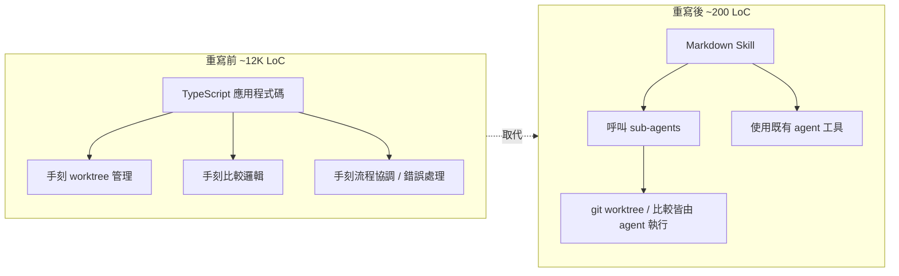
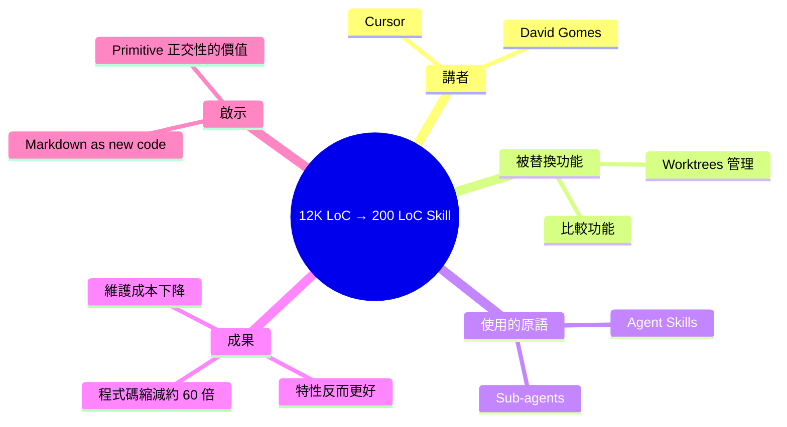

## Replacing 12K LoC with a 200 LoC Skill — David Gomes, Cursor

Cursor 工程師 David Gomes 分享如何用 markdown skill 將 Cursor 應用中的 12,000 行代碼替換為 200 行。核心創新是利用現有的 agent skills 與 sub-agents 兩個原始 primitive，重新實現原本需要 15,000+ 行代碼的 worktrees 和 best-event 比較功能。新實現維護成本大幅降低，甚至提供比舊版本更優的特性，體現了 markdown 作為新型 code 的強大潛力和 agent 系統設計的優雅簡化。

### 重點
- Cursor worktrees feature：從 15,000+ 行代碼縮減至 markdown skill 實現，deletion ratio 極高
- git worktrees 讓多個 agents 並行工作在隔離環境，支援同任務不同模型比較（best-event）
- Agent skills + sub-agents 兩個 primitive 足以替代複雜的 feature 工程，降低維護負擔

**原文：** [youtube-ai-engineer](https://www.youtube.com/watch?v=WE_Gnowy3uw)

<!-- deep-analysis:begin -->
## 📌 摘要 (TL;DR)

- Cursor 工程師 David Gomes 分享：用一個約 **200 行的 markdown skill**，取代了 Cursor 應用中原本約 **12,000 行的程式碼**（標題數字；摘要另提及舊實作合計超過 15,000 行）。
- 關鍵手法是把功能從硬編碼邏輯，改寫成依賴兩個既有原語（primitive）：**agent skills**（agent 技能）與 **sub-agents**（子代理）。
- 被替換的功能包含 **worktrees**（git 工作樹隔離）以及一個版本／結果**比較功能**（summary 中以「best-event 比較」描述，可能是 ASR 對 bisect 或 best-of-N 的誤拼，原始演講字幕未提供，無法 100% 確認）。
- 新版本不只程式碼少了一個量級，**維護成本顯著下降**，且據講者所述提供了比舊版更好的特性。
- 核心訊息：**markdown 正成為新型 code**，當底層 agent runtime 夠強，產品工程師可以用「寫 prompt／寫流程」取代「寫 TypeScript」。

> ⚠️ 注意：本則 inbox 的 `body_md` 並未包含完整字幕，僅有標題與一段中文摘要。以下分析嚴格依據該摘要與標題重述，不擴充未被明示的細節。

## 🎯 核心概念

- **Skill（技能）**：以 markdown 撰寫、由 agent 在執行期載入的「行為說明書」，告訴 agent 何時、如何完成某類任務。
- **Sub-agent（子代理）**：主 agent 在需要隔離脈絡或並行處理時，派出的下層 agent；通常擁有獨立 context window。
- **Worktree（git 工作樹）**：git 原生機制，可以在同一 repo 下開出多個獨立工作目錄；在 agent 場景常用來讓多個 agent 平行修改同一專案而不互相污染。
- **LoC（Lines of Code）**：程式碼行數，這裡是用來量化「重寫前 vs. 重寫後」的維護面積差距。

## 📖 整理分析

### 1. 為什麼一個 skill 能取代一萬多行程式

根據摘要，被替換掉的功能（worktrees 管理 + 比較功能）原本是用傳統應用程式碼實作——意味著 Cursor 必須自行處理 worktree 建立、清理、狀態追蹤、UI 串接、錯誤處理等邏輯。當底層 agent 已具備呼叫 shell、檔案系統、git 等工具的能力時，這些「流程協調」可以被 skill 中的自然語言指令取代，不需要每一步都寫成 TypeScript 函式。

### 2. 兩個既有原語：skills 與 sub-agents

講者強調這次改造**沒有引入新基礎建設**，而是組合了 Cursor agent 中已存在的兩件事：skills（讓 agent 知道流程）與 sub-agents（讓任務可隔離、可並行）。這是工程上很有意義的訊號——當 primitive 設計得夠正交，產品功能就能用「描述」而不是「實作」來交付。

### 3. Worktrees 與比較功能的 agent 化

worktrees 在 Cursor 中常見的用途是讓多個 agent 同時在同一份程式上做不同實驗；「比較功能」（摘要稱 best-event，原詞未確認）則是在多個結果中挑選或對照。這兩件事都是**流程性、可被語言描述**的工作，正好適合搬到 markdown skill。

### 4. 維護成本與產品體驗的雙重收益

摘要明確指出：新實作不只行數少，**還比舊版本提供更優的特性**。這在重寫專案中並不常見——通常重寫會先犧牲功能再慢慢補回來。能同時瘦身又升級，反映底層 agent 能力（工具呼叫、規劃、並行）已超過原本硬編碼邏輯所能維持的水準。

### 5. 給工程師的啟示：markdown as code

當 skill 能取代程式碼，code review 的對象、版本控管的單位、bug 的除錯方式都會跟著改變。這場演講把「200 vs 12,000」當作具體案例，論點是：**未來產品工程的部分工作量會從 IDE 寫函式，移到寫 markdown 流程**。

## 🧭 對照圖：舊架構 vs. 新架構

## 🧠 Mindmap

> 本整理的事實基礎僅來自原 inbox 提供的標題與中文摘要；具體技術細節（例如 skill 的實際內容、底層工具列表、效能數字）在 `body_md` 中並未提供，故未在此補完。
<!-- deep-analysis:end -->
