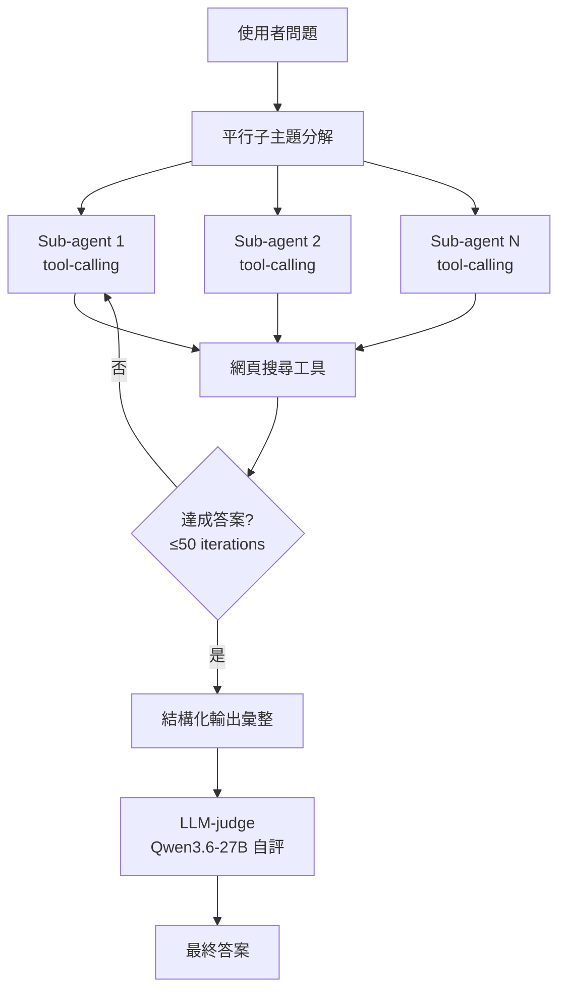
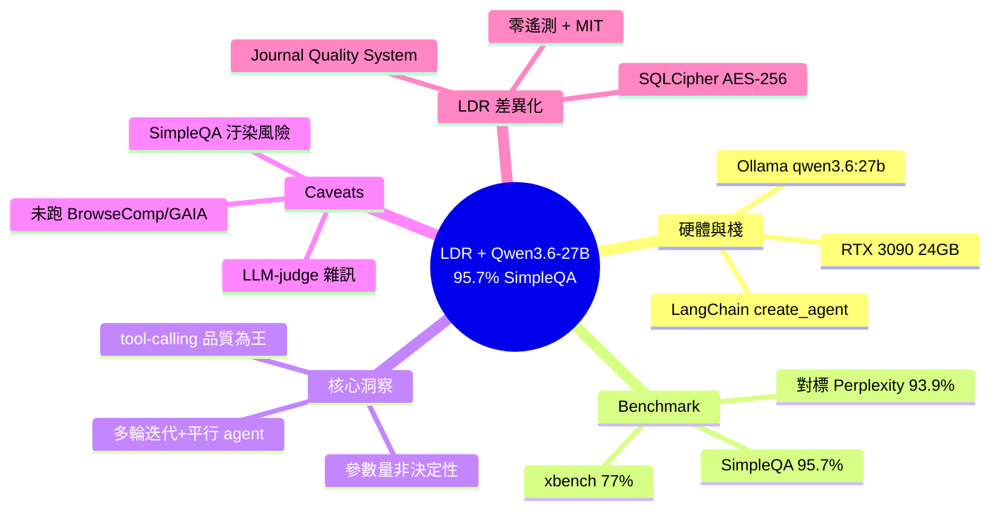

## We are finally there: Qwen3.6-27B + agentic search; 95.7% SimpleQA on a single 3090, fully local

Local Deep Research（LDR）社區使用 Qwen3.6-27B + agentic search 在單張 RTX 3090（24GB）上達成 95.7% SimpleQA 準確率（287/300），與商業方案 Perplexity Deep Research（93.9%）及 Tavily（93.3%）相當。核心技術棧：Ollama 後端、LangChain create_agent()、tool-calling、平行子主題分解、最多 50 次反覆迭代。關鍵發現：tool-calling 品質比原始模型大小更重要；Qwen3.6-27B 與 Qwen3.5-9B（91.2%）的差距源自工具調用能力，而非參數量。項目並實裝 Journal Quality System（學術來源分級）、SQLCipher AES-256 端到端加密、零遙測、MIT 授權。

### 重點
- Qwen3.6-27B + agentic search 單卡達成 95.7% SimpleQA、77% xbench-DeepSearch，性能逼近或超越商業級方案
- Tool-calling 品質（多輪反覆、並行工具調用、結構化輸出）比模型參數大小更關鍵，體現新代 Qwen 的核心優勢
- 開源設計突出隱私與透明：AES-256 加密、零遙測、MIT 授權、Journal Quality System，展示本地深度研究的成熟度

**原文：** [reddit-localllama](https://www.reddit.com/r/LocalLLaMA/comments/1t1n6o8/we_are_finally_there_qwen3627b_agentic_search_957/)

---

<!-- deep-analysis:begin -->
## 📌 摘要 (TL;DR)

- Local Deep Research（LDR）維護者宣布在單張 RTX 3090（24GB）上以 Qwen3.6-27B + agentic search 拿下 SimpleQA **95.7%（287/300）**，與 Perplexity Deep Research（93.9%）、Tavily（93.3%）等商業方案打平。
- 後端為 Ollama，策略採用 LDR 自家的 `langgraph_agent`：基於 LangChain `create_agent()`，整合工具調用（tool-calling）、平行子主題分解（parallel subtopic decomposition）與最多 50 次迭代。
- 同代比較：Qwen3.6-27B 95.7% vs Qwen3.5-9B 91.2% vs gpt-oss-20B 85.4%；在中文導向的 xbench-DeepSearch 上分別為 77%、59%。
- 維護者的核心觀察：在 deep research 任務中，**工具調用品質比模型參數規模更關鍵**，這恰好是新一代 Qwen 進步最大的軸線。
- LDR v1.6.0 加入 Journal Quality System（用 OpenAlex、DOAJ 對學術來源分級），並支援 SQLCipher AES-256 端到端加密、零遙測、Cosign 簽章 Docker image，採 MIT 授權。
- 重要框架：這些是 **agent + search** 分數，並非閉卷（closed-book）測試；維護者也承認 SimpleQA 在新模型上有資料汙染風險、樣本數較小、LLM-judge 有雜訊。

## 🎯 核心概念

- **Local Deep Research (LDR)**：開源的本地端深度研究框架，整合 LLM、網頁搜尋與多輪 agent 推理，目標是讓使用者完全在本機跑 Perplexity/ChatGPT Deep Research 級別的研究流程。
- **Agentic Search**：模型主動規劃查詢、呼叫搜尋工具、評估結果、再決定下一步的搜尋策略，而非單次 RAG。
- **SimpleQA**：OpenAI 推出的事實性問答 benchmark，用來評估模型對單一明確答案問題的正確率。
- **xbench-DeepSearch**：以中文為主的 deep search benchmark，對中文模型相對有利。
- **Closed-book vs Agent + Search**：閉卷測試模型只能靠權重內知識作答；agent + search 允許模型主動檢索網頁，因此分數可比性需要小心。
- **Tool-calling**：模型生成符合 schema 的函式呼叫，用以驅動外部工具（搜尋、計算、抓網頁等）。

## 📖 整理分析

### 1. 硬體與軟體棧：單張 3090 跑完整 pipeline
所有實驗在一張 RTX 3090（24GB VRAM）上完成，後端用 Ollama 載入 `qwen3.6:27b`。研究 agent 採 LDR 的 `langgraph_agent` 策略，底層是 LangChain 的 `create_agent()`，搭配 tool-calling、平行子主題分解，最多允許 50 次迭代。LLM-judge 用同一顆 Qwen3.6-27B 自評，作者另用 Claude Opus 抽查樣本，發現自評傾向**低估**準確率（即實際分數可能更高）。

### 2. Benchmark 結果：與商用 Deep Research 打平
SimpleQA 上 Qwen3.6-27B 拿 95.7%（287/300），對照組：Qwen3.5-9B 91.2%（182/200）、gpt-oss-20B 85.4%（295/346）。在中文 xbench-DeepSearch 上，Qwen3.6-27B 拿 77%（77/100），Qwen3.5-9B 只有 59%。對比商業方案：Perplexity Deep Research 93.9%、Tavily 93.3%——但作者特別註明 Tavily 強制只能用檢索到的文件作答（純檢索測試），Perplexity 則是端到端 agent 但未公開 grader 與樣本數，因此分數不完全可比。

### 3. 關鍵洞察：tool-calling 品質 > 參數規模
作者最大的觀察是：在 LDR 這種多輪迭代、平行子 agent、結構化輸出的場景下，分數提升軌跡更貼近**工具調用能力**而非模型大小本身。Qwen3.6-27B 對 Qwen3.5-9B 的 4.5 個百分點差距（SimpleQA）與 18 個百分點差距（xbench），主要來自新一代 Qwen 在 tool-calling 上的訓練改良。這是假說，作者邀請社群設計 ablation 實驗驗證。

### 4. 可信度框架與已知 caveats
作者明列限制：(1) SimpleQA 在新基礎模型上的資料汙染風險真實存在；(2) LLM-judge 雜訊與抽樣誤差；(3) xbench-DeepSearch 是中文，對中文模型 Qwen 有利；(4) 尚未跑 BrowseComp / GAIA，且作者直言目前在這兩個 benchmark 上並不擅長。即便如此，作者主張「就算只有 90% 也已經是巨大成功」。

### 5. LDR 在隱私與供應鏈安全上的差異化
除了模型表現，LDR v1.6.0 加了幾個其他開源 deep research 專案少見的特性：**Journal Quality System** 用 OpenAlex 和 DOAJ 對學術來源分級；**SQLCipher AES-256** 加密本地資料庫，金鑰用 PBKDF2-HMAC-SHA512、256k iterations，連管理員都讀不到使用者資料，且不支援密碼救援；**零遙測**、Cosign 簽章 Docker image 加 SLSA provenance 與 SBOM；採 MIT 授權。Repo：[LearningCircuit/local-deep-research](https://github.com/LearningCircuit/local-deep-research)。

## 🧭 流程圖：LDR `langgraph_agent` 策略

## 🧠 Mindmap

<!-- deep-analysis:end -->
### 📄 原文內容

點此展開 / 收合

<!-- SC_OFF -->

LDR maintainer here. Thanks to the strong support of <a href="https://www.reddit.com/r/LocalLLaMA">r/LocalLLaMA</a> community LDR got very far. I haven't reported in a while because I thought I was not ready for another prominent post in one of the leading outlets of Local LLM research.
 
But I think the LDR community finally there again. I think it is finally time to report again.
 
<strong>Setup</strong>
 <ul> <li>RTX 3090, 24GB</li> <li>Ollama backend (qwen3.6:27b)</li> <li>LDR's <code>langgraph_agent</code> strategy — LangChain <code>create_agent()</code> with tool-calling, parallel subtopic decomposition, up to 50 iterations</li> <li>LLM grader: qwen3.6:27b self-graded (I have used opus to review examples and it generally only underestimates accuracy)</li> </ul> 
<strong>Benchmarks (fully local LLM with web search)</strong>
 <table><thead> <tr> <th align="left">Model</th> <th align="left">SimpleQA</th> <th align="left">xbench-DeepSearch</th> </tr> </thead><tbody> <tr> <td align="left">Qwen3.6-27B</td> <td align="left">95.7% (287/300)</td> <td align="left">77.0% (77/100)</td> </tr> <tr> <td align="left"><strong>Qwen3.5-9B</strong></td> <td align="left">91.2% (182/200)</td> <td align="left">59.0% (59/100)</td> </tr> <tr> <td align="left">gpt-oss-20B</td> <td align="left">85.4% (295/346)</td> <td align="left">–</td> </tr> </tbody></table> 
sample size is small, but the benchmarks were not rerun multiple times and you can see from the other rows that this is unlikely just chance. Full leaderboard: <a href="https://huggingface.co/datasets/local-deep-research/ldr-benchmarks">https://huggingface.co/datasets/local-deep-research/ldr-benchmarks</a>
 
<strong>Important framing — these are</strong> <strong><em>agent + search</em></strong> <strong>scores, not closed-book</strong>
 
However, also note that these are similar benchmarks results to Perplexity Deep Research (93.9%), tavily (93.3%) etc. [Tavily forces the LLM to answer <em>only</em> from retrieved docs (pure retrieval test). Perplexity Deep Research is an end-to-end agent and discloses no grader or sample size. ]
 
<strong>Even if our results where only 90% it would already be a great success.</strong>
 
Also I can confirm from using it daily that these results feel consistent with my performance on random querries I do for daily questions.
 
<strong>Caveats:</strong>
 <ul> <li>SimpleQA contamination risk on newer base models is real</li> <li>LLM-judge noise + Sampling error</li> <li>bench-DeepSearch is in chinese so an advantage for the chinese qwen models</li> <li>No BrowseComp / GAIA numbers yet - But I also dont believe we are good at this benchmark yet. I will have to run some benchmarks to verify the current state</li> </ul> 
<strong>The thing that surprised me:</strong>
 
Results seem to track tool-calling quality more than raw size for local deep research. The <code>langgraph_agent</code> strategy hammers the model with multi-iteration tool calls, parallel subagent decomposition, and structured output — exactly the axis where the newer Qwen generations have improved most. Hypothesis only; if anyone wants to design an ablation we'd love the data.
 
<strong>Some cool LDR features that I want to additionally highlight:</strong>
 <ul> <li><strong>Journal Quality System</strong> (shipped v1.6.0) - academic source grading using OpenAlex, DOAJ. I haven't seen this anywhere else in the open-source deep-research space.</li> <li>Per-user <strong>SQLCipher AES-256 DB</strong> (PBKDF2-HMAC-SHA512, 256k iterations) — admins can't read your data at rest. No password recovery; we don't hold the keys.</li> <li><strong>Zero telemetry.</strong> no telemetry, no analytics, no tracking. </li> <li><strong>Cosign-signed Docker images</strong> with SLSA provenance + SBOMs.</li> <li><strong>MIT licensed.</strong> Everything open source</li> </ul> 
Repo: <a href="https://github.com/LearningCircuit/local-deep-research">https://github.com/LearningCircuit/local-deep-research</a>
 
Happy to share strategy configs, help reproduce the Qwen runs
 
Thanks to all the academic and other open source foundational work that made this repo possible.
 
<!-- SC_ON --> &#32; submitted by &#32; <a href="https://www.reddit.com/user/ComplexIt"> /u/ComplexIt </a>   <a href="https://www.reddit.com/r/LocalLLaMA/comments/1t1n6o8/we_are_finally_there_qwen3627b_agentic_search_957/">[link]</a> &#32; <a href="https://www.reddit.com/r/LocalLLaMA/comments/1t1n6o8/we_are_finally_there_qwen3627b_agentic_search_957/">[comments]</a>

