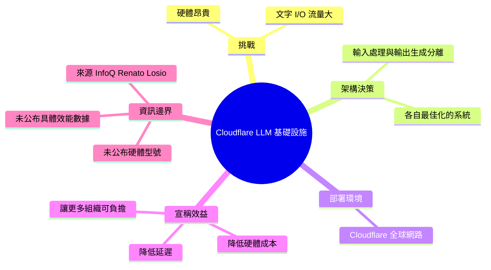

## Cloudflare Builds High-Performance Infrastructure for Running LLMs

Cloudflare 宣布推出專為大型語言模型設計的新一代運行基礎設施，可在其全球邊界網路上大規模部署和運行 LLM。Cloudflare 認識到 LLM 推論面臨的核心挑戰：昂貴的硬體成本和龐大的文本輸入輸出流量。為了應對，Cloudflare 採用了創新的系統架構：將 LLM 的輸入處理和輸出生成分離到不同的優化系統上。輸入處理系統針對快速處理大量輸入而優化，輸出生成系統則針對高效文本生成而優化。這一「分離優化」策略有效降低了推論的硬體成本和延遲，使全球更多組織能夠負擔得起部署強大的 LLM 模型。
```mermaid
graph LR
    Input["客戶端<br/>文本輸入"] --> |I| InSystem["輸入優化系統<br/>Tokenization<br/>Embedding"]
    InSystem --> |計算密集| Model["LLM 模型推論"]
    Model --> |計算密集| OutSystem["輸出優化系統<br/>Decoding<br/>流式編碼"]
    OutSystem --> |O| Output["生成結果<br/>文本輸出"]
    Note1["分離架構的優勢：針對不同<br/>計算特性各自優化]
    style InSystem fill:#e1f5ff
    style OutSystem fill:#f3e5f5
    style Model fill:#fff3e0
```

### 重點
- Cloudflare 構建全球邊界網路上的 LLM 運行基礎設施，支持大規模模型推論部署
- 採用「輸入處理／輸出生成分離」架構，針對不同計算特性分別優化硬體利用率和成本
- 分層設計直接降低推論成本及延遲，擴大 LLM 應用的經濟可行性

**原文：** [infoq-main](https://www.infoq.com/news/2026/05/cloudflare-llm-infrastructure/?utm_campaign=infoq_content&utm_source=infoq&utm_medium=feed&utm_term=global)

---


<!-- deep-analysis:begin -->
## 📌 摘要 (TL;DR)

- Cloudflare 宣布推出新一代基礎設施，專為在其全球網路上運行大型語言模型（large language models，LLM）而設計。
- 核心架構決策：將模型的**輸入處理**（input processing）與**輸出生成**（output generation）拆分到兩套各自最佳化的系統上運行。
- 此設計直接回應 LLM 推論的兩大成本來源：昂貴的硬體，以及龐大的文字輸入與輸出流量。
- 摘要指出此「分離最佳化」策略有助於降低推論的硬體成本與延遲，讓更多組織能負擔得起強大的 LLM 部署。
- 報導來源為 InfoQ，作者 Renato Losio，發佈於 2026 年 5 月。

## 🎯 核心概念

- **大型語言模型（large language models，LLM）**：本文討論的目標工作負載，特性是計算量大、依賴昂貴硬體。
- **輸入處理（input processing）**：模型讀取並理解使用者輸入提示（prompt）的階段。
- **輸出生成（output generation）**：模型逐步產出回應文字的階段。
- **分離最佳化（separated/disaggregated optimization）**：將以上兩個階段拆到不同系統，各自針對其工作特性調整硬體與軟體配置。

## 📖 整理分析

### 1. LLM 推論的兩大成本壓力

根據原文，運行大型語言模型面臨兩個核心挑戰：第一，模型仰賴**昂貴的硬體**（costly hardware）；第二，必須處理**大量進出的文字流量**（large volumes of incoming and outgoing text）。這兩點直接決定了 LLM 服務的單位成本與延遲體驗，也是 Cloudflare 設計新基礎設施時要解決的目標。

### 2. 將輸入與輸出拆到不同系統

Cloudflare 的關鍵設計是**把模型的輸入處理與輸出生成分離到不同的最佳化系統上**。原文沒有揭露具體的硬體型號或軟體堆疊，但根據摘要，輸入處理系統針對「快速處理大量輸入」最佳化，輸出生成系統則針對「高效文字生成」最佳化。這種分離讓兩條路徑各自挑選最適合自己工作負載特性的資源配置，而不是用單一通用配置同時應付兩種截然不同的計算模式。

### 3. 部署在全球網路上

Cloudflare 將這套基礎設施部署於其**全球網路**（global network）。原文僅以一句話帶過，未提供節點數、區域分布或可用區資訊。可以確定的是：這是一次「在邊緣／全球分散式網路上跑 LLM」的基礎設施宣告，而不是把工作負載集中在單一資料中心。

### 4. 摘要強調的目標：降低門檻

摘要部分說明此分離最佳化策略「有效降低推論的硬體成本與延遲，使全球更多組織能夠負擔得起部署強大的 LLM 模型」。需要注意：這是摘要中的論述方向，原文本身僅提到 Cloudflare 採用了分離的架構決策，並未公布具體的成本下降百分比、延遲數據或對標的競品基準。

### 5. 本則新聞的資訊邊界

這是一則 InfoQ 的**短訊式新聞**（news brief），核心資訊只有「Cloudflare 推出新基礎設施 + 採用輸入／輸出分離架構」兩點。原文未揭露下列細節：使用何種加速器、是否與既有 Workers AI 整合、與其他雲廠商相比的差異、實際的 token throughput 或延遲數字。讀者若需要技術細節，需要進一步追蹤 Cloudflare 官方部落格或後續的深度報導。

## 🧭 架構示意

以下為依據原文「將輸入處理與輸出生成分離」這一句話畫出的概念示意圖（具體實作細節原文未公開）：


## 🧠 Mindmap


<!-- deep-analysis:end -->
### 📄 原文內容

<details>
<summary>點此展開 / 收合</summary>

<p>Cloudflare has recently announced new infrastructure designed to run large AI language models across its global network. As these models rely on costly hardware and must handle large volumes of incoming and outgoing text, Cloudflare separates the model's input processing and output generation onto different optimized systems.</p> <i>By Renato Losio</i>

</details>