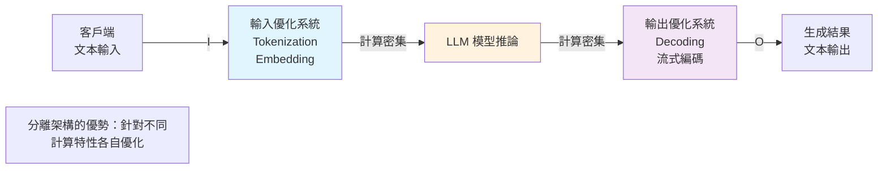

## Cloudflare Builds High-Performance Infrastructure for Running LLMs

Cloudflare 宣布推出專為大型語言模型設計的新一代運行基礎設施，可在其全球邊界網路上大規模部署和運行 LLM。Cloudflare 認識到 LLM 推論面臨的核心挑戰：昂貴的硬體成本和龐大的文本輸入輸出流量。為了應對，Cloudflare 採用了創新的系統架構：將 LLM 的輸入處理和輸出生成分離到不同的優化系統上。輸入處理系統針對快速處理大量輸入而優化，輸出生成系統則針對高效文本生成而優化。這一「分離優化」策略有效降低了推論的硬體成本和延遲，使全球更多組織能夠負擔得起部署強大的 LLM 模型。

### 重點
- Cloudflare 構建全球邊界網路上的 LLM 運行基礎設施，支持大規模模型推論部署
- 採用「輸入處理／輸出生成分離」架構，針對不同計算特性分別優化硬體利用率和成本
- 分層設計直接降低推論成本及延遲，擴大 LLM 應用的經濟可行性

**原文：** [infoq-ai-ml](https://www.infoq.com/news/2026/05/cloudflare-llm-infrastructure/?utm_campaign=infoq_content&utm_source=infoq&utm_medium=feed&utm_term=AI%2C+ML+%26+Data+Engineering)

---

### 📄 原文內容

點此展開 / 收合

Cloudflare has recently announced new infrastructure designed to run large AI language models across its global network. As these models rely on costly hardware and must handle large volumes of incoming and outgoing text, Cloudflare separates the model's input processing and output generation onto different optimized systems.
 <i>By Renato Losio</i>

