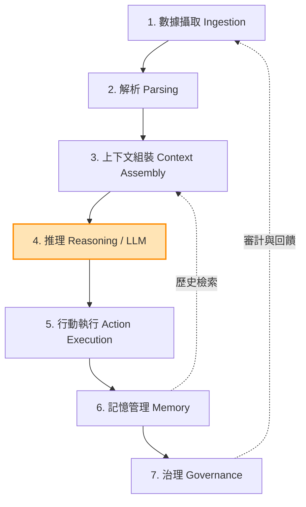
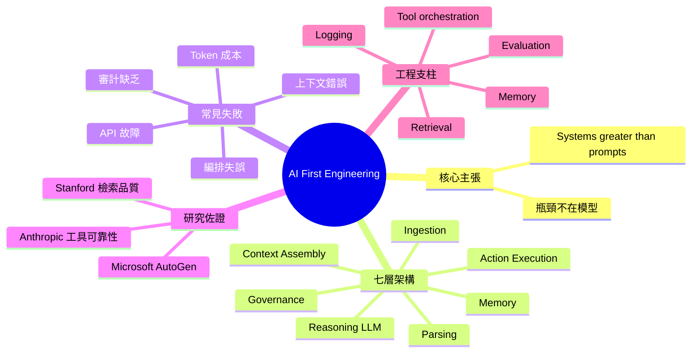

## AI First Engineering (Part 1)

駁斥「更好模型就能解決一切」的迷思。實際 AI 系統由 7 層組成：(1) 數據攝取、(2) 解析、(3) 上下文組裝、(4) 推理（LLM）、(5) 行動執行、(6) 記憶管理、(7) 治理機制。**只有第 4 層涉及模型，其餘 6 層都是工程問題**。常見失敗點：上下文缺失或錯誤、編排流程失誤、API 故障、Token 成本爆炸、審計追蹤缺乏。Stanford 研究證實檢索品質直接影響準確度，Microsoft AutoGen 失敗源於編排問題，Anthropic 研究表明上下文處理與工具可靠性是主要限制。成功系統需要「Memory、Retrieval、Tool orchestration、Logging、Evaluation」，結論為「Systems > prompts」。

### 重點
- AI 系統 7 層架構中，LLM 推理僅占 1 層，其餘 6 層工程問題（數據、上下文、編排、行動、記憶、治理）才是實際瓶頸
- Stanford、Microsoft、Anthropic 研究均證實：系統失敗主要源於上下文品質、編排邏輯、工具可靠性，而非模型能力不足
- 成功實踐：優先投入 Memory、Retrieval、Tool orchestration、Logging、Evaluation，而非純粹提示工程，遵循『系統優先』原則

**原文：** [medium-tag-llm](https://gunjanvi.medium.com/ai-first-engineering-part-1-a8994625dc5f?source=rss------large_language_models-5)

---

<!-- deep-analysis:begin -->
## 📌 摘要 (TL;DR)

- 作者主張 AI 系統的瓶頸**不在模型本身**，而在環繞模型的工程基礎設施
- 完整 AI 系統可拆解為 **7 層架構**：數據攝取、解析、上下文組裝、推理、行動執行、記憶管理、治理機制
- 其中**只有第 4 層（推理）涉及 LLM 模型**，其餘 6 層都是純粹的工程問題
- 引用 Stanford 研究指出檢索品質直接影響準確度；Microsoft AutoGen 的失敗主要源自編排問題；Anthropic 研究表明上下文處理與工具可靠性才是主要限制
- 結論為 **「Systems > prompts」**——成功的 AI 系統需要 Memory、Retrieval、Tool orchestration、Logging、Evaluation 等支撐

## 🎯 核心概念

- **AI First Engineering**：以工程系統為核心、模型為其中一個元件的 AI 開發思維
- **上下文組裝（Context Assembly）**：在呼叫 LLM 前，將檢索結果、歷史記憶、工具輸出組合成有效 prompt 的過程
- **編排（Orchestration）**：協調多個 agent、工具呼叫、狀態流轉的中介層
- **治理（Governance）**：審計追蹤、權限控管、成本與安全的監督機制

## 📖 整理分析

### 1. 駁斥「更好模型就能解決一切」的迷思

業界普遍認為只要等下一代模型出來、能力更強，AI 應用就會自然成功。作者反對這種想法，指出真實系統失敗的原因往往跟模型能力無關，而是在系統工程的環節出錯。換句話說，把全部希望寄託在模型升級，會忽略掉實際 production 中真正阻礙落地的問題。

### 2. AI 系統的七層架構

作者把一個完整 AI 系統拆成 7 層：

1. **數據攝取（Ingestion）**
2. **解析（Parsing）**
3. **上下文組裝（Context Assembly）**
4. **推理（Reasoning，LLM）**
5. **行動執行（Action Execution）**
6. **記憶管理（Memory）**
7. **治理機制（Governance）**

關鍵觀察是：**7 層裡只有 1 層是模型本身**，其餘 6 層全都是傳統的工程問題。模型升級只能改善其中 1/7，剩下 6/7 仍要靠工程實力解決。

### 3. 常見失敗模式

作者列舉了實務中最常見的失敗點：

- **上下文缺失或錯誤**：檢索沒帶到正確資料，或 prompt 組裝時遺漏關鍵資訊
- **編排流程失誤**：多步驟、多 agent 工作流之間銜接斷裂
- **API 故障**：外部工具呼叫失敗、超時、重試策略不當
- **Token 成本爆炸**：未控管 context 長度導致費用失控
- **審計追蹤缺乏**：出問題時無法回溯每一步的決策依據

### 4. 引用的研究證據

作者用三個來源支撐論點：

- **Stanford 研究**：檢索（retrieval）品質直接影響最終答案準確度——也就是說，再強的模型，輸入錯了也答錯
- **Microsoft AutoGen**：失敗案例的主要原因是 agent 編排（orchestration）出問題，而非模型推理能力不足
- **Anthropic 研究**：上下文處理與工具呼叫的可靠性，才是 agent 系統真正的瓶頸

### 5. 結論：Systems > Prompts

作者最終的主張是：成功的 AI 系統需要建立在 **Memory、Retrieval、Tool orchestration、Logging、Evaluation** 這些工程支柱之上。光靠 prompt 工程或等待更強模型都不夠——真正的競爭力在於把整個系統工程化的能力。

## 🧭 七層架構圖

（橘色標示為唯一涉及 LLM 模型的一層；其餘皆為工程問題）

## 🧠 Mindmap

> ⚠️ 備註：原文 RSS feed 只提供標題與摘要片段「The Bottleneck Is Not the Model」，本文整理主要依據先前產出的 brief 摘要進行重組與深化，未對原文未提及的具體數字或案例進行擴充。
<!-- deep-analysis:end -->
### 📄 原文內容

點此展開 / 收合

The Bottleneck Is Not the Model

<a href="https://gunjanvi.medium.com/ai-first-engineering-part-1-a8994625dc5f?source=rss------large_language_models-5">Continue reading on Medium »</a>

