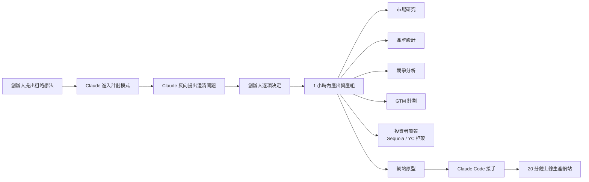

## I Started an AI Research Company in an Hour. Here’s the Prompt.

作者用 Claude 在 1 小時內完整創辦了 Archaeus Research Lab（研究訓練數據如何影響語言模型能力）。關鍵策略是使用「進入計劃模式並提出澄清問題」的 prompt，讓 Claude 先解決清晰度問題而非直接執行，據此產出市場研究、品牌設計、競爭分析、GTM 計劃、投資者簡報及網站原型。隨後 20 分鐘用 Claude Code 轉為生產網站。作者強調，2026 年創業的瓶頸已從執行轉向需求明確度；透過指定框架（如 Sequoia / Y Combinator 簡報格式）與工具環境連續性，壓縮了初期設立流程。

### 重點
- 使用『進入計劃模式並澄清』指令優先於直接執行，避免基於 AI 假設而非市場現實的方案設計
- 一小時內通過 Claude 獲得市場研究、品牌套件、競爭分析、GTM 計劃、投資者簡報和網站原型
- 多工具在同一資料夾連續使用，讓後期工作（如 Claude Code 網站開發）建立在前期成果上

**原文：** [medium-tag-claude](https://medium.com/@timbiondollo/i-started-an-ai-research-company-in-an-hour-heres-the-prompt-3abffdfad3a3?source=rss------claude-5)

---

<!-- deep-analysis:begin -->
## 📌 摘要 (TL;DR)

- 作者用 Claude 在 1 小時內完成 Archaeus Research Lab 的創辦準備工作，這是一家研究「訓練資料如何影響語言模型能力」的研究公司。
- 關鍵 prompt 策略：要 Claude **先進入計劃模式（plan mode）並提出澄清問題**，讓模型主動把模糊的需求補齊，再開始執行。
- 1 小時內 Claude 連續產出：市場研究、品牌設計、競爭分析、進入市場計劃（go-to-market，GTM）、投資者簡報（investor deck）、網站原型。
- 接著用 Claude Code 花 20 分鐘把網站原型轉為可上線的生產網站。
- 作者的核心主張：2026 年的創業瓶頸已從「執行」轉向「需求明確度（requirement clarity）」——能不能講清楚自己要什麼，比能不能做出來更關鍵。
- 加速關鍵：明確指定外部框架（Sequoia 與 Y Combinator 的簡報格式），以及讓工具環境（Claude → Claude Code）保持上下文連續。

## 🎯 核心概念

- **計劃模式**（plan mode）：在執行任何工作前，先要求模型規劃步驟、釐清未知，而不是直接動手。
- **澄清問題**（clarifying questions）：讓模型反向提問，把使用者沒講清楚的部分先問出來，再行動。
- **進入市場計劃**（GTM）：產品如何觸達客戶與市場的計劃。
- **Claude Code**：Anthropic 的 CLI 工具，用於在實際 codebase 上接續模型的設計輸出。

## 📖 整理分析

### 1. 創業的瓶頸從執行轉向需求明確度

作者觀察到，2026 年用 AI 工具創辦一家公司，第一週要做的「不會真正推進業務的紙上作業」可以被大幅壓縮。真正的瓶頸不再是「能不能把投影片做出來」「能不能寫出網站」，而是創辦人能不能講清楚自己要什麼。模型的執行力已經溢出，需求側才是新的限制因子。

### 2. 不是「給更好的 prompt」，而是讓模型先反問

本文標題雖然強調「Here's the Prompt」，但 summary 指出真正的關鍵不是某段魔法文字，而是一個轉換思路：要求 Claude **進入計劃模式、先提出澄清問題再執行**。當模型先問「你希望這家公司聚焦哪一類訓練資料？」「投資人簡報是要對種子輪還是 A 輪？」，使用者被迫把模糊的想法逐項決定，產出的品質自然提升。

### 3. 一小時內可以交付的清單

依照 summary，Claude 在 1 小時內幫作者產出了一家研究公司啟動所需的多份資產：

- 市場研究
- 品牌設計
- 競爭分析
- 進入市場計劃（GTM）
- 投資者簡報
- 網站原型

而公司的研究主題本身——「訓練資料如何影響 language model 的能力」——也是在這個對話裡被定義並命名為 Archaeus Research Lab。

### 4. 從原型到生產：20 分鐘的 Claude Code 接力

網站原型在對話階段已經完成，作者再用 Claude Code 在 20 分鐘內把它轉成可實際部署的生產網站。這一步的價值在於**工具環境連續性**：對話階段累積的脈絡（公司定位、品牌調性、頁面結構）可以直接被 Claude Code 接住，不需要重新解釋一次，因此實作端能聚焦在 codebase 改動而非情境補課。

### 5. 用既有框架當「思考腳手架」

summary 點出作者刻意指定 **Sequoia** 與 **Y Combinator** 的簡報框架做為投資者簡報的模板。這是另一個值得注意的技巧：與其讓模型從零生成簡報結構，不如直接把產業中已被驗證的框架名稱丟給它，讓模型沿著熟悉的骨架填內容，品質下限會穩定許多。

## 🧭 流程圖

## 🧠 Mindmap

```mermaid
mindmap
  root((1 小時開公司))
    新瓶頸
      不是執行
      是需求明確度
    Prompt 策略
      進入計劃模式
      先提澄清問題
      再開始執行
    1 小時產出
      市場研究
      品牌與競爭分析
      GTM 計劃
      投資者簡報
      網站原型
    工具接力
      Claude 對話端
      Claude Code 實作
      20 分鐘上線
    加速槓桿
      指定 Sequoia / YC 框架
      工具環境連續性
```

<!-- deep-analysis:end -->
### 📄 原文內容

點此展開 / 收合

The thing nobody tells you about starting a company in 2026 is how much of the first week is paperwork that doesn&#x2019;t actually move the&#x2026;

<a href="https://medium.com/@timbiondollo/i-started-an-ai-research-company-in-an-hour-heres-the-prompt-3abffdfad3a3?source=rss------claude-5">Continue reading on Medium »</a>

