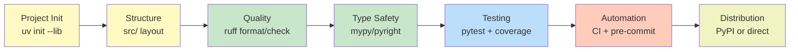

## Building Python Libraries in 2026

文章介紹 2026 年 Python 庫開發現代工具棧與實踐。核心工具推薦：uv（統一依賴管理、版本管理、多版本測試），ruff（linting + formatting 統一標準），mypy/pyright（type checking），pytest + pytest-cov（測試框架）。推薦 src/ 布局（改進 import 清晰度）、pyproject.toml 作為配置單一真實源、type annotations 作為基準要求（非可選）。強調自動化：pre-commit hooks 確保提交前檢查通過、CI 管道驗證 linting/type/test、支援多 Python 版本測試（`uv run --python 3.12/3.13 pytest`）。對發佈策略保持彈性觀點——不必總是 PyPI，小團隊可選直接源安裝（`uv add /path/to/my-package`）避免私有 registry 複雜度。核心心法：不追求「完美工具」，而是建立一致、自動化、可維護的工作流。

### 重點
- uv 成為現代 Python 開發中心：`uv init --lib`、`uv version --bump`、`uv run --python X.Y pytest` 統一版本管理與多版測試
- 工具複數化常態：ruff 統一 linting/formatting（替代 flake8/black），可複數 type checker（mypy + pyright 互補邊界案例），CI 驗證所有層面
- 發佈策略彈性優於預設複雜度：PyPI 是標準，但小團隊可用直接源安裝或替代方案，避免早期引入私有 registry 管理負擔

**原文：** [medium-stackademic](https://blog.stackademic.com/building-python-libraries-in-2026-171df902b5b3?source=rss----d1baaa8417a4---4)

---

### 📄 原文內容

點此展開 / 收合

<h4>The Modern Stack, Smarter Workflows, and What Actually Matters</h4><figure><figcaption>Photo by <a href="https://unsplash.com/@andriklangfield?utm_source=medium&amp;utm_medium=referral">Andrik Langfield</a> on <a href="https://unsplash.com?utm_source=medium&amp;utm_medium=referral">Unsplash</a></figcaption></figure><h3>Introduction</h3>
The Python ecosystem has matured significantly over the past few years, especially in the area of library development. What once required stitching together multiple tools and conventions has now become more streamlined, with clearer standards and improved tooling.

For developers building Python libraries in 2026, the focus has shifted toward consistency, automation, and maintainability. This article outlines the modern approach to structuring, developing, and maintaining a Python library, based on real-world experience and current best practices.
<h3>Project Initialization and Tooling</h3>
Modern Python development begins with a solid foundation. Today, tools like <strong>uv</strong> have simplified project setup and dependency management, consolidating workflows that were previously fragmented.

Initializing a new library is straightforward:
<pre>uv init --lib my-package</pre>
This command scaffolds a project with a standardized structure and a pyproject.toml configuration file. This file is now the central place for project metadata, dependencies, and build configuration, aligning with Python packaging standards.

Versioning should follow semantic versioning (SemVer), and tools like uv allow automated version management:
<pre>uv version --bump {major,minor,patch}</pre><h3>Structuring Your Library</h3>
A typical modern Python library follows a src/ layout:
<pre>src/   my_package/     __init__.py     py.typed</pre>
This structure improves import clarity and avoids common pitfalls in package resolution. The __init__.py file is often used to define the public API surface via __all__.

Keeping metadata accurate in pyproject.toml is equally important, especially for publishing and discoverability.

<a href="https://abdurrahman12.gumroad.com/l/pybrief">Python Weekly Brief</a>
<h3>Code Quality: Linting and Formatting</h3>
Automated code quality tools are no longer optional. Linters and formatters eliminate stylistic inconsistencies and reduce cognitive overhead.

A common modern setup includes:
<ul><li><strong>Linting and formatting</strong> with ruff</li><li>Alternative tools like Flake8 and Black still exist in older projects</li></ul>
Example commands:
<pre>uv add --dev ruff uv run ruff format uv run ruff check --fix</pre>
These tools should be integrated into development workflows using scripts or command runners like make.
<h3>Type Checking as a Standard</h3>
Type annotations are now a baseline expectation for production-quality Python libraries. They improve reliability, enable better tooling, and help catch bugs early.

Popular type checkers include:
<ul><li>mypy</li><li>pyright</li><li>pyrefly</li></ul>
With uv, testing multiple type checkers is trivial:
<pre>uv run --with mypy mypy src/ uv run --with pyrefly pyrefly check</pre>
Selecting one (or more) and integrating it into your workflow ensures consistent type safety.

<a href="https://abdurrahman12.gumroad.com/l/pybrief">Python Weekly Brief</a>
<h3>Testing and Coverage</h3>
Testing remains a core pillar of library development. The standard approach includes:
<ul><li>Unit tests for fast feedback</li><li>Integration tests for system-level validation</li></ul>
A typical setup uses pytest with coverage reporting:
<pre>uv add --dev pytest pytest-cov</pre>
Example test command:
<pre>uv run pytest --cov=my_package --cov-report=term-missing tests/unit</pre>
Testing across multiple Python versions is also easier now:
<pre>uv run --python 3.12 pytest uv run --python 3.13 pytest</pre><h3>A Note for Readers</h3>
If you’re interested in staying updated on tools like uv, evolving Python workflows, and practical development patterns, <strong>PyBrief</strong> covers weekly insights tailored for Python developers. It’s a focused way to keep up with changes without digging through fragmented sources.

<a href="https://abdurrahman12.gumroad.com/l/pybrief">Python Weekly Brief</a>
<h3>Maintaining Code Quality at Scale</h3><h4>Continuous Integration (CI)</h4>
Automation is essential for enforcing standards. CI pipelines should validate:
<ul><li>Linting and formatting</li><li>Type checking</li><li>Test suites</li></ul>
A minimal CI pipeline ensures that only validated code gets released. While platforms like GitHub Actions are widely used, developers are increasingly cautious about supply chain risks and exploring alternatives.
<h4>Pre-commit Hooks</h4>
Pre-commit hooks improve developer experience by catching issues before code is pushed.

Using the pre-commit framework:
<pre>uv add --dev pre-commit uv run pre-commit install</pre>
This ensures consistent enforcement of checks across all contributors.
<h3>Publishing and Distribution</h3>
Publishing workflows have also evolved. While PyPI remains the default distribution channel, smaller teams often adopt alternative approaches.

One practical method is installing directly from source:
<pre>uv add /path/to/my-package</pre>
This avoids the overhead of maintaining private registries while still enabling reuse across projects.

<a href="https://abdurrahman12.gumroad.com/l/pybrief">Python Weekly Brief</a>
<h3>Learning from Real-World Projects</h3>
Established libraries offer insight into practical toolchains:
<ul><li>Many projects combine ruff, pytest, and mypy</li><li>Some use multiple type checkers to handle edge cases</li><li>Build systems vary depending on language integrations (e.g., Rust bindings)</li></ul>
The key takeaway is flexibility — modern tooling supports different workflows while maintaining consistency.
<h3>Conclusion</h3>
Building a Python library in 2026 is less about choosing the “perfect” tools and more about adopting a cohesive, automated workflow.

Key takeaways:
<ul><li>Use modern tooling like uv to simplify setup and dependency management</li><li>Enforce code quality with linters, formatters, and type checkers</li><li>Prioritize testing and multi-version compatibility</li><li>Automate validation through CI and pre-commit hooks</li><li>Choose a distribution strategy that fits your team’s needs</li></ul>
For developers looking to stay current with these evolving practices, <strong>PyBrief</strong> provides concise, practical updates on Python tooling and workflows. It’s designed for engineers who want signal over noise in the rapidly changing Python ecosystem.

<a href="https://abdurrahman12.gumroad.com/l/pybrief">Python Weekly Brief</a>

<a href="https://blog.stackademic.com/building-python-libraries-in-2026-171df902b5b3">Building Python Libraries in 2026</a> was originally published in <a href="https://blog.stackademic.com">Stackademic</a> on Medium, where people are continuing the conversation by highlighting and responding to this story.

