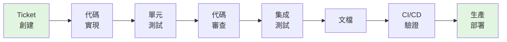

## We Gave Claude Code Access to Our Entire Stack. Here's What the Workflow Looks Like Now.

某公司將 Claude Code 集成到完整技術堆棧，實現從 ticket 創建到生產部署的八階段端到端工作流自動化。該工作流完全在單次對話中完成，消除所有上下文切換，開發者無需離開對話界面即可完成代碼審查、測試和部署。這展示了 AI 驅動開發工具在實際生產環境中大幅降低工程摩擦的具體應用方式，相比傳統多工具切換流程，大幅提升開發體驗。

### 重點
- 八階段完整工作流：ticket 創建 → 代碼實現 → 單元測試 → 代碼審查 → 集成測試 → 文檔 → CI/CD 驗證 → 生產部署，完全嵌入單次對話
- 零上下文切換設計：整個過程開發者不離開對話，減少認知負荷、工具切換時間和 context reload 成本
- Claude Code 堆棧深度集成：直接存取 git、CI/CD pipeline、testing frameworks、production deployment 系統，實現端到端自動化

**原文：** [medium-tag-ai](https://medium.com/@lorenzovangi/we-gave-claude-code-access-to-our-entire-stack-heres-what-the-workflow-looks-like-now-7920bb247f82?source=rss------artificial_intelligence-5)

---

### 📄 原文內容

點此展開 / 收合

From ticket creation to production deploy: one conversation, eight phases, zero context switching.

<a href="https://medium.com/@lorenzovangi/we-gave-claude-code-access-to-our-entire-stack-heres-what-the-workflow-looks-like-now-7920bb247f82?source=rss------artificial_intelligence-5">Continue reading on Medium »</a>

