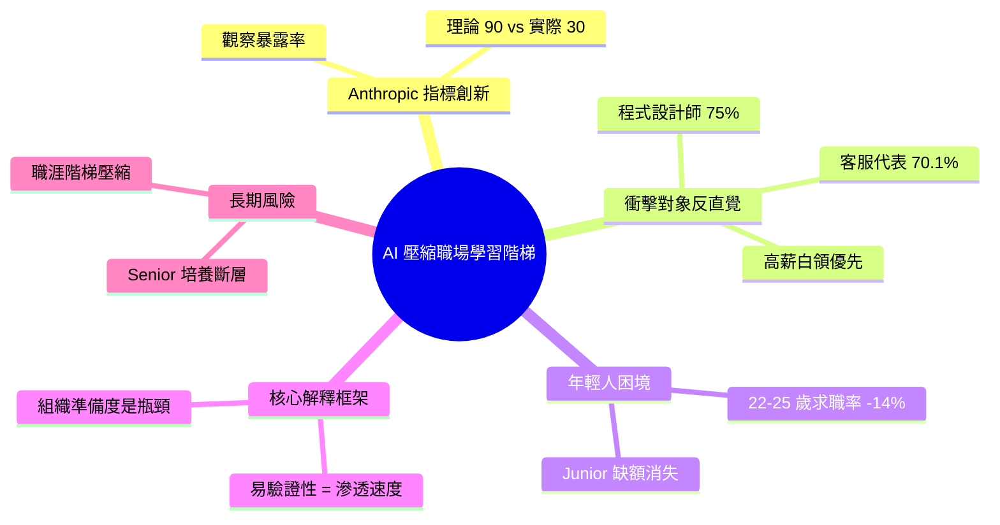

## 沒有 Junior，哪來 Senior？AI 正在壓縮職場的學習階梯

Anthropic 最新研究發現，AI 的第一波職場衝擊不是失業潮，而是新人進入門檻提升。研究引入「Observed Exposure」指標，揭示理論上 LLM 能涉及 90% 工作任務，但實際覆蓋率僅 30%——瓶頸不在 AI 技術，而在企業組織準備。最反直覺的發現是 AI 優先衝擊高薪白領職位（程式設計師 75% 暴露率、客服代表 70.1%），因為高薪工作的輸出相對易驗證。最令人擔憂的數據是 22-25 歲年輕人進入高暴露職業的求職成功率下降 14%，意味著 junior 缺額正在消失。核心框架：工作輸出的「易驗證性」決定了 AI 滲透速度，而非職位薪資或教育程度。

### 重點
- LLM 理論影響 90% 任務 vs 實際覆蓋 30%——限制因素是企業流程/法規/組織信任，非技術能力
- 程式設計師 75%、客服 70.1%、資料輸入員 67% 最高暴露率；高薪白領比低薪工作更早被 AI 接手
- 年輕求職者進入高暴露職業成功率 -14%：下一個 junior 缺號可能不再補人，而是以 AI 替代

**原文：** [substack-darren-techtalk](https://darrentechtalk.substack.com/p/anthropic-report)

---

<!-- deep-analysis:begin -->
## 📌 摘要 (TL;DR)

- Anthropic 最新研究指出，AI 的第一波職場衝擊不是失業潮，而是**新人進入門檻被抬高**
- 研究引入「觀察暴露率」（Observed Exposure）指標：LLM 理論上可涉及 90% 工作任務，但實際覆蓋率僅 30%
- 反直覺發現：高薪白領首當其衝——程式設計師暴露率 75%、客服代表 70.1%
- 22-25 歲年輕人進入高暴露職業的**求職成功率下降 14%**，junior 缺額正在消失
- 核心解釋：工作輸出的「**易驗證性**」決定 AI 滲透速度，而非薪資或教育程度

## 🎯 核心概念

- **觀察暴露率** (Observed Exposure)：Anthropic 提出的新指標，衡量 AI 在實際工作中被採用的程度，而非僅看理論上能否處理
- **易驗證性** (Verifiability)：工作產出是否能被快速判斷對錯，是決定 AI 滲透速度的關鍵變數
- **學習階梯壓縮**：原本由 junior 負責、輸出可驗證的任務被 AI 接手，導致新人失去入行訓練的位置

## 📖 整理分析

### 1. 理論 90% vs 實際 30% 的落差
研究最關鍵的方法論貢獻在於區分「理論暴露」與「觀察暴露」。LLM 在能力上可涉及 90% 的工作任務，但實際被企業整合進工作流程的覆蓋率僅 30%。這個落差告訴我們：**瓶頸不在 AI 技術，而在企業組織的導入準備度**。

### 2. 高薪白領為何優先被衝擊
程式設計師暴露率 75%、客服代表 70.1%，這顛覆了「AI 先取代低薪工作」的直覺。報告的解釋是：高薪白領的輸出（程式碼、客服回覆）相對**容易被驗證對錯**——程式碼可以跑測試、客服回覆有 SOP 比對。反而許多體力勞動或需要實體在場的工作，因為輸出難以遠端驗證，AI 反而難以介入。

### 3. 22-25 歲求職成功率下降 14%
這是報告中最令人擔憂的單一數據。年輕人進入高暴露職業的求職成功率明顯下降，意味著企業在 AI 輔助下「不再需要 junior 來做那些可驗證的入門任務」。當入行的第一階梯被抽掉，整個職涯培養機制就出現缺口。

### 4. 沒有 Junior，哪來 Senior
標題點出了長期結構性問題：senior 工程師、senior 客服、senior 分析師都是從 junior 階段累積經驗而來。如果 AI 接管了所有 junior 任務，**未來十年的 senior 人才從何培養**？這是企業短期省成本、長期可能面臨人才斷層的風險。

## 🧠 Mindmap

<!-- deep-analysis:end -->
### 📄 原文內容

點此展開 / 收合

Anthropic &#30340;&#26032;&#30740;&#31350;&#27794;&#26377;&#35657;&#26126; AI &#36896;&#25104;&#22833;&#26989;&#28526;&#65292;&#20294;&#23427;&#25235;&#21040;&#20102;&#19968;&#20491;&#26356;&#23433;&#38748;&#30340;&#35338;&#34399;&#65306;&#26032;&#20154;&#35201;&#20837;&#34892;&#26356;&#22256;&#38627;&#20102;

